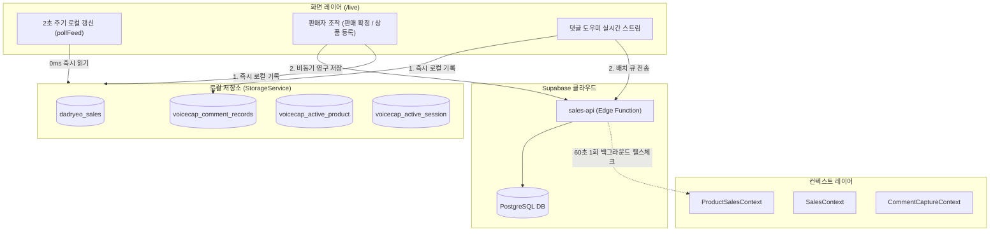

# VoiceCAP 웹 & 라이브 커머스 시스템 종합 인수인계서
**문서 작성일**: 2026-09-29  
**최신 안정 커밋**: `f2aa53c` (`origin/main`)  
**저장소**: `https://github.com/nettman001-hub/voice-pin-web.git`  
**작업 디렉터리 권장**: `C:\dev\voicecap-web`

---

## 1. 프로젝트 개요 및 핵심 역할

VoiceCAP(보이스캡)은 틱톡 라이브 등 실시간 라이브 커머스 방송 진행자를 위한 **실시간 음성 인식(STT) 기반 판매 기록, 틱톡 실시간 댓글 수집, 자동 주문/배송 관리 및 블루투스/네트워크 영수증 프린터 연동** 풀스택 웹 솔루션입니다.

- **프론트엔드**: React 18, TypeScript, Vite, Tailwind CSS, Lucide React
- **백엔드/데이터베이스**: Supabase (PostgreSQL, Auth, Edge Functions, Storage, Realtime)
- **보조 데스크톱/로컬 서비스**:
  - `VoiceCAP-Comment-Helper` (포트 `2137`, 틱톡 라이브 댓글 수집 및 ESC/POS 영수증 프린터 중계)
  - `faster-whisper` 기반 로컬 오프라인 STT 서비스

---

## 2. 새 컴퓨터에서 즉시 개발 환경 구축하기 (Quick Start)

### 2.1. 필수 도구 준비
1. **Node.js**: v20.x 또는 v22.x LTS ([nodejs.org](https://nodejs.org/))
2. **Git for Windows**: [git-scm.com](https://git-scm.com/)

### 2.2. 저장소 복제 및 의존성 설치
새 컴퓨터의 터미널(PowerShell 권장)에서 다음 명령어를 실행합니다:

```powershell
# 1. 원하는 디렉터리로 이동 및 저장소 복제
cd C:\dev
git clone https://github.com/nettman001-hub/voice-pin-web.git
cd voicecap-web

# 2. 의존성 설치
npm install
```

### 2.3. 환경 변수 파일 생성 (`.env.local`)
프로젝트 루트 디렉터리(`C:\dev\voicecap-web\.env.local`)에 아래 파일을 생성합니다.

```env
VITE_SUPABASE_URL=https://ymegrhxpbeanvxwdzfym.supabase.co
VITE_SUPABASE_PUBLISHABLE_KEY=sb_publishable_ejcf3T3BATOD0yAN2e5oMg_9kwHOgzb
```

### 2.4. 개발 서버 실행 및 검증
```powershell
# 개발 서버 구동 (기본 포트: http://localhost:5173)
npm run dev

# 빌드 및 TypeScript 정적 타입 검증
npm run build
```

---

## 3. 핵심 아키텍처: "동시 쓰기 + 로컬 읽기(0ms)" 시스템

라이브 방송 도중 수많은 댓글과 판매가 발생하는 환경에서 Supabase Edge Function(`sales-api`)에 2초마다 HTTP 폴링을 수행하던 기존 방식은 Edge Function 호출 쿼터 초과 및 네트워크 지연 문제를 야기했습니다.

이를 해결하기 위해 **"쓰기는 Supabase와 로컬(localStorage/메모리)에 동시 기록하고, 2초 주기 화면 조회는 100% 로컬에서 0ms로 수행"**하는 구조로 전면 전환되었습니다.



---

## 4. 최근 완료된 8대 P1 핵심 결함 해결 내역 (커밋 `f2aa53c`)

외부 시니어 아키텍트의 정밀 코드 리뷰에서 지적된 8대 P1 항목을 2026-09-29에 모두 완벽하게 해결했습니다.

| 번호 | 결함 항목 | 위험 내용 | 해결 조치 및 구현 코드 |
| :---: | :--- | :--- | :--- |
| **P1-1** | **용량 초과 시 판매 기록 절삭 방지** | 브라우저 쿼터 초과 시 `setItem`의 50% 절삭 로직이 판매/금융 데이터까지 절반 삭제하던 치명적 결함 | `setItem`에 `{ allowEviction: true }`를 추가하여 댓글 등 비필수 캐시만 절삭 허용. `saveSales` 실패 시 스냅샷·댓글 등 캐시를 먼저 비우고 재시도하여 판매 기록은 100% 온전히 보존 |
| **P1-2** | **TikTok ID의 구매자 UUID 오염 방지** | `incoming.userId/uniqueId`를 `buyerId`에 대입하여 서버 `sales-api`의 UUID(36자) 기대 스키마와 충돌 | 댓글 스트리밍 시 `buyerId: undefined`로 설정하고 틱톡 식별자는 `uniqueId`에만 보존. 서버 피드 수신 시 정식 발급된 `buyerId`(UUID)를 로컬 스토리지에 동기화 |
| **P1-3** | **정식 방송 간(A→B) 댓글 혼입 방지** | 방송 회차가 변경될 때 `promoteSessionComments`가 무조건 실행되어 이전 방송 A의 댓글이 새 방송 B로 이전됨 | `isTemporarySessionId` 검사기를 도입하여, 날짜형 임시 회차명에서 정식 세션 UUID로 바뀔 때만 승격 허용. 정식 세션 간 전환 시에는 댓글 이동 차단 및 큐 리셋 |
| **P1-4** | **계정별 저장소 격리 누출 차단** | `workspaceId`가 전달되어도 데이터가 없으면 공용 키(`dadryeo_sales`)로 fallback하여 다른 계정 데이터 노출 | `storageService.getSales`, `getCommentRecords`에서 `ws` 존재 시 fallback 제거(`[]` 반환). `loadBootstrap` 호출 시점과 응답 시점의 `workspaceId` 검증으로 계정 전환 레이스 컨디션 차단 |
| **P1-5** | **서버 삭제 판매 건 로컬 부활 방지** | `refreshSales`에서 서버 목록에 없는 항목을 무조건 살려두어 서버에서 삭제/취소된 판매 건이 로컬에서 영구 부활 | `syncStatus: 'PENDING' \| 'SYNCED'` 필드 도입. 서버 목록에 없는 항목 중 **오직 미전송 신규 항목(`PENDING`)만 보존**하고, 이미 `SYNCED`였던 항목은 서버 삭제로 판단하여 로컬에서도 정상 제거 |
| **P1-6** | **판매 수정/삭제 경쟁 조건 방지** | 로컬 수정 직후 서버 응답 도착 시 이전 revision으로 덮어써지거나, 다른 컨텍스트와의 상태 동기화 누락 | `refreshSales`에서 `local.revision > serverRow.revision`이면 로컬 수정본 유지. 판매 확정 시 `voicecap_sales_updated` 이벤트를 발생시켜 `SalesContext` 즉시 동기화 |
| **P1-7** | **60초 헬스체크 및 멀티탭 동기화** | 백그라운드 헬스체크 및 `storage` 이벤트 수신 시 피드만 갱신하고 활성 상품/세션 revision 미반영 | 60초 헬스체크 및 `storage` 이벤트 발생 시 `activeProduct`와 `activeSession` revision까지 수화(hydrate) 및 로컬 스토리지에 최신화 |
| **P1-8** | **피드 댓글 최신 50건 반영 버그 수정** | `localRecords`가 시간 오름차순인데 `slice(0, 50)`을 하여 가장 오래된 50개만 노출되고 최신 댓글이 누락됨 | `localRecords.slice(-50)`으로 수정하여 가장 최신의 50개 댓글이 피드에 정확히 표시되도록 수정 |

---

## 5. 주요 파일 및 디렉터리 가이드

### 5.1. 컨텍스트 (`src/context/`)
- **`AuthContext.tsx`**: Supabase 사용자 로그인/로그아웃, 세션 및 `workspaceId` 관리
- **`LiveContext.tsx`**: 판매자 마이크/탭 오디오 음성 인식(STT) 스트림 및 세션 관리
- **`ProductSalesContext.tsx`**: 현재 활성 상품, 방송 세션, 0ms 로컬 피드(`buildLocalFeed`), 음성 명령 후보 확정(`commitSales`, `handleCommitCandidate`), 60초 백그라운드 헬스체크
- **`SalesContext.tsx`**: 전체 판매 기록 목록 관리, Supabase 동기화(`refreshSales`), `syncStatus` 관리, CSV 내보내기, 일자별/기간별 정산 요약
- **`CommentCaptureContext.tsx`**: 틱톡 실시간 댓글 도우미 소켓 연동, 키워드 알림(예: '저요'), 클라우드 큐 배치 전송
- **`CommerceContext.tsx`**: 입금 확인 문자 대조, 청구서 발행, 택배 배송 관리

### 5.2. 서비스 (`src/services/`)
- **`storageService.ts`**: `localStorage` 입출력, 워크스페이스 격리(`scopedKey`), 금융 데이터 자동 절삭 차단 및 비필수 캐시 우선 정리, 세션별 판매 요약 SUM/COUNT 집계
- **`productSalesApi.ts`**: Supabase Edge Function(`sales-api`) 통신 (부트스트랩, 상품 등록/준비, 판매 확정, 댓글 적재 등)
- **`remoteWorkspaceService.ts`**: Supabase DB 직접 쿼리 및 Realtime 구독
- **`commentStreamService.ts`**: 데스크톱 댓글 도우미(`127.0.0.1:2137`) WebSocket 연결 및 전표 인쇄 명령 중계

### 5.3. 최근 UI 수정 파일 (`src/pages/`)
- **`src/pages/ShippingManagementPage.tsx`**:
  - 발송 업무 생성 모달에서 **연락처와 배송지 주소가 없는 경우 발송대기로 넘어가지 않도록 차단** 및 안내 얼럿 구현
  - 하단 고객 정보 카드에 **고객정보 수정 모달** 기능 추가
  - 라이브 청취 홈과 동일하게 상하 여백 최소화 패딩 적용
- **`src/pages/SettlementPage.tsx`**: 정산 관리 페이지 여백 최소화
- **`src/pages/LiveSalesView.tsx`**: 방송 회차 표시 문자열 깨짐 현상 정상화

---

## 6. 새 컴퓨터 작업 시 체크리스트 및 주의사항

> [!IMPORTANT]
> 1. **금융/판매 데이터 무결성 보장**:
>    - `storageService.saveSales`나 `addSale`을 수정할 때 절대 데이터를 임의로 절삭하거나 삭제하지 않도록 주의하세요.
> 2. **`syncStatus` 상태값 유지**:
>    - 신규 로컬 판매 생성 시 `syncStatus: 'PENDING'`으로 설정하고, Supabase 저장 응답 완료 시 `syncStatus: 'SYNCED'`로 갱신해야 서버 삭제 건과의 동기화가 정상 유지됩니다.
> 3. **컴파일 및 빌드 검증**:
>    - 작업 후 항상 `npm run build`를 실행하여 TypeScript 컴파일 에러가 없는지 확인하세요.
> 4. **Git 협업**:
>    - 다른 PC에서 작업을 시작하기 전에 반드시 `git pull origin main`을 실행하여 최신 커밋을 먼저 확보하세요.
