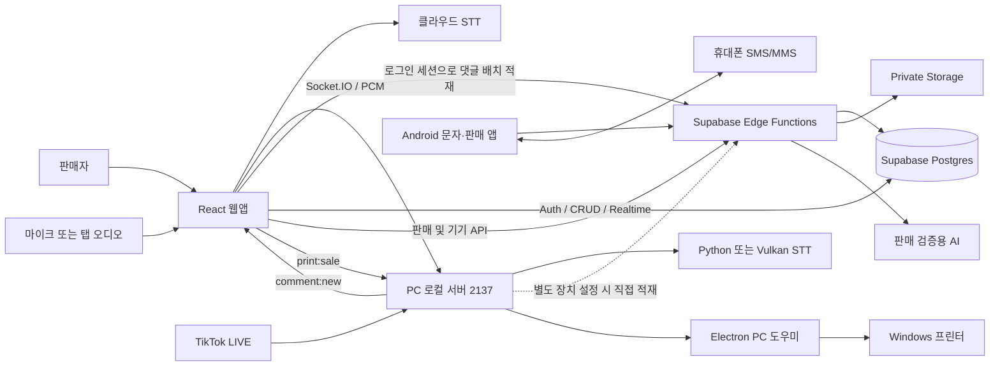

# VoiceCAP 전체 설계도 및 다른 컴퓨터 복제 안내서

작성일: 2026-09-26 · 분석 기준: `main`, `62a464924b3785255e5d68e8898b14c23f66f554`

이 문서는 **기존 프로젝트를 다른 Windows PC에서 실행하는 개발자**와 **동일한 기능을 이해하고 다시 구현하는 초보 개발자**를 위한 안내서다. 현재 저장소의 코드를 기준으로 구조, 설치, 데이터, 화면, 통신, 구현 순서와 검증 방법을 설명한다. 실제 비밀번호·API 키·고객 정보는 포함하지 않았다.

문서 작성 과정에서 애플리케이션 코드를 변경하거나 클라우드에 배포하지 않았다. 기존 클라우드의 실제 DB 구조와 배포 설정은 조회하지 않았으므로, 저장소와 운영 서버가 완전히 같다고 가정하지 않는다. 확인한 코드와 로컬 검사 결과, 앞으로 구현해야 할 사항을 구분한다.

## 1. 읽는 순서

| 순서 | 문서 | 읽고 나면 할 수 있는 일 |
|---|---|---|
| 0 | 이 문서 | 전체 구조와 복제 범위 이해 |
| 1 | [새 PC 설치·복제 절차](docs/replication/01_NEW_PC_SETUP.md) | 소스·도구·설정 복원, 웹·PC 프로그램 실행, 새 서버 구성 |
| 2 | [웹앱 상세 설계](docs/replication/02_WEB_DESIGN.md) | 화면·상태·음성 처리·판매 저장 흐름 이해 |
| 3 | [백엔드·데이터베이스 설계](docs/replication/03_BACKEND_DATABASE.md) | 테이블·권한·API·AI 처리·마이그레이션 이해 |
| 4 | [로컬 서버·PC 도우미·STT 설계](docs/replication/04_LOCAL_SERVER_DESKTOP_STT.md) | 댓글 수집·인쇄·오프라인 음성인식 재현 |
| 5 | [Android 앱 설계·구축](docs/replication/05_ANDROID_DESIGN.md) | 앱 빌드, 기기 연결, 문자와 상품 판매 연동 |
| 6 | [개발 작업 순서·검증·인수 기준](docs/replication/06_IMPLEMENTATION_AND_ACCEPTANCE.md) | 단계별 개발과 테스트, 문제 원인 추적 |

처음에는 0 → 1 → 6 순서로 최소 실행을 성공시킨다. 이후 수정하려는 기능에 맞춰 2~5를 읽는다. 서버까지 새로 만드는 경우에는 3장의 **스키마 불일치와 권한 관련 보완사항**을 먼저 확인한다.

## 2. 이 프로그램은 무엇인가

VoiceCAP는 라이브 방송 판매 업무를 보조한다. 방송 음성을 문자로 바꾸고, 상품·금액·구매자 후보를 추출하고, 같은 방송의 댓글과 대조해 판매를 기록한다. 판매자는 구매자를 확인하거나 보류 건을 수정하고, 정산·배송 관련 업무를 처리한다. PC 도우미가 TikTok 댓글과 프린터를 연결하고, Android 앱이 업무용 문자를 동기화한다.

예를 들어 판매자가 “구매확정, 하늘님 0.9”라고 말하면 다음 과정을 거친다. 아래 이름과 숫자는 설명용 예시다.

1. 웹브라우저가 선택한 마이크 또는 공유한 탭의 소리를 받는다.
2. STT가 최종 문장을 만든다. STT는 Speech-to-Text, 즉 음성의 문자 변환이다.
3. 규칙이 구매확정 표현·닉네임·가격을 찾는다. 해당 가격 규칙에서는 `0.9`를 9,000원으로 해석할 수 있다.
4. 현재 작업공간과 현재 방송 회차의 댓글에서 “하늘”을 검증한다.
5. 근거가 충분하면 판매를 기록하고, 부족하면 보류 상태로 남긴다.
6. 후속 발화·수동 확인·설정된 AI 처리로 보류 또는 정정을 처리한다.
7. 저장된 판매를 다른 기기에서 조회하고 정산에 사용한다.

이 흐름과 별도로, **상품을 먼저 등록하고 댓글의 구매자를 선택하여 판매를 확정하는 경로**가 있다. 현재 두 경로는 저장 방식과 인쇄 연결이 완전히 같지 않다.

## 3. “똑같이 복제”의 세 가지 범위

| 범위 | 가져오는 것 | 별도로 필요한 것 | 완료의 의미 |
|---|---|---|---|
| A. 개발 PC 이전 | 같은 커밋의 소스·패키지 버전 | 기존 서비스 접속 권한, 새 PC 설정, 로컬 모델·프린터 | 같은 서버에 연결해 같은 프로그램 개발 가능 |
| B. 독립 서비스 복제 | 소스와 DB 구조·함수 | 새 Supabase/Vercel 프로젝트, 새 키·도메인·사용자·기기 | 기존 서비스와 분리된 환경에서 기능 검증 가능 |
| C. 데이터까지 이전 | B + 업무 데이터·파일·필요한 계정 관계 | DB 및 Storage 복원, ID/소유권 매핑, 전환 계획 | 판매·고객·이미지까지 복원되고 교차 검증 완료 |

`git clone`은 소스 복제다. Supabase 데이터, 브라우저 설정, PC 프린터, API 키, STT 모델은 자동으로 따라오지 않는다. 가장 먼저 자신의 목표가 A/B/C 중 무엇인지 정해 설치표에 기록한다. 이 문서는 세 범위를 모두 다루지만 C의 실제 데이터 복원은 인수받은 백업 형식에 맞춰 실행해야 한다.

## 4. 전체 구성도

도식은 주요 연결을 요약한다. 클라우드의 `print_jobs`를 처리하는 워커 클래스는 있으나 현재 PC 시작 코드와의 연결은 확인되지 않았다. 따라서 “Android 판매를 저장하면 클라우드 큐를 통해 자동 인쇄까지 완료된다”는 기능을 완성 상태로 간주하지 않는다. 상세 경로는 4장에 설명한다.

## 5. 구성요소와 실행 단위

| 구성요소 | 위치 | 언어·실행 환경 | 책임 |
|---|---|---|---|
| 웹 UI | `src/` | TypeScript, React, 브라우저 | 로그인·라이브·상품·판매·정산·관리 화면 |
| 웹 빌드 | 루트 `package.json`, `vite.config.ts` | Node.js, Vite | 개발 서버 3000, 배포용 `dist` 생성 |
| 웹 측 서버 API | `api/` | TypeScript, Vercel/개발 middleware | AI 모델 목록·설정·상태 보조 API |
| 중앙 업무 API | `supabase/functions/` | TypeScript, Supabase Edge Runtime | 작업공간·장치·문자·판매·AI 처리 |
| 데이터베이스 | `supabase/migrations/` | PostgreSQL SQL | 테이블·관계·인덱스·접근 정책 |
| 로컬 서버 | `server/` | Node.js, Express, Socket.IO | TikTok 연결·로컬 브리지·STT·인쇄 전달 |
| PC 설치 프로그램 | `desktop/comment-helper/` | Electron, CommonJS JS | 로컬 서버 실행·설정·프린터·업데이트 |
| 오프라인 STT | `server/stt_worker.py`, `server/vulkanRunner.js` | Python / whisper.cpp | 음성을 로컬에서 문자로 변환 |
| 휴대폰 앱 | `android/voicecapSMS/` | Java, Android SDK, Gradle | 문자 동기화·기기 인증·상품 판매 |
| API 계약 | `contracts/product-sales/v1/` | JSON Schema·fixtures | 웹·Android·서버가 공유할 요청/응답 예 |
| 자동 테스트 | `test/`, `server/test/`, PC·Android 테스트 | Node test / JUnit | 로직과 계약 회귀 검증 |

루트의 `npm ci` 한 번으로 모든 프로그램이 설치되지 않는다. 웹, 로컬 서버, Electron은 각각 `package.json`과 lock 파일이 있다. Android는 Gradle, Python STT는 별도의 패키지 설치를 사용한다.

## 6. 초보 개발자를 위한 핵심 용어

| 용어 | 뜻 | 이 프로젝트에서의 예 |
|---|---|---|
| 저장소 / 커밋 | 소스와 변경 이력을 보관하는 곳 / 특정 시점 | 문서 맨 위 SHA가 복제 기준 |
| 의존성 / lock 파일 | 가져다 쓰는 라이브러리 / 정확한 버전 목록 | `npm ci`가 `package-lock.json`을 따른다 |
| 프런트엔드 | 사용자가 보는 화면과 브라우저 동작 | React 라이브 화면 |
| 백엔드 / API | 데이터를 검사·저장하는 서버 / 요청 약속 | `sales-api`의 `commit-sales` |
| 작업공간(workspace) | 한 판매자 조직의 데이터 경계 | 다른 판매자의 판매와 댓글을 분리 |
| 회차(session) | 한 번의 방송 업무 단위 | UUID가 내부 ID, 날짜·회차 이름은 표시용 |
| UUID | 중복 가능성이 매우 낮은 식별 문자열 | `live_sessions.id`, `products.id` |
| RLS | DB가 행마다 적용하는 접근 권한 | 현재 사용자의 workspace만 조회 |
| JWT / 장치 토큰 | 사용자 / 기기의 인증 증표 | 웹 로그인과 Android 연결에 각각 사용 |
| Realtime / polling | 서버 변경 알림 / 반복 조회 | 판매 변경 알림 / 댓글 피드 조회 |
| draft / commit | 미완성 초안 / 최종 확정 | 상품 사진 업로드 전 초안 생성 |
| revision | 데이터 수정 버전 | 이미 변경된 상품을 오래된 화면으로 덮어쓰지 않게 검사 |
| operationId / 멱등성 | 한 작업의 ID / 재요청해도 중복 실행 방지 | 판매 저장 중 응답이 끊겼을 때 같은 작업 조회 |
| migration | DB 구조 변경을 기록한 SQL | 컬럼·테이블을 시간 순으로 설치 |
| 환경변수 | PC·서버마다 다른 실행 설정 | Supabase 주소, 포트, 서버 비밀키 |
| 모델 | 음성·텍스트를 해석하는 학습된 파일/서비스 | Whisper STT 모델, 판매 검증 AI |

## 7. 데이터의 원본은 어디인가

| 정보 | 현재 주 저장 위치 | 새 PC에서 할 일 |
|---|---|---|
| 실제 판매·댓글·고객·회차 | Supabase DB | 같은 프로젝트에 재로그인 또는 DB 데이터 이전 |
| 캡처·상품 이미지·MMS 파일 | Supabase Storage | 같은 프로젝트 사용 또는 객체 파일 별도 이전 |
| 로그인 세션 | 브라우저 메모리·탭 sessionStorage 등 | 새 PC에서 로그인 |
| 인식 규칙·훈련 문장·캡처 영역 | 브라우저 localStorage 캐시 + workspace settings 동기화 | 로그인 후 원격 복원 확인, 동기화 실패/빈 원격값 처리 확인 |
| 장치별 음성·일부 UI 환경 | 브라우저/PC 로컬 설정 | 실제 장치 선택과 로컬 설정 재확인 |
| PC 도우미 설정·출력 기록 | PC 사용자 데이터 디렉터리 | 파일 역할 확인 후 필요한 설정만 복원, 프린터 재선택 |
| 오프라인 STT 모델 | PC의 모델 캐시 | 다운로드 또는 승인된 모델 파일 복사 후 검사 |
| 휴대폰 토큰·업로드 표시 | Android SharedPreferences | 앱 설치 및 재페어링 |

웹의 “백업” 기능은 클라우드 DB와 Storage 전체 백업이 아니다. 실제 판매와 별개인 과거 로컬 판매 저장소를 포함할 수 있다. 최신 판매 데이터 이전은 DB 원본을 기준으로 한다. 규칙·훈련 문장·캡처 영역은 로그인 후 workspace settings에서 동기화하지만 로컬 캐시와 원격이 비었을 때의 초기 저장 로직도 있으므로 실제 복원값을 확인한다.

## 8. 현재 구현과 완성되지 않은 부분

| 영역 | 현재 코드로 확인한 사실 | 복제·개발 시 의미 |
|---|---|---|
| 웹·서버·PC 테스트 | 236 + 11 + 7개 통과 | 로직 검증 결과이며 실서비스 전체 검증은 아님 |
| 음성 판매·상품 판매 | 서로 다른 저장 경로 존재 | 두 경로를 각각 검증해야 함 |
| 상품 예약 스키마 | 코드의 `expires_at` 요구와 migration 불일치 | 새 DB에 추가 정합성 작업 필요 |
| 상품번호 범위 | 코드의 회차별 번호 운용과 workspace 단위 고유 제약 불일치 | 2번째 회차 같은 번호 재사용 검증 필요 |
| 댓글 업로드 | 로그인한 웹의 적재와 별도 PC 직접 적재 경로가 병존 | 사용할 경로의 인증·회차와 실제 DB 적재를 확인 |
| 클라우드 출력 | 워커 클래스는 있으나 시작 경로 미연결 | 출력 업무를 완료하려면 연결 구현 및 실기기 검증 필요 |
| 음성훈련 | 실제 학습 파이프라인이 아닌 화면 시뮬레이션 | 모델 학습 기능으로 납품하지 않음 |
| 구독 결제 | 실제 PG 결제 연동 없는 로컬 시뮬레이션 | 운영 결제는 별도 구현 범위 |
| 권한·AI 보조 API | 일부 경로와 RLS에 권한 검증 보완 필요 | 독립 공개 서비스로 전환 전 3장 보완사항 적용 |
| 세부 판매 메타데이터 | 웹 직접 저장 변환이 일부 필드를 저장·복원하지 않음 | 새로고침·다른 PC에서 보류 근거까지 보존되는지 따로 검증 |

이 표는 기능을 새로 구현했다는 뜻이 아니다. 복제 과정에서 이미 완성된 기능으로 오해하기 쉬운 부분을 구분한 것이다. 수정 내용은 새 migration·코드·테스트로 관리하고 본 설계도의 분석 기준 커밋과 분리한다.

## 9. 처음부터 다시 구현할 때의 큰 순서

1. 타입·DB·API 계약을 정하고 테스트용 작업공간을 만든다.
2. 로그인과 workspace 분리를 구현한다.
3. 회차·상품·구매자·수동 판매를 완성한다.
4. 댓글 수집 및 같은 회차의 댓글 조회를 연결한다.
5. STT와 음성 판매 규칙을 수동 판매 위에 연결한다.
6. 보류·정정·AI 검증을 추가한다.
7. PC 인쇄와 Android 문자·판매를 연결한다.
8. 정산·배송·관리 기능을 검증한다.
9. 독립 환경에서 장애·중복 요청·재시작·데이터 경계를 확인한다.

단계별 수정할 파일, 테스트와 합격 기준은 [6장](docs/replication/06_IMPLEMENTATION_AND_ACCEPTANCE.md)에 있다.

## 10. 이 문서의 우선순위

이 설계도는 2026-09-26의 저장소를 직접 조사한 결과다. 과거 [HANDOFF.md](HANDOFF.md), [PROJECT_HANDOVER.md](PROJECT_HANDOVER.md), [NEW_PC_SETUP.md](NEW_PC_SETUP.md)와 값이 다르면 **현재 소스·lock 파일·migration·테스트 결과를 먼저 확인**한다. 기존 설계 제안서에 쓰인 SaaS 재설계나 RPC 계획은 코드 존재 여부를 확인한 후 사용한다.

현재 PC의 성공이 새 PC의 성공을 대신하지 않는다. 설치 후에는 [6장의 인수 체크리스트](docs/replication/06_IMPLEMENTATION_AND_ACCEPTANCE.md)에서 자신의 새 환경 결과를 다시 기록하면 된다.
