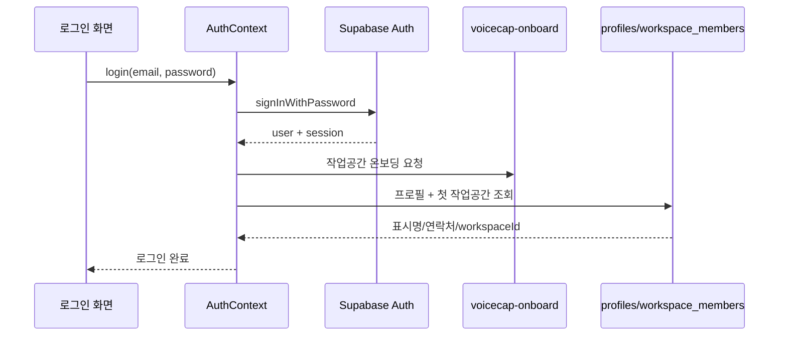
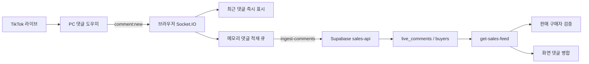

# 02. 웹 애플리케이션 상세 설계도

[전체 설계도](../../PROJECT_REPLICATION_BLUEPRINT.md) · [이전: 설치](01_NEW_PC_SETUP.md) · [다음: 백엔드·DB](03_BACKEND_DATABASE.md)

> 기준: 2026-09-26에 저장소의 실제 소스를 읽어 작성한 재현 문서. 이 문서는 현재 구현을 설명하며, 화면 문구·기획 문서·테스트 이름만으로 운영 기능이 완성되었다고 판단하지 않는다. 예시의 사용자·상품·ID는 설명을 위한 가짜 값이다. 실제 계정, 비밀번호, API 키, 고객 자료를 포함하지 않는다.

## 1. 무엇을 만드는 웹인가

이 프로젝트의 웹은 라이브 판매 방송을 보면서 판매자의 음성을 글자로 바꾸고, 그 글에서 구매자·금액·상품을 찾아 판매 내역을 만드는 React 애플리케이션이다. 댓글 수집과 프린터 제어는 브라우저 자체가 아니라 같은 PC에서 실행되는 댓글 도우미와 연결한다. 영구적인 공동 판매 자료의 주 저장소는 Supabase이다.

전체 사용 흐름은 다음과 같다.

1. 판매자가 로그인하고 자신의 작업공간을 불러온다.
2. 댓글 도우미를 실행하고 TikTok 아이디를 설정한다.
3. 방송 회차를 새로 시작하거나 기존 회차를 이어 간다.
4. 방송 탭 오디오 또는 마이크를 선택한다.
5. 클라우드 STT 또는 PC 로컬 STT가 음성을 글로 바꾼다.
6. 상품 등록·판매·정정·화면 캡처 명령을 파싱한다.
7. 구매자를 같은 회차의 클라우드 댓글과 대조한다. 확인하지 못한 판매는 보류한다.
8. 판매 목록에서 보류 사유, 금액, 구매자를 검토한다.
9. 상품 중심 판매 화면에서는 댓글 작성자를 선택하여 판매를 확정할 수도 있다.
10. 정산서·고객 회신·입금 자료·배송 정보를 관리한다. 실제 문자 발송에는 별도 서버·기기 연결이 필요하다.

### 초보 개발자를 위한 용어

| 용어 | 이 프로젝트에서의 뜻 |
|---|---|
| SPA | 주소별 HTML 파일을 여러 개 만드는 대신 React 화면을 바꾸는 웹 앱 |
| 라우트 | `/live`, `/sales`처럼 특정 화면에 대응하는 주소 |
| 컴포넌트 | 화면의 재사용 단위. 버튼, 모달, 페이지 등이 해당 |
| Context/Provider | 여러 화면이 같이 사용하는 로그인·판매·음성 상태를 제공하는 React 구조 |
| 서비스 | HTTP 호출, 오디오 처리, 파싱처럼 UI와 분리한 업무 함수 묶음 |
| STT | Speech-to-Text. 소리를 글자로 변환하는 단계 |
| LLM/AI 보완 | 이미 얻은 글·댓글·판매 근거를 분석하는 단계. STT와 다른 기능 |
| 작업공간 | 한 판매 조직의 자료를 묶는 `workspaceId` 단위 |
| 방송 회차 | 한 번의 라이브 판매를 묶는 `sessionId` 단위 |
| revision | 데이터를 수정할 때 비교하는 버전 번호. 오래된 화면의 덮어쓰기를 막기 위해 사용 |
| operationId | 같은 업무 요청의 중복 처리를 막기 위한 고유 요청 ID |
| 스냅샷 | 당시의 상품명·단가·이미지·발화 등을 남기는 복사본 |
| 폴링 | 일정 간격으로 서버에 새 자료가 있는지 묻는 방식 |
| 서명 URL | 비공개 이미지를 일정 시간 동안만 읽을 수 있는 임시 주소 |

## 2. 기술 구성과 실행 진입점

기준 파일은 [package.json](../../package.json), [src/main.tsx](../../src/main.tsx), [src/App.tsx](../../src/App.tsx), [vite.config.ts](../../vite.config.ts)이다.

| 항목 | 소스에 선언된 구성 |
|---|---|
| 패키지 이름/버전 | `voice-pin-web`, `1.0.0`, ESM (`type: module`) |
| UI | React `^18.3.1`, React DOM `^18.3.1` |
| 언어 | TypeScript `^5.7.2` |
| 번들러/개발 서버 | Vite `^6.0.1`, React Vite 플러그인 |
| 화면 이동 | React Router DOM `^6.28.0` |
| CSS | Tailwind CSS `^3.4.16`, PostCSS, Autoprefixer |
| 아이콘 | `lucide-react` |
| 클라우드 연결 | `@supabase/supabase-js` |
| 로컬 도우미 통신 | `socket.io-client` |
| 효과·클래스 도구 | `canvas-confetti`, `clsx`, `tailwind-merge` |
| 단위/계약 테스트 | Node.js 내장 `node:test`와 `assert` |

`^`가 붙은 값은 허용 범위이지 설치된 정확한 버전이 아니다. 같은 환경을 재현하려면 저장소의 `package-lock.json`을 유지하고 `npm ci`로 설치한다. 새 프로젝트에서 버전 범위만 복사하고 `npm install`하면 이후 시점의 다른 버전이 설치될 수 있다.

실행 경로:

```text
index.html의 #root
  → src/main.tsx
  → React.StrictMode
  → src/App.tsx
  → BrowserRouter + 각 Provider
  → AppLayout
  → 주소에 해당하는 Page
```

[tsconfig.json](../../tsconfig.json)은 `strict: true`, `target: ES2020`, `moduleResolution: bundler`, `jsx: react-jsx`, `noEmit: true`를 사용한다. `npm run build`는 `tsc && vite build`이므로 타입 검사 실패 시 빌드가 멈춘다. 웹 TypeScript의 `include`는 `src`이다. 이 명령이 모든 서버·모바일 코드를 검사하는 것은 아니다.

### 웹만 실행하는 최소 순서

```powershell
cd C:\dev\voice-pin-anti
npm ci
npm run dev
```

기본 접속 주소는 `http://localhost:3000`이다. Vite 설정은 `port: 3000`, `open: false`이다. 브라우저가 자동으로 열리지 않으므로 주소를 직접 연다. 3000번이 이미 사용 중이면 실제 접속 주소는 터미널의 Vite 출력을 확인한다.

```powershell
npm run build
npm run preview
```

`preview`는 빌드된 정적 웹 확인용이다. `configureServer`에 등록한 개발용 `/api/*` 미들웨어까지 실행하는 서버라고 생각하면 안 된다. 실제 AI 보조 API는 Vite 개발 서버 또는 Vercel 서버 함수 실행 환경이 있어야 한다.

### 코드가 참조하는 환경변수

| 위치 | 변수 이름 | 역할 |
|---|---|---|
| 브라우저 | `VITE_SUPABASE_URL` | 연결할 Supabase 프로젝트 URL |
| 브라우저 | `VITE_SUPABASE_PUBLISHABLE_KEY` | 공개 가능한 Supabase 클라이언트 키 |
| `api/ai-settings.ts`, `api/ai-health.ts` | `VITE_SUPABASE_URL` 또는 `SUPABASE_URL` | 보조 API가 연결할 Supabase URL |
| 같은 서버 함수 | `SUPABASE_SERVICE_ROLE_KEY` → `VITE_SUPABASE_PUBLISHABLE_KEY` → `SUPABASE_ANON_KEY` 순 | 서버 함수의 Supabase 클라이언트 키 선택 순서 |

예시 설정은 다음처럼 값 대신 새 환경의 값을 넣는다.

```dotenv
VITE_SUPABASE_URL=https://YOUR_PROJECT.supabase.co
VITE_SUPABASE_PUBLISHABLE_KEY=YOUR_PUBLIC_CLIENT_KEY
```

`VITE_` 변수는 브라우저 빌드에 포함된다. 서버 전용 키를 이 접두사로 만들면 안 된다. 환경변수 변경 뒤 개발 서버를 재시작하고, 배포한 정적 웹은 다시 빌드한다. `api/ai-settings.ts`와 `api/ai-health.ts`에는 URL 미설정 시 기존 프로젝트 주소를 사용하는 fallback이 있으므로 새 독립 환경에서는 URL을 명시해야 한다. 현재 파일의 기존 URL을 새 프로젝트의 기본값으로 복제하지 않는다.

## 3. 폴더를 읽는 순서

| 경로 | 역할 | 처음 확인할 파일 |
|---|---|---|
| `src/pages` | 사용자가 보는 페이지 | [LiveHomePage.tsx](../../src/pages/seller/LiveHomePage.tsx) |
| `src/components/common` | 헤더·사이드바·모달·오디오 그래프 | [Sidebar.tsx](../../src/components/common/Sidebar.tsx) |
| `src/components/live` | 상품 미리보기, AI 상태 표시 | [ProductRegistrationPreview.tsx](../../src/components/live/ProductRegistrationPreview.tsx) |
| `src/components/sales` | 구매자 대조·AI 근거·후보 적용 | [SaleAiActionButtons.tsx](../../src/components/sales/SaleAiActionButtons.tsx) |
| `src/context` | 앱 전체에 공유하는 상태 | [LiveContext.tsx](../../src/context/LiveContext.tsx) |
| `src/services` | 파서·통신·저장·장치 접근 | [productSalesApi.ts](../../src/services/productSalesApi.ts) |
| `src/types` | 데이터의 필드와 상태 정의 | [live.ts](../../src/types/live.ts), [productSales.ts](../../src/types/productSales.ts) |
| `api` | Vercel에서 실행할 AI 보조 HTTP API | [ai-health.ts](../../api/ai-health.ts) |
| `contracts/product-sales/v1` | 웹·Android·서버·도우미 공통 JSON 계약 | [README.md](../../contracts/product-sales/v1/README.md) |
| `test` | 파서·계약·업무 규칙·소스 구조 테스트 | [decimal-price.test.mjs](../../test/decimal-price.test.mjs) |

## 4. 화면과 라우팅 설계

라우팅의 기준은 [App.tsx](../../src/App.tsx)이다. 처음 `/`에 접속하면 로그인 초기화가 끝날 때까지 기다린다. 비로그인은 자동 로그인 저장 정보가 있으면 `/login`, 없으면 `/onboarding`으로 이동한다. 로그인한 관리자는 `/admin`, 판매자는 `/live`로 이동한다.

`ProtectedRoute`는 로그인 여부를 확인한다. `AdminRoute`는 `user.role === '관리자'`인지 확인한다. 이것은 화면 접근 제어이며, 실제 자료 권한 검사는 서버에서도 수행되어야 한다.

| 주소 | 페이지 파일/역할 | 접근 |
|---|---|---|
| `/onboarding` | [OnboardingPage](../../src/pages/auth/OnboardingPage.tsx): 서비스 소개·시작 | 공개 |
| `/login` | [LoginPage](../../src/pages/auth/LoginPage.tsx): 로그인·자동 로그인 저장 | 공개 |
| `/signup` | [SignupPage](../../src/pages/auth/SignupPage.tsx): 판매자 가입·이메일 확인 | 공개 |
| `/password/reset` | [PasswordResetPage](../../src/pages/auth/PasswordResetPage.tsx): 재설정 이메일 요청 | 공개 |
| `/pricing` | [PricingPage](../../src/pages/auth/PricingPage.tsx): 요금 안내 | 공개 |
| `/privacy` | [PrivacyPolicyPage](../../src/pages/legal/PrivacyPolicyPage.tsx): 개인정보 문서 | 공개 |
| `/live` | [LiveHomePage](../../src/pages/seller/LiveHomePage.tsx): 방송 회차, STT, 자막, 댓글, 캡처, 실시간 판매 | 로그인 |
| `/seller/product-sales`, `/sales/product` | [ProductSalesPage](../../src/pages/seller/ProductSalesPage.tsx): 수동 상품 등록·댓글 선택 판매 | 로그인 |
| `/stt-vocabulary` | [SttVocabularyPage](../../src/pages/seller/SttVocabularyPage.tsx): 클라우드 STT 발음 힌트(최대 50개) 등록·저장 | 로그인 |
| `/recognition-rules`, `/rules` | [RecognitionRulesPage](../../src/pages/seller/RecognitionRulesPage.tsx): 인식 단어·캡처 영역 설정 | 로그인 |
| `/comments` | [CommentRecordsPage](../../src/pages/seller/CommentRecordsPage.tsx): 댓글/판매멘트 기록 | 로그인 |
| `/sales` | [SalesListPage](../../src/pages/seller/SalesListPage.tsx): 판매 목록·필터·일괄 작업 | 로그인 |
| `/sales/:id` | [SalesDetailPage](../../src/pages/seller/SalesDetailPage.tsx): 판매 상세·수정·인쇄·AI 관련 보기 | 로그인 |
| `/sales/:id/capture` | [CaptureViewerModal](../../src/pages/seller/CaptureViewerModal.tsx): 판매 캡처 보기 | 로그인 |
| `/sales/review` | [SalesReviewPage](../../src/pages/seller/SalesReviewPage.tsx): 방송 후 행별 수정·일괄 확정 | 로그인 |
| `/invoices` | [InvoiceManagementPage](../../src/pages/seller/InvoiceManagementPage.tsx): 고객별 정산서 | 로그인 |
| `/shipments` | [ShipmentManagementPage](../../src/pages/seller/ShipmentManagementPage.tsx): 배송 정보·안내 문자 | 로그인 |
| `/settlement` | [SettlementPage](../../src/pages/seller/SettlementPage.tsx): 기간별 판매 합계·내보내기 | 로그인 |
| `/seller/devices`, `/devices` | [DeviceManagementPage](../../src/pages/seller/DeviceManagementPage.tsx): 기기 연결·권한·출력 기기 | 로그인 |
| `/seller/helper`, `/helper` | [CommentHelperPage](../../src/pages/seller/CommentHelperPage.tsx): 연결 상태·댓글 수집/알림·전표 출력·자동 실행/진단 설정. STT 하드웨어 가속은 관리자만 표시 | 로그인 |
| `/subscription` | `/subscription/plans`로 이동 | 로그인 |
| `/subscription/plans` | [PlanSelectionPage](../../src/pages/subscription/PlanSelectionPage.tsx): 플랜 선택 | 로그인 |
| `/subscription/payment` | [PaymentPage](../../src/pages/subscription/PaymentPage.tsx): 결제 UI | 로그인 |
| `/subscription/manage` | [SubscriptionManagePage](../../src/pages/subscription/SubscriptionManagePage.tsx): 구독 UI | 로그인 |
| `/notifications/settings` | [NotificationSettingsPage](../../src/pages/my/NotificationSettingsPage.tsx): 알림 설정 | 로그인 |
| `/settings/notifications` | 위 알림 주소로 이동 | 로그인 |
| `/my` | [MyPage](../../src/pages/my/MyPage.tsx): 프로필·환경·백업 관련 UI | 로그인 |
| `/error/permission` | [PermissionErrorModal](../../src/pages/my/PermissionErrorModal.tsx): 권한 오류 안내 | 로그인 |
| `/admin` | [AdminDashboardPage](../../src/pages/admin/AdminDashboardPage.tsx): 관리 개요 | 관리자 |
| `/admin/sales` | [AdminSalesManagementPage](../../src/pages/admin/AdminSalesManagementPage.tsx): 관리자 판매 조회 | 관리자 |
| `/admin/members` | [MemberManagementPage](../../src/pages/admin/MemberManagementPage.tsx): 회원 상태·STT 이용권 | 관리자 |
| `/admin/reports` | [ReportManagementPage](../../src/pages/admin/ReportManagementPage.tsx): 신고 관리 UI | 관리자 |
| `/admin/stats` | [AdminStatsPage](../../src/pages/admin/AdminStatsPage.tsx): 통계 UI | 관리자 |
| `/admin/ai` | [AdminAiSettingsPage](../../src/pages/admin/AdminAiSettingsPage.tsx): AI 두 슬롯 설정·진단 | 관리자 |
| 그 밖의 주소 | `/`로 이동 | 공통 |

### 화면 외형을 동일하게 유지하는 법

[AppLayout](../../src/App.tsx)은 위쪽 `Header`, 큰 화면의 `Sidebar`, 작은 화면의 `MobileBottomNav`, 본문으로 나뉜다. 인증·공개 정책 화면에서는 메뉴를 숨긴다. 사이드바 접기 상태는 `voicecap_sidebar_collapsed`에 저장된다.

[tailwind.config.js](../../tailwind.config.js)의 `brand` 파란색 팔레트와 `tiktok` 색상을 유지한다. [index.css](../../src/index.css)는 Pretendard 우선 글꼴, 모바일 safe-area, 스크롤바, 댓글 알림 애니메이션을 정의한다. 페이지별 Tailwind 클래스가 레이아웃의 상당 부분을 결정하므로 CSS만 복사하면 동일한 화면이 되지 않는다. `src/pages`, `src/components`, `index.html`, Tailwind/PostCSS 설정을 같이 옮긴다.

[index.html](../../index.html)은 Pretendard 1.3.9 CSS를 jsDelivr에서 읽는다. 인터넷에 연결되지 않으면 OS 기본 대체 글꼴로 표시되어 글자 폭과 줄바꿈이 달라질 수 있다. 같은 외형을 확인할 때 글꼴 다운로드 성공 여부도 살핀다. 문서 제목·Open Graph 주소 등 배포 메타데이터는 새 독립 배포의 주소에 맞추어 정한다.

## 5. Provider 관계: 공유 상태가 연결되는 순서

현재 중첩 순서를 그대로 유지한다.

```text
BrowserRouter
└─ AuthProvider
   └─ SalesProvider
      └─ CommerceProvider
         └─ ProductSalesProvider
            └─ SttVocabularyProvider
               └─ LiveProvider
                  └─ CommentCaptureProvider
                     └─ AppDataProvider
                        └─ AppLayout + Routes
```

안쪽 Provider는 바깥쪽 Provider의 값을 읽을 수 있다. 예를 들어 `LiveProvider`는 `useSales`, `useAuth`, `useProductSales`를 사용한다. 이 순서를 바꾸면 `use... must be used within ...Provider` 오류가 발생할 수 있다.

| Provider | 핵심 상태 | 원본/연결 대상 |
|---|---|---|
| [AuthContext](../../src/context/AuthContext.tsx) | 사용자, 토큰, 작업공간, 초기화 완료 여부 | Supabase Auth, `profiles`, `workspace_members`, `voicecap-onboard` |
| [SalesContext](../../src/context/SalesContext.tsx) | `SaleRecord[]`, 저장·수정·확정·CSV·인쇄 상태 | Supabase `sales` 직접 조회/저장, 실시간 변경 구독, 로컬 도우미 인쇄 |
| [CommerceContext](../../src/context/CommerceContext.tsx) | 문자, 고객 구매 주장, 정산서, 입금, 배송, 확인 상태 | 로컬 캐시 + Supabase 관련 테이블 + SMS bridge |
| [ProductSalesContext](../../src/context/ProductSalesContext.tsx) | bootstrap, 활성 회차·상품, 댓글 feed, 음성 후보 | `sales-api` Edge Function |
| [SttVocabularyContext](../../src/context/SttVocabularyContext.tsx) | 판매자별 클라우드 STT 발음 힌트(최대 50개) | [sttVocabularyService](../../src/services/sttVocabularyService.ts)를 통한 작업공간별 로컬 보관 + Supabase `workspace_settings`의 `stt_vocabulary` namespace 동기화 |
| [LiveContext](../../src/context/LiveContext.tsx) | 청취, 오디오 파형, 전사, 캡처, 음성 명령·정정 | 오디오/STT/화면 서비스, 판매·상품 Context |
| [CommentCaptureContext](../../src/context/CommentCaptureContext.tsx) | 수집 토글, 연결 상태, 최근 댓글, 알림 | 댓글 도우미 Socket.IO + `ingest-comments` + 판매 feed |
| [AppDataContext](../../src/context/AppDataContext.tsx) | 규칙, 구독 UI, 알림, 관리자 목록 | 로컬 저장 + 일부 workspace settings/관리 Edge API |

React 상태와 `useRef`를 혼동하지 않는다. 상태는 화면을 다시 그리기 위한 값이고, ref는 비동기 콜백이 최신 값·진행 중 여부·세대 번호를 읽는 데 사용한다. 음성 처리에서 ref를 단순한 state로 교체하면 중지 후 늦은 STT 결과가 판매로 저장되는 등의 문제가 생길 수 있다.

## 6. 로그인과 새 PC에서의 사용자 복원

실제 클라우드 로그인 흐름은 다음과 같다.



관리자 여부는 입력 이메일에 포함된 문자열이 아니라 **실제 클라우드 모드에서는** `authUser.app_metadata.role === 'ADMIN'`으로 판단한다. 가입 UI에서 관리자를 선택하여 관리자 계정을 만들 수 없도록 `signup`이 차단한다. 실제 클라우드 회원가입은 `auth.signUp`, 이메일 코드 확인은 `verifyOtp`, 재발송은 `resend`를 사용한다.

단, Supabase 두 공개 환경변수가 없으면 별도 데모 로그인 분기가 동작한다. 이 분기는 이메일에 `seller` 또는 `admin`이 있거나 비밀번호에 `demo`가 있으면 로컬 사용자를 만든다. 이는 오프라인 화면 확인용이며 클라우드 인증 정책이 아니다. `ProductSalesContext`는 이 경우에도 실제 `sales-api`를 호출하므로 전체 업무가 오프라인으로 구현되는 것은 아니다.

### 저장소 두 종류를 구분한다

1. [supabaseClient.ts](../../src/services/supabaseClient.ts)는 `persistSession: false`로 전체 Supabase 세션의 영구 저장을 끈다. 새로고침 복원에 필요한 refresh token은 `sessionStorage`의 `voicecap_session_refresh_token`에 보관한다.
2. 별개인 [authCredentialsService.ts](../../src/services/authCredentialsService.ts)는 자동 로그인 선택 시 이메일과 비밀번호를 Base64 형태로 `localStorage`의 `voicecap_saved_login_credentials`에 기록한다. Base64는 되돌릴 수 있는 인코딩이며 암호화가 아니다.

따라서 다른 PC로 옮길 때 브라우저 전체 저장소를 통째로 복제하는 방식은 필요하지 않다. 새 PC에서 같은 Supabase 프로젝트와 같은 계정으로 로그인하여 작업공간 자료를 다시 읽는다. 비밀번호를 문서·소스·백업 예시에 넣지 않는다.

현재 `resetPassword`는 이메일 재설정 링크 발송만 구현하고 두 번째 `newPass` 인자를 사용하지 않는다. [PasswordResetPage](../../src/pages/auth/PasswordResetPage.tsx)에 새 비밀번호 입력 UI가 있어도 실제 클라우드 `auth.updateUser({ password })` 완료 흐름은 이 코드에서 확인되지 않는다. 재현 완료 검증에서 이메일 발송 성공과 비밀번호 변경 성공을 분리해야 한다.

## 7. 두 가지 판매 데이터 경로

이 프로젝트를 다시 만드는 사람이 가장 먼저 알아야 할 구조적 특징이다. 이름이 비슷해도 아래 두 경로는 완전히 같은 함수가 아니다.

| 구분 | 음성 중심 라이브 경로 | 상품·댓글 중심 API 경로 |
|---|---|---|
| 중심 타입 | `src/types/live.ts`의 `SaleRecord` | `src/types/productSales.ts`의 `Sale` |
| 주요 Context | `LiveContext` + `SalesContext` | `ProductSalesContext` |
| 저장 호출 | `addSale` → `remoteWorkspaceService.saveSale` → `sales.upsert` | `productSalesApi.commitSales` → `sales-api` |
| 구매자 | 닉네임 우선, `buyerId` 선택 필드 | `buyerId` 필수 |
| 가격 | 발화에서 추출한 `amount`, 상품 정보 연결 | 상품 단가 × 수량 |
| 상태 | `자동저장`, `수동수정`, `확정`, `보류` | `recordState: ACTIVE/CANCELLED`, revision |
| 인쇄 | Socket.IO `print:sale`, `printRevision` | API 응답의 `printJobs`, 서버 작업 큐 |
| 대표 화면 | 라이브 홈·판매 목록·판매 상세 | 상품 중심 판매 화면 |

재현할 때 모든 판매 저장을 `commit-sales` 한 가지라고 설명하거나, 모든 인쇄를 로컬 소켓 한 가지라고 구현하면 현재 동작과 달라진다. 신규 설계에서 통합하려면 별도 리팩터링 작업으로 취급하고, 우선 현재 두 경로를 각각 검증한다.

### 예시: 음성 판매 화면 데이터

```json
{
  "id": "s-11111111-1111-4111-8111-111111111111",
  "sessionId": "22222222-2222-4222-8222-222222222222",
  "buyerNickname": "예시구매자",
  "amount": 17000,
  "recognizedAt": "2026-09-26T01:00:00.000Z",
  "rawTranscript": "예시구매자님 구매확정 가격은 1.7입니다",
  "status": "보류",
  "productCode": "0007",
  "quantity": 1,
  "unitPrice": 17000,
  "source": "WEB_VOICE",
  "revision": 1,
  "printStatus": "NOT_REQUESTED"
}
```

같은 닉네임의 클라우드 댓글을 확인하지 못했다면 금액이 있어도 보류일 수 있다. 상품번호는 `"0007"`처럼 문자열이다. 숫자 `7`로 바꾸면 앞자리 0이 사라진다. 금액은 표시 문자열이 아니라 원 단위 숫자를 저장한다.

## 8. 실제 라이브 음성 처리 파이프라인

### 8.1 시작과 종료

[LiveHomePage](../../src/pages/seller/LiveHomePage.tsx)는 이어가기/새 회차 선택을 거쳐 서버 회차를 구한 뒤 `startListening(audioSourceMode, session.id)`를 호출한다. `generateSessionId`는 서버 회차가 준비되기 전의 임시 표시값 생성기이므로 실제 회차 키를 대신해서 쓰지 않는다.

입력 모드는 다음 두 가지이다.

- `TAB_AUDIO`: 사용자가 공유한 방송 탭의 오디오를 읽는다. 탭 공유에서 오디오를 포함해야 한다.
- `MIC`: 브라우저의 마이크 입력을 읽는다.

`TAB_AUDIO` 연결 실패 때 몰래 마이크로 바꾸지 않는다. 청취 중지는 탭 공유 원본 트랙을 보존하여 재개할 수 있게 하고, 명시적인 공유 해제·로그아웃·사용자 교체는 별도로 처리한다. 중복 클릭 방지, 로그인 세대 번호, 청취 세대 번호, 소유 사용자 ID 비교가 포함되어 있다.

브라우저의 미디어 권한과 탭 선택은 새 PC에서 다시 허용해야 한다. 이전 PC의 공유 스트림이나 마이크 권한은 Git 복사로 이동하지 않는다.

### 8.2 오디오를 STT로 전송

[audioCaptureService.ts](../../src/services/audioCaptureService.ts)의 핵심 흐름:

```text
MediaStream
→ AudioContext(16,000 Hz)
→ MediaStreamAudioSourceNode
→ AnalyserNode (화면의 파형/볼륨)
→ ScriptProcessorNode (4,096 샘플)
→ Float32를 Int16 PCM으로 변환
→ 약 256ms 단위 ArrayBuffer
→ 선택한 STT 서비스
```

현재 구현은 `ScriptProcessorNode`를 사용한다. 재현 단계에서 이를 다른 오디오 API로 바꾸면 처리 타이밍과 정지/재개 동작도 다시 검증해야 한다.

| STT 방식 | 웹 서비스 | 실제 연결 |
|---|---|---|
| 클라우드 Deepgram | [deepgramService.ts](../../src/services/deepgramService.ts) | Deepgram WebSocket, `linear16`, 16 kHz, 한국어, `nova-3` 설정 |
| 클라우드 Soniox | 같은 서비스 | Soniox WebSocket, `pcm_s16le`, 16 kHz, 확정 토큰 누적 처리 |
| 로컬 STT | [localSttService.ts](../../src/services/localSttService.ts) | 로컬 도우미와 STT bridge |
| 브라우저 SpeechRecognition fallback | `deepgramService.ts` | 허용된 마이크 모드의 fallback; 탭 소리를 대신 읽는 기능이 아님 |

클라우드 STT는 관리자 지정 공급자·키를 받아 사용하며 `allowAdminSttKey` 권한을 확인한다. 로컬 STT 모드와 모델 선택(`large-v3-turbo`, `small`, `base`)은 별도로 존재한다. 관리자의 LLM 슬롯 설정은 이 STT 공급자 선택과 같은 설정이 아니다.

`/stt-vocabulary`의 발음 힌트는 음성 모델을 훈련하지 않는다. 판매자가 최대 50개(각 40자 이내)의 상품명·브랜드명·고유명사를 저장하면 다음 클라우드 STT WebSocket 연결을 열 때 초기 요청 설정으로 함께 보낸다. Deepgram Nova-3의 `keyterm`과 Soniox v5의 `context.terms`를 사용하며 이미 열린 연결에는 소급 적용하지 않는다. 로컬 Whisper에는 적용되지 않는다. 인식률 향상은 보장되지 않으므로 실제 자막으로 확인한다.

### 8.3 중간 전사와 확정 전사

중간 전사(`isFinal: false`)는 화면 자막으로 보낸다. 확정 전사(`isFinal: true`)는 상품·판매·정정 명령 파이프라인에 들어간다. 자막 분할은 [captionStreamService.ts](../../src/services/captionStreamService.ts)의 `InterimStreamChunker`, `splitTranscriptIntoTwoLineChunks`가 담당한다. 기본 자막 분할 기준은 40자이다.

Soniox는 확정된 텍스트 조각을 따로 누적하여 문장 중간에서 판매가 여러 번 저장되지 않도록 한다. 누적 버퍼 한도는 600자, 판매 문장 대기 시간은 10초이다. 로컬 STT가 `isAbnormal`을 전달하면 반복 생성으로 판단한 전사를 업무 처리에 넣지 않고 화면 경고만 남긴다.

화면 전사 목록은 최근 300건만 표시한다. 전체 회차 로그는 메모리와 `voicecap_transcripts:<workspace>:<session>` 로컬 저장소에 보관하며 TXT/CSV 다운로드를 지원한다. 이 전체 로그를 클라우드 판매 테이블과 동일하게 자동 동기화한다고 가정하면 안 된다.

### 8.4 상품 등록 음성

`LiveContext.handleVoiceProductTranscript`는 다음처럼 동작한다.

1. `상품 등록`을 감지하면 30초 동안 유지하는 상품 초안을 만든다.
2. 현재 화면을 촬영한다. 촬영이 실패해도 초안 처리는 계속될 수 있다.
3. `상품번호 7번`, `가격 17,000원` 같은 후속 발화에서 번호와 단가를 채운다.
4. 캡처 처리가 끝나고 단가가 정해지면 `registerProduct`를 실행한다.
5. 사진이 없으면 `NUMBER_IMAGE` 이미지를 만들어 업로드한다.
6. 서버 상품 초안을 commit하고 현재 판매 상품을 바꾼다.

판매가 먼저 인식되었는데 활성 상품이 없다면 `ensureProductForVoiceSale`이 상품을 보완한다. 최근 90초 캡처 또는 상품 초안의 이미지를 사용하고, 없다면 번호 이미지를 만든다. 자동 생성 번호 충돌은 조건에 따라 최대 3번 시도한다. 서버 등록에 실패하면 fallback 번호/이미지를 붙인 판매 데이터가 만들어질 수 있으므로 상품 등록 성공과 판매 화면 표시를 별개로 확인한다.

### 8.5 구매자·금액 추출과 댓글 검증

[salesExtractor.ts](../../src/services/salesExtractor.ts)는 다음 업무 표현을 처리한다.

- 구매확정, 결제완료, 주문확정, 낙찰, 판매완료 같은 트리거.
- `예시구매자님`, `닉네임 예시구매자` 등의 구매자 표현.
- 원·만·천 단위 금액과 방송 관용 표현인 `1.7` → `17,000원`, `0.9` → `9,000원`.
- 날짜·버전처럼 보이는 소수를 가격으로 잘못 읽지 않기 위한 일부 예외.
- 필수 닉네임이나 양수 금액을 추출하지 못한 결과는 보류.

추출 후 [commentNicknameVerifier.ts](../../src/services/commentNicknameVerifier.ts)가 같은 회차의 댓글과 대조한다. 실제 `persistVoiceSale`은 우선 `get-sales-feed`로 클라우드 댓글 최신 50개를 다시 읽고, 실패하면 마지막 클라우드 feed를 사용한다. 화면에 즉시 보이는 로컬 소켓 댓글만을 판매 확정 근거로 사용하지 않는다.

대조 기준은 같은 `sessionId`, 인식 시간과 댓글 시간 차이 3분 이내이다. 닉네임 정규화·유사도·끝번호·구매 의사 표현·시간 근접성을 고려한다. 끝번호가 같은 후보가 여러 명이면 한 명을 임의로 선택하지 않는다. 검증 성공 시 댓글의 실제 닉네임을 사용하고, 검증 실패 시 판매 상태를 보류로 둔다.

### 8.6 판매 저장·캡처·인쇄

`persistVoiceSale`은 다음 값을 조합하여 `SalesContext.addSale`로 넘긴다.

- 인식된 구매자, 원 단위 금액, 인식 시각, 원문.
- 현재 상품 ID, 상품번호·상품명·이미지의 당시 값.
- `source: WEB_VOICE`, `quantity: 1`, 관련 근거.
- 댓글 검증 메모와 구조화한 보류 사유.

화면 공유가 살아 있거나 `캡처하세요`가 포함되면 판매에 화면 캡처를 추가로 연결한다. 단독 `화면 캡처` 명령도 지원한다. 캡처 영역은 [screenCaptureService.ts](../../src/services/screenCaptureService.ts)의 공유 화면과 비율 좌표 설정을 이용한다.

`SalesContext`는 UI 목록에 먼저 반영하고 Supabase 저장은 비동기로 진행한다. 서버 저장 오류가 콘솔에만 기록되는 경로가 있으므로 화면에 판매가 보인다는 사실만으로 영구 저장 완료라고 판단하지 않는다. 새로고침·두 번째 PC 재조회가 저장 검증에 필요하다.

보류가 아니고, 금액이 양수이며, 구매자가 확인 가능한 판매는 자동 인쇄 대상으로 잡힌다. `print:sale` 요청에는 판매 ID와 `printRevision`을 넣는다. 응답 제한은 15초이고 결과는 `PRINTED/FAILED`로 반영한다. 판매자 수정은 revision을 올려 재출력하고 단순 이미지 추가만으로는 재출력하지 않는다. 서버 작업 큐 기반 `PrintJobStatus`와 이 UI의 `SalePrintStatus`를 같은 enum으로 합치지 않는다.

## 9. 댓글 파이프라인과 동기화

관련 파일은 [commentStreamService.ts](../../src/services/commentStreamService.ts), [CommentCaptureContext.tsx](../../src/context/CommentCaptureContext.tsx), [types/comment.ts](../../src/types/comment.ts)이다.



- 도우미 연결은 고정 로컬 주소를 사용한다. 과거 설정에 다른 사설 IP가 있어도 자동 연결 경로는 설치형 도우미 기준이다.
- Socket.IO transport는 `websocket`이고 연결 재시도 간격은 1초에서 최대 5초이다.
- 이벤트는 `collect:start`, `collect:stop`, `tiktok:status`, `tiktok:stats`, `comment:new`, `cloud:config`, `print:sale` 등을 사용한다.
- 댓글 수집 시작 조건은 수집 토글 ON, 라이브 청취 중, 서버 연결 완료, TikTok 아이디 설정이다.
- 댓글 중복 제거는 플랫폼 메시지 ID 우선이다. 같은 사람이 같은 문장을 다시 쓴 새로운 메시지는 보존한다.
- 화면은 최근 100개 댓글을 유지하고, 중복 검사 집합은 1,500개 초과 시 최근 800개로 줄인다.
- 클라우드 큐는 같은 회차별 최대 50개씩 전송한다. 기본 100ms 후 묶어 보내고 실패하면 큐에 되돌린 후 1초 간격으로 다시 처리한다.
- 화면의 즉시 댓글은 플랫폼 메시지 ID로 클라우드의 정식 레코드와 병합한다.
- 이 큐는 React ref의 메모리 자료이다. 브라우저 종료까지 보장하는 영구 오프라인 큐로 구현되어 있지는 않다.

`ProductSalesContext`의 정기 feed 조회는 **로그인 + 청취로 활성화한 polling + `/live` 주소 + 활성 회차** 조건에서만 돈다. 기본 2초 주기이며 실패 시 4초부터 최대 30초까지 늘린다. `/seller/product-sales` 화면 자체가 자동 폴링을 켜는 것은 아니므로 그 화면의 새로고침 버튼 동작도 확인한다. 오래된 회차·오래된 revision 응답은 현재 화면을 덮어쓰지 않게 검사한다.

## 10. 상품 중심 API 화면을 구현하는 법

[ProductSalesPage.tsx](../../src/pages/seller/ProductSalesPage.tsx)는 별도의 새 대형 프레임워크가 아니라 기존 Provider의 함수를 사용한다.

### 10.1 초기 자료

로그인 후 `get-bootstrap`에서 작업공간, 설정, 활성 회차, 활성 상품, 프린터 상태, 권한을 받는다. 상품 이미지 경로는 비공개 저장소의 서명 URL로 바꾸어 표시한다.

### 10.2 상품 등록

```text
폼 입력
→ 숫자만 입력했으면 상품번호, 문자면 상품명으로 분류
→ 입력 가격의 쉼표 제거 후 정수 파싱
→ prepare-product (operationId + session revision)
→ 번호 이미지 또는 사진을 서명 upload URL에 PUT
→ commit-product (새 operationId + draft/session revision)
→ 활성 상품/회차 갱신
```

현재 수동 웹 폼에는 직접 카메라 촬영 단계가 없다. [productImageService.ts](../../src/services/productImageService.ts)가 720×720 JPEG 번호 이미지를 생성하고 실제 저장소에 업로드한다. 업로드는 이미지 MIME 형식과 4MB 제한을 검사한다. 저장소에는 이미지 경로를 보존하며, 일시적인 서명 URL을 영구 식별자로 쓰지 않는다.

### 10.3 댓글 선택 판매

선택 상태는 `Map<buyerId, { quantity, commentIds, nickname }>`이다. 동일 구매자의 댓글 여러 개를 선택해도 기본 수량은 1개이다. 수량은 `+/-`로 별도 조절하며 1보다 작아지지 않는다. 확정 시 현재 상품과 회차 revision, 구매자별 수량, 근거 댓글 ID를 서버로 보낸다.

가짜 요청 예시:

```json
{
  "action": "commit-sales",
  "operationId": "11111111-1111-4111-8111-111111111111",
  "sessionId": "22222222-2222-4222-8222-222222222222",
  "productId": "33333333-3333-4333-8333-333333333333",
  "expectedProductRevision": 1,
  "expectedSessionRevision": 2,
  "buyers": [
    {
      "buyerId": "44444444-4444-4444-8444-444444444444",
      "quantity": 2,
      "sourceCommentIds": ["55555555-5555-4555-8555-555555555555"]
    }
  ]
}
```

응답은 `CommonApiResponse<T>` 형태이다.

```json
{
  "ok": false,
  "apiVersion": 1,
  "serverTime": "2026-09-26T01:00:00.000Z",
  "error": {
    "code": "REVISION_CONFLICT",
    "message": "최신 상품 상태를 다시 읽어 주세요.",
    "retryable": false
  }
}
```

위 문구는 설명용이다. 정확한 계약 필드는 [envelope.schema.json](../../contracts/product-sales/v1/schemas/envelope.schema.json), [request.schema.json](../../contracts/product-sales/v1/schemas/request.schema.json), [fixtures](../../contracts/product-sales/v1/fixtures/commit_sales.json)를 기준으로 한다.

### 10.4 웹 API 래퍼 전체 분류

[productSalesApi.ts](../../src/services/productSalesApi.ts)는 모두 Supabase `sales-api` 한 함수에 `{ action, ...payload }`를 보낸다.

| 기능 | action |
|---|---|
| 초기화·설정 | `get-bootstrap`, `update-settings` |
| 기기 | `list-devices`, `update-device-capabilities`, `set-output-device` |
| 회차 | `start-session`, `end-session`, `list-sessions` |
| 상품 | `prepare-product`, `update-product-draft`, `commit-product`, `activate-product`, `list-session-products` |
| 댓글·feed | `get-sales-feed`, `ingest-comments`, `list-live-comments`, `delete-live-comments` |
| 구매자 | `search-buyers`, `confirm-buyer` |
| 판매 | `commit-sales`, `get-operation`, `get-product-sales` |
| 변경 미리보기 | `prepare-product-image`, `preview-product-change`, `commit-product-change` |
| 인쇄 조회·재출력 | `get-print-status`, `request-reprint` |

함수가 서비스 파일에 존재하는 것과 모든 화면에서 호출하는 것은 다르다. 현재 `previewProductChange`/`commitProductChange`는 웹 서비스에 있지만 `src` 화면 호출은 확인되지 않는다. `ProductSalesContext.processVoiceUtterance`도 정의·제공은 되어 있으나 현재 `src` 내 실제 호출자가 확인되지 않는다. 이 함수의 `setPrice` 분기는 빈 주석만 있다. 주된 음성 등록·판매는 앞 절의 `LiveContext` 경로다.

## 11. 보류·정정·AI 보완 구조

### 11.1 규칙을 먼저 적용

[pendingSalesService.ts](../../src/services/pendingSalesService.ts)는 닉네임 누락, 끝번호만 인식, 금액 누락, 미완성 발화, 댓글 지연 등의 사유를 구조화한다. 원문·관련 댓글 ID·당시 상품/금액·이미지를 `evidenceSnapshot`에 담고 간이 해시를 만든다.

`LiveContext`는 직전 20초 이내의 보류 판매에 후속 발화를 연결할 수 있다. 먼저 규칙 평가로 해결하고, 해결되지 않으며 원격 인증이 있으면 `trigger-pending-ai`로 후속 발화를 보낸다. 단순히 AI가 준비되어 있다는 표시만으로 모든 보류 판매가 항상 자동 해결되는 것은 아니다.

### 11.2 정정은 새 판매와 다르다

[voiceCorrectionService.ts](../../src/services/voiceCorrectionService.ts)는 `아니고`, `변경`, 취소/복원 의도, 대상 상품·구매자·금액을 해석한다. 대상이 유일할 때 변경하고 후보가 여러 건이면 보류 정정 요청을 만든다. `12번이요` 같은 후속 발화로 대상을 좁히는 경로가 있다. 미완성 정정은 중간 값으로 저장하지 않는 규칙이 포함되어 있다.

별도의 [voiceCommandParser.ts](../../src/services/voiceCommandParser.ts)는 `수정 시작`, 필드 수정, `수정 완료` 같은 편집 명령을 다룬다. 또 다른 [voiceSaleCandidate.ts](../../src/services/voiceSaleCandidate.ts)에도 동명의 `parseVoiceCommand`가 있으므로 import 경로를 구분한다.

### 11.3 AI 설정 화면

AI 설정은 [types/aiSettings.ts](../../src/types/aiSettings.ts)와 [AdminAiSettingsPage.tsx](../../src/pages/admin/AdminAiSettingsPage.tsx)에 정의된다.

| 설정 | 뜻 |
|---|---|
| `slot1`, `slot2` | 주/대체 AI 연결 두 개 |
| `primarySlot` | 먼저 사용할 슬롯 번호 |
| `type` | `LOCAL` 또는 `CLOUD` |
| `provider` | Ollama, LM Studio, vLLM, OpenAI, Anthropic, Google, DeepSeek, Custom 등의 선택 값 |
| `location` | `SAME_PC`, `LAN`, `EXTERNAL_IP` |
| `routingMode` | `PC_HELPER` 또는 `SERVER_DIRECT` |
| `endpointUrl`, `model` | 호출 주소와 모델 식별자 |
| `authType` | 인증 없음/Bearer/API key/사용자 정의 헤더 |
| `version`, `appliedVersion`, `isDraft` | 저장한 설정과 실제 적용 설정 구분 |
| `autoFallbackEnabled` | 주 슬롯 실패 시 대체 사용 설정 |
| `recoveryIntervalSeconds`, `autoReturnToPrimary` | 주 슬롯 회복 점검·복귀 설정 |

기본값은 슬롯 1 Ollama `qwen2.5:7b`, 동일 PC, `PC_HELPER`, 슬롯 2 OpenAI `gpt-4o-mini`, 외부, `SERVER_DIRECT`이다. 이는 코드의 초기값이며 최신 추천 모델이나 설치 확인 결과가 아니다. 실제 사용 가능한 모델 이름을 새 PC의 실행 서버에서 확인한다.

브라우저 API [aiSettingsApi.ts](../../src/services/aiSettingsApi.ts)는 설정·진단뿐 아니라 `create-ai-task`, `process-ai-task`, `get-ai-tasks`, `get-ai-runtime-status`, 보류 해결, 일괄 확정, 음성 정정·복원 요청을 래핑한다. 작업 큐·권한·모델 호출의 상세 구현은 Supabase 서버 설계와 함께 읽어야 한다.

### 11.4 AI 근거 화면

[SaleAiEvidenceModal](../../src/components/sales/SaleAiEvidenceModal.tsx), [SaleAiActionButtons](../../src/components/sales/SaleAiActionButtons.tsx)는 상태, 근거, 적용 후보, 되돌리기 등 판매 검토 UI를 담당한다. AI 답변만 표시하는 것보다 원본과 변경 이유를 함께 제시하려는 구조다.

다만 현재 `remoteWorkspaceService.toSaleRow/mapSale`은 `SaleRecord`의 `buyerId`, `revision`, `pendingReasons`, `evidenceSnapshot`, `aiVerification`, `history`를 매핑하지 않는다. 따라서 웹 메모리에서 만든 모든 근거가 이 직접 저장 경로를 통해 다른 PC에 완전히 복원된다고 보장할 수 없다. 서버의 별도 업무 처리로 저장되는 항목과 웹 직접 저장 항목을 분리하여 점검해야 한다.

## 12. Vercel AI 보조 API와 개발 서버 차이

이 프로젝트의 `api` 폴더는 전체 판매 백엔드가 아니다. 판매·상품의 주 API는 Supabase Edge Function이고, 이 폴더는 AI 설정/모델 목록/건강 진단의 보조 경로이다.

| 엔드포인트 | 구현 | 동작 |
|---|---|---|
| `/api/ai-settings` | [api/ai-settings.ts](../../api/ai-settings.ts) | `get-ai-settings`, `save-ai-settings`, `apply-ai-settings` 처리 |
| `/api/ai-models` | [api/ai-models.ts](../../api/ai-models.ts) | OpenAI 호환 `/v1/models`, Ollama `/api/tags` 목록 조회 |
| `/api/ai-health` | [api/ai-health.ts](../../api/ai-health.ts) | 연결·모델·추론 3단계 진단 |

[vercel.json](../../vercel.json)은 `/api/`를 제외한 주소를 `/index.html`로 rewrite하여 `/sales/...` 직접 접근과 새로고침을 지원한다. 다른 정적 호스팅을 사용해도 같은 SPA fallback이 필요하다.

### 개발 모드

[vite.config.ts](../../vite.config.ts)가 `/api/ai-settings`와 `/api/ai-health` 요청 body를 읽어 같은 handler를 호출한다. `/api/ai-models`만은 별도 개발용 간이 구현이며 다음 차이가 있다.

- 개발용 모델 조회는 쿼리의 `endpointUrl`을 사용한다.
- Vercel 구현에 있는 인증 헤더 처리와 Ollama `/api/tags` fallback을 개발 미들웨어가 동일하게 구현하지 않는다.
- 개발용 요청 제한은 4초, Vercel 모델 목록 프록시 제한은 5초이다.

따라서 개발 서버에서 모델 목록을 찾는 것과 배포 서버에서 찾는 것을 각각 시험한다.

### 브라우저에서의 fallback 순서

| 기능 | 호출 순서 |
|---|---|
| AI 설정 읽기 | Supabase → `/api/ai-settings` → 브라우저 캐시 |
| AI 설정 저장 | 로컬 선반영 → Supabase → `/api/ai-settings`; 원격 전체 실패 시 오류 |
| 모델 목록 | `/api/ai-models` → 브라우저 직접 endpoint → Supabase |
| 연결 시험 | `/api/ai-health` Tier 1 → 환경에 따라 로컬 모의 또는 Supabase |
| 상세 health 검사 | Supabase → `/api/ai-health` → `127.0.0.1:2137/api/ai-health` → 미설정이면 모의 응답/설정되어 있으면 Supabase 재요청 |

`127.0.0.1`은 **요청을 실행하는 컴퓨터 자신**이다. Vercel 서버가 `http://127.0.0.1:11434`를 요청하면 판매자의 PC Ollama에 연결되지 않는다. 동일 PC 모델에는 PC 도우미 경로가 필요하고, 서버 직접 경로에는 서버에서 도달 가능한 주소가 필요하다. HTTPS 페이지의 직접 HTTP 요청, CORS, 로컬 네트워크 접근 허용 여부도 배포 환경에서 별도로 확인한다.

### 현재 보조 API의 정확한 한계

다음은 소스에서 확인된 사항으로, 재현 시 운영 완료 여부를 판단하는 데 필요하다.

1. 세 handler는 `Access-Control-Allow-Origin: *`를 설정하며 자체 사용자 토큰/관리자 검증이 없다. 서버 전용 Supabase 키를 설정하면 이 보조 API 경로가 어떤 권한으로 동작하는지 별도로 다뤄야 한다. UI 관리자 라우트만으로 API가 보호되지는 않는다.
2. `ai-settings`는 GLOBAL 설정을 직접 읽고 쓴다. `expectedVersion`을 현재 DB 값과 비교하는 낙관적 잠금과 동일한 구현이 아니다.
3. `ai-settings` 저장은 DB 오류가 있어도 입력 내용을 응답하는 성공 경로가 있다. 저장 성공 메시지 뒤 다른 PC에서 재조회하여 영구 저장을 확인한다.
4. `ai-settings` 적용 응답은 `appliedVersion/isDraft`만 보내는데, 웹 fallback은 `data.settings`를 기대한다. Supabase 성공 경로와 fallback의 응답 구조가 다르다.
5. `ai-health` Tier 1은 HTTP 401/403/404/405도 서버 도달 성공으로 판단한다. 인증 성공을 뜻하지 않는다.
6. `ai-health` Tier 3은 HTTP 성공 응답이면 검사 문구 일치 여부와 무관하게 `passed: true`, `allPassed: true`를 기록한다. 표시된 진단 성공은 모든 업무 정정 정확도 검증 완료를 뜻하지 않는다.
7. `AiProvider` 타입에 이름이 있다고 모든 보조 API에 공급자 전용 처리가 완성된 것은 아니다. endpoint·인증·요청 형식을 선택 공급자별로 확인한다.

## 13. 정산·문자·배송과 로컬 저장 범위

[CommerceContext](../../src/context/CommerceContext.tsx)는 판매 내역과 고객이 문자로 알려 온 구매 주장을 연결한다. [customerMessageParser.ts](../../src/services/customerMessageParser.ts)는 메시지에서 고객 정보·구매 내역을 해석하고 판매 자료와 비교한다.

- 정산서 생성은 `DRAFT` 자료를 만든다.
- 정산서 전송은 고객·금액·계좌·기한으로 문자 본문을 만들고 전송 요청한다.
- 실패하면 초안 상태를 유지하고, 요청 성공이면 `QUEUED` 상태로 바꾼다. 큐 등록과 휴대전화 실제 발송 완료는 다르다.
- 배송 생성은 회차+구매자별 판매를 묶고 기본 택배사·주소·연락처를 채운다.
- 배송 안내는 연락처와 송장번호가 있을 때 문자 요청을 만든다.

[smsBridgeService.ts](../../src/services/smsBridgeService.ts)는 기본 `http://127.0.0.1:2137`에 `X-VoiceCAP-Key` 헤더로 연결하는 별도 API를 제공한다. 상태, 문자 목록, 발신함, 입금 자료를 다룬다. Commerce의 원격/로컬 발신 분기는 [CommerceContext](../../src/context/CommerceContext.tsx)와 서버/Android 문서를 함께 확인한다. 실제 외부 문자 발송 없이도 화면 생성·초안 계산만 시험할 수 있다.

원격 로그인 상태에서는 `sendSms`가 먼저 `QUEUED` 메시지를 만들고 Commerce 원격 저장을 통해 전달한다. 비원격 모드에서는 `smsBridgeService.queueMessage`가 로컬 `/api/sms/outbox`에 요청한다. 두 경우 모두 브라우저 자체가 이동통신망에 문자를 전송하는 구조가 아니다.

### 어떤 자료가 다른 PC에 따라오는가

| 자료 | 현재 저장/복원 경로 | 복제 시 처리 |
|---|---|---|
| 사용자·작업공간 | Supabase Auth/DB | 같은 프로젝트에 로그인 |
| 실제 판매 목록 | `SalesContext`가 Supabase `sales`를 조회 | DB와 권한을 준비하고 재조회 |
| 상품·회차·구매자·공식 댓글 | `sales-api`와 DB | 서버/스토리지 복제 또는 동일 프로젝트 연결 |
| 판매/상품 이미지 | `voicecap-private` 저장소 | 객체와 경로 함께 유지 |
| STT 발음 힌트 | 작업공간별 로컬 캐시 + Supabase `workspace_settings`의 `stt_vocabulary` namespace | 새 PC에서 작업공간 설정 동기화·다음 클라우드 연결 적용 확인 |
| 규칙·캡처 영역 | 로컬 캐시 + workspace settings 동기화 | 작업공간 설정 조회 확인 |
| 댓글 수집 설정 | 로컬 + 일부 원격 설정 | TikTok ID와 새 PC 도우미 연결 확인 |
| Commerce 자료 | 로컬 캐시 + 원격 테이블 | 원격 초기화 완료 및 동기화 확인 |
| 전체 전사 로그 | `voicecap_transcripts:*` 로컬 자료 | 필요 시 회차 TXT/CSV를 별도 내보내기 |
| 오디오 모드·로컬 STT 모델 | localStorage 및 관련 선호 설정 | 새 PC의 장치 능력에 맞게 재선택 |
| 사이드바·브라우저 권한 | 해당 브라우저/주소의 저장소 | 새 환경에서 다시 설정 |
| 로그인 자동 저장 | localStorage의 별도 자격 증명 저장 | 문서/소스에 복제하지 않고 재로그인 |

`http://localhost:3000`, `http://127.0.0.1:3000`, 배포 HTTPS 주소는 브라우저 저장소 관점에서 서로 다른 origin이다. 같은 PC라도 주소를 바꾸면 로컬 설정이 달라 보일 수 있다.

[storageService.exportFullBackup](../../src/services/storageService.ts)은 legacy `getSales()` 자료, 캡처, 규칙, 훈련, 결제 UI 기록, 알림, Commerce, STT 선택 등을 JSON으로 묶는다. 현재 실제 `SalesContext`는 legacy `dadryeo_sales`를 원본으로 쓰지 않는다. 따라서 메뉴의 전체 백업만으로 Supabase DB 전체, 스토리지 전체, Auth 계정, 서버 비밀정보, 회차 전사 로그가 백업되는 것은 아니다.

## 14. 실제 동작·시뮬레이션·미연결 부분 구분

| 기능 | 현재 확인된 수준 | 새 PC에서 무엇을 확인해야 하나 |
|---|---|---|
| 로그인·판매자 가입 | Supabase 실제 호출 | Auth 설정, 온보딩 함수, 프로필/작업공간 |
| 라이브 클라우드 STT | 실제 WebSocket | 관리자 설정, 키 이용권, 미디어 입력 |
| 라이브 로컬 STT | 실제 로컬 bridge 통신 | 도우미·Python/엔진·모델·장치 |
| 댓글 수집 | 실제 도우미 소켓과 cloud ingest | 도우미 연결, TikTok 방송, 회차 |
| 상품·댓글 선택 판매 | 실제 `sales-api` | migrations/functions/storage/기기 권한 |
| 라이브 시연 데모 | `salesDemoService`의 시간표·가상 댓글·가상 전사·가상 출력 상태 | 화면 시연용. 실제 DB/STT/프린터 시험으로 계산하지 않음 |
| 발음 힌트 설정 | 판매자 단어 최대 50개를 클라우드 STT 연결 설정에 전송 | 새 연결에서 공급자 요청에 포함되는지 확인. 모델 학습이나 정확도 보장은 아님 |
| 플랜/카드 결제 | 로컬 상태·결제 이력 시뮬레이션 | 실제 결제대행사 승인·정기청구 연동은 없음 |
| 알림 설정 | 로컬 토글·브라우저 Notification 시험 | 푸시 서버/이메일 전달 구현과 구분 |
| 일부 관리자 KPI | 고정 수치 또는 실제 목록+상수 조합 | 운영 통계 전체를 의미하지 않음 |
| 관리자 회원 상태/STT 권한 | 원격 Edge API 연결 | 서버 관리자 권한 확인 |
| AI 미설정 모드 | 여러 함수가 모의 성공·모의 task/health 반환 | 모델이 실제 실행되었다는 증거로 사용하지 않음 |
| AI 증거 장기 보존 | 타입/로컬 흐름은 있으나 직접 판매 매핑 누락 | 다른 PC/새로고침 후 보존 여부 별도 검증 |
| 비밀번호 재설정 | 이메일 링크 요청 | 새 비밀번호 저장 단계 추가 검증 필요 |

로컬 백업에 남아 있을 수 있는 과거 훈련 횟수와 예상 정확도는 실제 음성 모델을 개선한 증거가 아니며, 현재 판매자 메뉴에서는 사용하지 않는다. 관리자 KPI 중 `dailyNewUsers`, `sttAccuracyAvg`, `totalSalesToday`에도 고정 값이 있다. 재현 문서에서 이런 값을 실제 운영 측정치로 사용하면 안 된다.

## 15. 초보 개발자의 권장 구현 순서

이미 있는 프로젝트를 옮기는 목적이면 **원본 파일을 보존하여 설치/설정하는 것**이 우선이다. 코드를 새로 작성하며 구조를 익히려면 다음 순서로 진행한다.

| 단계 | 구현 내용 | 완료 기준 |
|---|---|---|
| 1 | Vite+React+TypeScript, Tailwind, 루트 렌더링 | 빈 앱이 3000번 포트에서 표시되고 build 통과 |
| 2 | 공통 Header/Sidebar/BottomNav와 라우팅 | 주소 이동·뒤로가기·직접 새로고침 동작 |
| 3 | `src/types`와 API 응답 계약 | 상품번호 문자열, 금액 숫자, revision 구조 이해 |
| 4 | Supabase client/AuthProvider | 실제 계정 로그인→정확한 workspaceId 확인 |
| 5 | SalesProvider와 원격 판매 조회 | 새로고침·다른 브라우저에서 동일 자료 조회 |
| 6 | ProductSalesProvider bootstrap/회차 | 서버 회차 생성·이어가기·활성 상품 표시 |
| 7 | 수동 상품 prepare/upload/commit | 번호 이미지가 새로고침 후에도 표시 |
| 8 | 댓글 도우미 소켓·cloud ingest | 즉시 댓글과 서버 댓글이 중복 없이 병합 |
| 9 | 댓글 선택 판매와 수정/인쇄 상태 | 구매자당 기본 1개, 요청 중복·revision 처리 |
| 10 | 오디오 입력과 STT 자막 | 탭/마이크 선택, 중지·재개, 늦은 결과 차단 |
| 11 | 규칙 파싱·댓글 검증·보류 판매 | 가짜 테스트 발화가 기대 금액/구매자로 처리 |
| 12 | 캡처와 상품 음성 등록 | 사진/번호 이미지 모두 저장 가능 |
| 13 | 보류 검토·후속 발화·정정 | 대상이 애매하면 보류, 중간 값으로 확정하지 않음 |
| 14 | AI 두 슬롯·진단·근거 UI | 실제 요청 경로와 모의 경로를 구별하여 검증 |
| 15 | Commerce·정산·배송 | 외부 발송 전 초안과 DB 동기화를 먼저 확인 |
| 16 | 운영/데모 화면 표시 검토 | 모의 기능을 실제 기능으로 잘못 안내하지 않음 |

각 단계에서 화면만 완성하고 넘어가기보다, 입력→서비스 호출→저장 위치→재조회 결과를 한 세트로 확인한다. 문제가 생기면 해당 단계의 Context와 서비스를 먼저 읽는다.

## 16. 재현 검증 방법

### 자동 검사

```powershell
npm run build
npm test
```

범위를 나누려면 다음 스크립트를 사용한다.

```powershell
npm run test:contracts
npm run test:api
npm run test:sales
```

| 테스트 묶음 | 확인 대상 |
|---|---|
| [decimal-price](../../test/decimal-price.test.mjs) | `1.7` 등의 가격·날짜 예외·화면 표현 |
| [nickname-matcher](../../test/nickname-matcher.test.mjs), [nickname-voice-matching](../../test/nickname-voice-matching.test.mjs) | 닉네임·끝번호·음성 구매자 대조 |
| [caption-stream](../../test/caption-stream.test.mjs) | 중간·확정 자막 분할 |
| [comment-stream-dedupe](../../test/comment-stream-dedupe.test.mjs), [feed-comments](../../test/feed-comments.test.mjs) | 댓글 중복·feed |
| [pending-sales](../../test/pending-sales.test.mjs), [voice-correction](../../test/voice-correction.test.mjs) | 보류 사유·정정·복원 |
| [products-sessions](../../test/products-sessions.test.mjs), [product-change](../../test/product-change.test.mjs) | 상품·회차·변경 계약 |
| [ai-settings](../../test/ai-settings.test.mjs), [ai-tasks](../../test/ai-tasks.test.mjs), [ai-adapters](../../test/ai-adapters.test.mjs) | AI 설정·작업·어댑터 |
| [validate-contracts](../../contracts/product-sales/v1/validate-contracts.test.mjs) | 고정 fixture의 API 구조·UUID·계산 일관성 |
| [sales-demo-service](../../test/sales-demo-service.test.mjs) | 데모 소스 존재·시나리오 문자열·UI 통합 구조 |

테스트 중에는 실제 함수를 실행하는 단위 검사, 모의 adapter를 쓰는 시나리오, 소스 문자열을 검사하는 구조 검사가 섞여 있다. `pre-deployment-integration`이라는 이름도 실제 모든 기기와 외부 서비스를 켠 종단 간 검증 완료를 자동으로 의미하지 않는다. 통과 개수와 운영 연결 성공을 구분한다.

### 실제 브라우저 확인 시나리오

1. 새 브라우저에서 로그인한다. 같은 계정의 workspaceId와 판매 목록이 맞는지 확인한다.
2. 새 회차를 만들고 번호 `0007`, 가격 `17000`으로 테스트 상품을 등록한다. 새로고침 후 번호 앞자리 0과 이미지가 유지되어야 한다.
3. 도우미를 실행하고 테스트 방송 댓글을 수집한다. 같은 내용의 서로 다른 메시지는 모두 남고 같은 메시지 재전송은 중복되지 않아야 한다.
4. 한 구매자의 댓글 2개를 선택한다. 기본 구매 수량은 1이어야 하며 `+`를 누른 경우에만 늘어나야 한다.
5. 마이크 또는 방송 탭으로 `예시구매자님 구매확정 가격은 1.7입니다`를 입력한다. 댓글 확인 여부에 따라 자동저장/보류 상태가 달라지는지 확인한다.
6. 댓글에 없는 구매자·금액 없는 발화·같은 끝번호 여러 명을 시험한다. 임의로 한 명을 확정하지 않는지 본다.
7. `상품 등록`, `상품번호 8번`, `가격은 2만원`을 순서대로 말한다. 캡처와 번호 이미지 대체 경로를 각각 확인한다.
8. 판매 정정·후속 발화·일괄 확정을 시험한다. 원문, 현재 금액, 변경 이력, 재출력 결과를 구분하여 확인한다.
9. 청취 중지 뒤 늦게 도착한 결과가 새 판매를 만드는지 검사한다. 로그아웃·다른 계정 로그인에서도 이전 입력이 섞이지 않아야 한다.
10. 두 번째 PC 또는 브라우저에서 판매·상품·댓글을 재조회한다. 화면 메모리에만 있던 근거 필드 누락 여부도 확인한다.
11. 인쇄와 실제 문자 발송은 준비된 테스트 장치에서 별도로 검증한다. 가상 데모의 출력 상태는 실제 출력 결과로 계산하지 않는다.

### 자주 막히는 지점

| 증상 | 우선 볼 곳 |
|---|---|
| 화면은 열리지만 상품 API 실패 | 두 `VITE_SUPABASE_*` 설정, 로그인 세션, `sales-api` 배포, workspace |
| 새로고침 후 로그인 해제 | 탭 sessionStorage 복원, Auth callback, 다른 origin으로 접속했는지 |
| 상품 이미지만 안 보임 | `voicecap-private`, 이미지 경로, signed URL 생성 권한 |
| 댓글 도우미 미연결 | 2137 로컬 서비스/Socket.IO 연결, 새 PC 설치 상태 |
| 댓글은 화면에 보이는데 판매 보류 | 클라우드 ingest 완료, feed 조회, 같은 회차·3분 대조 조건 |
| 탭 소리 자막 없음 | 공유 대상에 오디오 포함, 권한, 청취 모드, STT 연결 상태 |
| AI 로컬 주소가 배포 후 실패 | 실제 요청 실행 위치, `PC_HELPER`/`SERVER_DIRECT` 구분 |
| AI 설정 저장했는데 다른 PC에서 다름 | 로컬 캐시 선반영 여부, 서버 저장 성공 여부, 보조 API echo 경로 |
| 새 PC에서 전사 로그가 없음 | 전체 전사는 로컬 보관; 회차 TXT/CSV 별도 이전 여부 |
| 백업 JSON 복원해도 실제 판매가 없음 | legacy localStorage 백업과 Supabase 판매 원본의 차이 |
| 통계 수치가 항상 같음 | 고정 KPI/시뮬레이션 영역인지 확인 |

## 17. 이 문서를 이용한 완료 판정

동일 복제의 완료 기준은 페이지가 열리는 것이 아니라, 같은 입력과 같은 설정에 대해 같은 저장 경로·상태 전이·동기화 결과가 재현되는 것이다. 웹 파일만으로 댓글 도우미, STT 엔진, Supabase migrations/functions/storage, 프린터, Android 문자 기기가 자동 설치되지는 않는다. 이 문서의 웹 연결 지점과 나머지 구성요소 설계 문서를 맞추어 검증한다.

현재 구현의 모의 기능·빈 분기·저장 매핑 누락을 이 문서에서는 숨기지 않았다. 이를 완성하거나 통합하는 작업은 원본과 동일하게 옮기는 작업과 구분하여 진행해야 한다.
