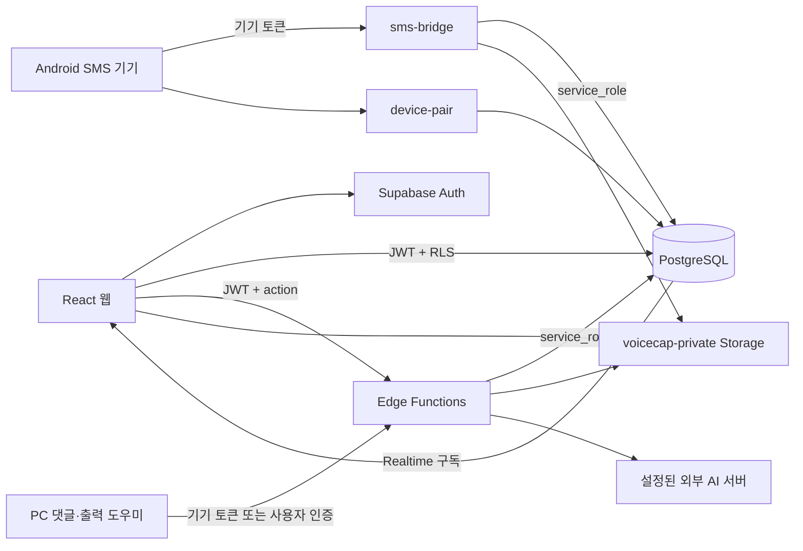
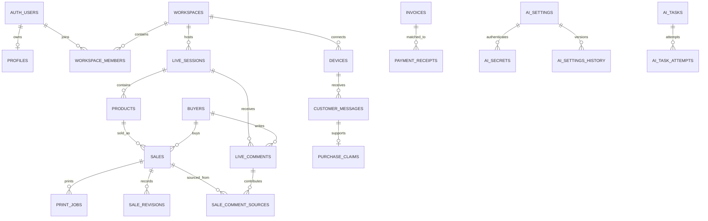

# 03. Supabase 백엔드·데이터베이스 복제 설계도

[전체 설계도](../../PROJECT_REPLICATION_BLUEPRINT.md) · [이전: 웹](02_WEB_DESIGN.md) · [다음: PC·STT](04_LOCAL_SERVER_DESKTOP_STT.md)

이 문서는 **2026-09-26 작업 디렉터리의 코드와 SQL**을 기준으로 작성했다. 기존 운영 프로젝트의 실제 설정·배포된 함수·실데이터를 조회한 문서가 아니다. 저장소에 구현된 내용, 새 프로젝트에서 직접 설정해야 하는 내용, 현재 코드와 SQL이 맞지 않는 내용을 구분한다. 실제 비밀 키와 고객 데이터는 포함하지 않는다.

다른 PC에서 같은 Supabase를 연결하는 일과, **새 Supabase 프로젝트에 독립 복제하는 일은 다르다.** 전자는 웹·도우미·Android의 접속 설정과 장치 연결을 복원하는 작업이다. 후자는 아래 DB, Auth, Storage, Edge Function, 외부 AI 설정까지 새로 준비해야 한다. Git 저장소에는 운영 DB의 행, 로그인 계정, Storage 이미지, 서버 비밀 키가 들어 있지 않다.

## 1. 초보 개발자를 위한 구성 설명

| 용어 | 이 프로젝트에서의 의미 |
|---|---|
| Supabase Auth | 판매자의 가입·로그인·JWT 발급 담당. `auth.users`는 Supabase가 관리한다. |
| PostgreSQL | 판매, 고객 문자, 상품, 방송 회차, AI 작업을 저장하는 실제 데이터베이스. |
| workspace | 한 판매 조직의 데이터 경계. 대부분의 업무 행에 `workspace_id`가 붙는다. |
| RLS | 로그인 사용자가 어느 행을 읽거나 수정할 수 있는지 DB에서 검사하는 규칙. |
| Edge Function | Supabase에서 실행되는 TypeScript 서버 코드. 웹·휴대폰·PC 도우미가 HTTP로 호출한다. |
| service_role | RLS를 우회하는 서버 권한. Edge Function 내부에서만 사용하며 웹의 `VITE_*` 변수에 넣지 않는다. |
| Storage | 이미지 파일을 보관하는 공간. DB에는 이미지 자체보다 경로를 저장한다. |
| Realtime | DB 변경을 웹에 알리는 구독 기능. 웹을 새로고침하지 않아도 변경을 감지하도록 돕는다. |
| revision | 데이터 버전 번호. 읽었을 때의 버전과 수정 시점의 버전이 다르면 충돌로 처리하려는 장치. |
| operationId | 같은 요청을 재전송해도 같은 거래로 식별하기 위한 UUID. |
| lease | 한 기기가 일정 시간 동안 문자나 출력 작업을 처리하도록 맡는 임시 점유권. |



중요한 구조상의 특징은 **DB 직접 접근과 Edge Function 접근이 함께 존재한다**는 것이다. 기존 판매·문자·청구·입금·배송 화면은 [remoteWorkspaceService.ts](../../src/services/remoteWorkspaceService.ts)에서 Supabase 테이블을 직접 읽고 쓴다. 상품 중심 판매·댓글·인쇄·AI 기능은 주로 `sales-api`를 호출한다. 새 개발자가 모든 CRUD가 하나의 REST 서버를 지난다고 가정하면 안 된다.

## 2. 소스 위치와 읽는 순서

| 순서 | 파일 | 확인할 내용 |
|---|---|---|
| 1 | [supabase/config.toml](../../supabase/config.toml) | 함수 4개의 플랫폼 JWT 검사 설정 |
| 2 | [migrations](../../supabase/migrations/) | 빈 DB에서 만들어질 실제 스키마 |
| 3 | [_shared/voicecap.ts](../../supabase/functions/_shared/voicecap.ts) | 일반 사용자 인증, 기기 토큰, CORS, 이미지 제한 |
| 4 | [_shared/productSales.ts](../../supabase/functions/_shared/productSales.ts) | `sales-api` 인증·권한·공통 응답 |
| 5 | [sales-api/index.ts](../../supabase/functions/sales-api/index.ts) | 실제 action 50개와 capability 검사 |
| 6 | [sales-api/handlers](../../supabase/functions/sales-api/handlers/) | 각 업무 기능의 실제 처리 순서 |
| 7 | [src/types](../../src/types/) | 웹과 서버가 공유하는 데이터 형식 |
| 8 | [contracts/product-sales/v1](../../contracts/product-sales/v1/) | 기존 요청·응답 예제와 계약 테스트 |

`docs/plans`는 과거 설계 의도이며 현재 코드와 항상 일치하지 않는다. 특히 상품번호 정책·트랜잭션·출력 복구·AI 도우미 경유는 **계획의 표현을 구현 완료로 간주하지 말고** 이 문서의 구현 차이 항목을 함께 확인한다.

## 3. 빈 데이터베이스 만드는 순서

### 3.1 마이그레이션 적용 순서

파일명의 숫자 순서대로 적용한다. 여기서 마이그레이션은 “DB 구조 변경을 기록한 SQL 파일”이다. 앞 파일이 만든 테이블을 뒷 파일이 참조하므로 순서를 바꾸지 않는다.

| 순서 | 파일 | 생성·변경 내용 |
|---|---|---|
| 1 | [202608300001_initial_multitenant.sql](../../supabase/migrations/202608300001_initial_multitenant.sql) | 기본 14개 테이블, RLS, 문자 점유 RPC, 감사 함수, Storage bucket·정책 |
| 2 | [202609010001_sale_print_status.sql](../../supabase/migrations/202609010001_sale_print_status.sql) | `sales`의 이전 방식 인쇄 상태 컬럼 |
| 3 | [202609050002_admin_sales_and_stt_usage.sql](../../supabase/migrations/202609050002_admin_sales_and_stt_usage.sql) | STT 사용 로그, 관리자 조회 RPC 3개 |
| 4 | [202609080001_product_sales_core.sql](../../supabase/migrations/202609080001_product_sales_core.sql) | 방송·상품·구매자·댓글·작업·인쇄 등 11개 테이블, sales/devices 확장 |
| 5 | [202609090001_product_zero_price.sql](../../supabase/migrations/202609090001_product_zero_price.sql) | 상품·상품초안 단가에 0원 허용 |
| 6 | [202609100002_ai_resolution_settings.sql](../../supabase/migrations/202609100002_ai_resolution_settings.sql) | AI 설정·비밀정보·설정 이력, GLOBAL 기본 설정 |
| 7 | [202609100003_ai_health_status.sql](../../supabase/migrations/202609100003_ai_health_status.sql) | AI 연결·모델·추론 점검 결과 |
| 8 | [202609100004_ai_task_queue.sql](../../supabase/migrations/202609100004_ai_task_queue.sql) | AI 작업·시도·서킷 브레이커 |
| 9 | [202609100005_pending_sales_resolution.sql](../../supabase/migrations/202609100005_pending_sales_resolution.sql) | 판매 보류 사유·근거·AI 검증·이력 컬럼 |
| 10 | [202609100006_voice_correction_resolution.sql](../../supabase/migrations/202609100006_voice_correction_resolution.sql) | 음성 정정 보류 요청 |

모두 적용하면 저장소 정의상 업무용 테이블은 **34개**다. Supabase 자체 `auth`, `storage`, 기타 관리 테이블은 이 숫자에 포함하지 않는다. AI 테이블의 `UNIQUE NULLS NOT DISTINCT` 구문 때문에 PostgreSQL 15 이상과의 호환성을 확인해야 한다. 일반 PostgreSQL만 설치해서는 `auth.users`, `auth.uid()`, `storage.buckets` 등 Supabase 전용 객체가 없으므로 그대로 실행할 수 없다.

### 3.2 새 Supabase 프로젝트에서 실행할 작업

1. 새 프로젝트를 만든다. 운영 중인 다른 서비스의 프로젝트와 분리하는 편이 복제 상태를 확인하기 쉽다.
2. 새 프로젝트의 URL·프로젝트 식별자·공개 클라이언트 키를 기록하고, 서버 키는 서버 설정에만 보관한다.
3. 저장소 루트에서 Supabase CLI가 새 프로젝트를 가리키도록 연결한다. `supabase/.temp`는 이전 연결의 로컬 상태이므로 새 프로젝트의 정답으로 사용하지 않는다. 이 저장소에는 `supabase/config.toml`이 있으므로 `supabase init`을 다시 실행할 필요가 없다.
4. 위 10개 SQL을 순서대로 적용한다. CLI를 사용하면 아래와 같은 흐름이다. `<...>`는 실제 대상의 식별자로 바꾼다.

```powershell
npx.cmd supabase login
npx.cmd supabase link --project-ref <NEW_PROJECT_REF>
npx.cmd supabase db push --dry-run
npx.cmd supabase db push
```

5. `--dry-run` 출력에서 대상 프로젝트와 예정된 마이그레이션을 확인한 뒤 실제 `db push`를 실행한다. SQL Editor에서 적용한다면 한 파일씩 실행하고 오류가 없는지 확인한 후 다음 파일을 실행한다. 첫 파일의 일부 정책·제약조건은 재실행용 `IF NOT EXISTS`로 모두 감싸져 있지 않으므로 파일 전체를 무작정 반복 실행하지 않는다.
6. 아래 “코드와 SQL 불일치”를 먼저 해소한다. 특히 상품 예약 `expires_at`와 상품번호 유일성은 단순 환경변수 설정으로 해결되지 않는다.
7. Auth의 Site URL·Redirect URL·이메일 인증 및 메일 발송 설정을 복제 환경의 주소에 맞춘다. 이 설정의 실제 운영값은 저장소만으로 복원할 수 없다.
8. Storage bucket과 정책을 확인한다. 이미지 파일의 복사는 SQL 마이그레이션과 별개다.
9. Edge Function 비밀 변수와 CORS origin을 설정하고 함수 4개를 배포한다.
10. Realtime publication을 확인·설정한 후 새 테스트 사용자와 테스트 장치로 기능을 검증한다.

```powershell
npx.cmd supabase functions deploy voicecap-onboard
npx.cmd supabase functions deploy device-pair
npx.cmd supabase functions deploy sms-bridge
npx.cmd supabase functions deploy sales-api
```

`config.toml`에 함수별 `verify_jwt = false`가 선언되어 있다. 이것은 **인증을 없앤다는 뜻이 아니다.** 함수 코드가 사용자 JWT 또는 자체 기기 토큰을 검증하므로 이 파일과 인증 코드를 함께 배포해야 한다. `sales-api`의 일부 핸들러는 `../../../../src/types/*.ts`를 import하므로 `supabase` 디렉터리만 별도 복사하지 말고 저장소 전체를 기준으로 빌드·배포한다.

### 3.3 Edge Function 환경변수

| 변수 이름 | 용도 | 설정 구분 |
|---|---|---|
| `SUPABASE_URL` | 함수가 접근할 새 Supabase API 주소 | Supabase 함수 실행 환경의 기본 값 확인 |
| `SUPABASE_ANON_KEY` | 사용자 JWT를 `auth.getUser()`로 검증할 때 사용 | 실행 환경 기본 값 확인 |
| `SUPABASE_SERVICE_ROLE_KEY` | 서버 DB·Storage 관리 클라이언트 | 서버 전용, 클라이언트에 제공하지 않음 |
| `VOICECAP_WEB_ORIGIN` | 브라우저 요청의 허용 Origin | 새 웹의 정확한 origin으로 지정 |
| `VOICECAP_PAIRING_PEPPER` | 연결코드 해시 생성에 섞는 서버 문자열 | 새 환경에서 설정; 기본값은 빈 문자열 |
| `DEEPGRAM_API_KEY` | 공용 STT 공급자 설정의 환경변수 fallback | 사용할 때만 |
| `SONIOX_API_KEY` | 다른 공용 STT 공급자 fallback | 사용할 때만 |
| `DEEPSEEK_API_KEY` | DeepSeek AI 호출 fallback, 일부 설정 자동 등록 | 사용할 때만 |
| `OPENAI_API_KEY` | Cloud AI adapter의 OpenAI fallback | 사용할 때만 |
| `ANTHROPIC_API_KEY` | Cloud AI adapter의 Anthropic fallback | 사용할 때만 |

Google/Gemini 공급자 분기는 코드에 있지만 위 세 공급자와 같은 환경변수 fallback은 `cloudAdapter.ts`에 없으므로 설정 화면/`ai_secrets` 경로를 확인한다. 모델 이름의 실제 제공 여부와 외부 계정 사용 가능 여부는 이 문서가 보증하지 않는다.

CORS 기본값도 두 구현이 다르다. `_shared/voicecap.ts`와 `voicecap-onboard`는 기존 서비스 origin, `_shared/productSales.ts`는 `*`를 기본으로 한다. `VOICECAP_WEB_ORIGIN`은 문자열 하나를 그대로 헤더에 넣으므로 여러 URL을 쉼표로 나열해도 허용 목록 기능이 되지 않는다. 로컬·배포 웹을 동시에 지원하려면 요청 Origin을 검사하는 명시적 허용 목록 구현 또는 환경별 배포를 사용한다.

## 4. 데이터 모델 전체 지도

### 4.1 관계 이해



관계도는 주요 **실제 외래키**를 요약한다. `sales.session_id`는 원래 `text` 컬럼이며 `live_sessions.id`로의 외래키가 아니다. 문자·청구·입금·배송의 `sale_ids`는 JSON 배열이므로 각 판매 ID 존재 여부를 DB FK가 보장하지 않는다. `pending_corrections.workspace_id`도 다른 테이블의 UUID와 달리 `text`이고 외래키가 없다. 애플리케이션에서 일관성을 확인해야 하는 부분이다.

### 4.2 계정·조직·기기 테이블

| 테이블 | 기본키·주요 컬럼 | 역할·관계·제약 |
|---|---|---|
| `profiles` | `id UUID`, `email`, `display_name`, `phone`, 생성/수정 시각 | `id → auth.users`; 사용자 표시 프로필. |
| `workspaces` | `id UUID`, `name`, `owner_id` | `owner_id → auth.users`; 판매 조직. owner 삭제는 restrict. |
| `workspace_members` | `(workspace_id, user_id)`, `role` | `OWNER`, `MANAGER`, `STAFF`. 한 사용자가 여러 조직에 속할 수 있다. |
| `workspace_settings` | `(workspace_id, namespace)`, `value JSONB`, `updated_at` | 이름별 설정 묶음. `product_sales`, `voicecap-global-stt` 등을 사용. |
| `devices` | `id UUID`, `workspace_id`, `name`, `token_hash`, `app_version`, `last_seen_at`, `revoked_at`, `capabilities[]`, `is_output_device`, `device_type`, `revision` | 토큰 원문 대신 SHA-256 저장. 기본 capability는 `SMS`. 기기 종류는 `ANDROID_SMS`, `ANDROID_PHONE`, `WINDOWS_HELPER`, `OTHER`. |
| `device_pairing_codes` | `id UUID`, `workspace_id`, `created_by`, `code_hash`, `expires_at`, `claimed_at` | 10분 유효 1회용 연결코드. 해시 유일성 제약. |
| `audit_logs` | `id UUID`, 조직, 사용자/기기 actor, `action`, `entity_type`, `entity_id`, `metadata` | 문자 수신·기기 연결 등 감사 이벤트. 모든 비즈니스 변경에 자동 생성되는 것은 아니다. |
| `stt_usage_logs` | `id UUID`, 조직, 사용자, `session_id text`, `provider`, `duration_seconds`, 시작/종료 시각 | 공급자는 `DEEPGRAM`/`SONIOX`, 시간은 0 이상 정수 초. 음성 원본을 저장하는 표가 아니다. |

### 4.3 기존 판매·고객 업무 테이블

| 테이블 | 주요 컬럼 | 동작과 주의점 |
|---|---|---|
| `sales` | `id text`, 조직, `session_id text`, `buyer_nickname`, `amount integer`, `recognized_at`, `raw_transcript`, `status`, `product_name`, `capture_image_paths`, `note`, `revision` | 모든 판매 기록의 중심. `amount >= 0`; status는 `자동저장`, `수동수정`, `확정`, `보류`. |
| `customer_messages` | `id text`, 조직/기기, `external_id`, `phone_number`, `body`, `direction`, `category`, `status`, `sale_ids`, `attachments`, 수신/발송 시각, `lease_device_id`, `lease_expires_at`, `attempt_count`, `error` | 수신 메시지와 발신 대기열을 같이 보관. `(workspace_id, external_id)`는 external ID가 있을 때 유일. |
| `purchase_claims` | `id text`, `message_id`, 전화, 닉네임, 주소, 상품, 금액, 이미지, `sale_ids`, `match_status`, `field_matches`, `seller_note`, `revision` | 고객이 보낸 구매 정보와 판매 기록의 대응. 메시지당 1개 claim. |
| `invoices` | `id text`, `sale_ids`, 고객·전화·주소, `amount`, `bank_account`, `due_date`, `status`, `sms_message_id`, `sent_at` | 청구서. 메시지 FK는 삭제 시 null. |
| `payment_receipts` | `id text`, `external_id`, `payer_name`, `amount`, `paid_at`, `memo`, `sale_ids`, `invoice_id`, `match_status` | 입금 알림 기록. 금액은 0보다 큰 정수. `(workspace_id, external_id)` 중복 방지. |
| `shipments` | `id text`, `sale_ids`, 수령인·연락처·주소, `carrier`, `tracking_number`, `status`, `memo`, 연결 문자, 발송/수령 시각 | 배송 기록. 판매 ID 연결은 JSON 배열. |
| `verified_sales` | `(workspace_id, sale_id)`, `verified_by`, `verified_at` | 판매 검수 표시. 실제 sales FK가 있다. |

상태값은 다음과 같이 정확한 대문자/한글을 사용한다.

| 필드 | 허용값 |
|---|---|
| 메시지 direction | `INCOMING`, `OUTGOING` |
| 메시지 category | `PURCHASE_INFO`, `CUSTOMER_INQUIRY`, `QUESTION`, `ANSWER`, `INVOICE`, `SHIPPING`, `GENERAL` |
| 메시지 status | `RECEIVED`, `QUEUED`, `SENDING`, `SENT`, `FAILED` |
| 구매정보 match_status | `NOT_RECEIVED`, `MATCHED`, `MISMATCH`, `NEEDS_REVIEW` |
| 청구서 status | `DRAFT`, `QUEUED`, `SENT`, `PAID`, `CANCELLED` |
| 입금 match_status | `UNMATCHED`, `MATCHED`, `NEEDS_REVIEW` |
| 배송 status | `READY`, `PACKED`, `SHIPPED`, `DELIVERED`, `CANCELLED` |

### 4.4 상품·회차·댓글·출력 테이블

| 테이블 | 주요 컬럼 | 동작과 제약 |
|---|---|---|
| `live_sessions` | UUID, 조직, `display_code`, `status`, `active_product_id`, `revision`, 시작/종료 시각 | 조직당 `ACTIVE` 최대 1개인 partial unique index. 표시명과 내부 UUID를 구분한다. |
| `products` | UUID, 조직/회차, `product_code`, `name`, `image_path`, `image_kind`, `unit_price`, `revision`, `sales_revision`, `source` | 단가 null 또는 0~99,999,999. 사진 종류 `PHOTO`/`NUMBER_IMAGE`. 소스 `WEB_VOICE`/`ANDROID`/`MANUAL`. SQL상 코드는 조직 전체에서 유일. |
| `product_drafts` | UUID, 조직/회차, 예약 product ID/code, 이름/가격, 이미지 종류/업로드 경로, `status`, `revision`, `actor_id`, `expires_at` | 15분 상품 등록 초안. 상태 `DRAFT`, `READY`, `COMMITTED`, `CANCELLED`, `EXPIRED`. |
| `product_code_reservations` | `(workspace_id, product_code)`, `product_id`, `draft_id`, `reserved_at` | SQL상 영구 코드 예약. 현재 handler가 요구하는 `expires_at`는 SQL에 없다. |
| `buyers` | UUID, 조직, `platform`, 플랫폼 사용자 ID/unique ID, `display_nickname`, `identity_status` | 닉네임과 고유 구매자 ID를 구분. 플랫폼 `TIKTOK`/`MANUAL`/`OTHER`; 상태 `VERIFIED`/`MANUAL_CONFIRMED`/`UNRESOLVED`. |
| `live_comments` | UUID, 조직/회차, `collector_id`, `platform_message_id`, buyer FK, `nickname_snapshot`, `content`, `captured_at`, `ingest_sequence` | `(workspace_id, session_id, collector_id, platform_message_id)` 중복 차단. collector ID는 UUID지만 기기 FK는 아니다. |
| `operations` | `(workspace_id, operation_id)`, `actor_id`, `action`, `request_hash`, `status`, `response_json` | `PROCESSING`, `SUCCEEDED`, `FAILED`. 같은 요청 재전송 판정/응답 보존. |
| `product_change_previews` | `token_hash`, 조직/actor/product, `proposed_patch`, 상품/판매 revision, `affected_sales_revisions`, 만료 시각, `consumed_operation_id` | 상품 변경 미리보기. 현재 함수는 10분 만료 토큰 생성. |
| `print_jobs` | UUID, 조직, sale FK, `sale_revision`, `kind`, `reprint_sequence`, `immutable_payload`, target device, status, lease token/만료, attempts/result | 변경되어도 해당 출력 건의 원문을 유지하는 JSON snapshot. kind는 `SALE`, `CORRECTION`, `CANCEL`, `REPRINT`. |
| `sale_revisions` | UUID, 조직/sale, old/new revision, before/after JSON, 사용자/기기 actor, 사유, operation ID | 상품 판매 변경 이력. `sales.history`와 별개의 저장 체계. |
| `sale_comment_sources` | `(workspace_id, product_id, comment_id)`, `sale_id` | 같은 상품에서 같은 댓글을 두 번 판매 근거로 소비하지 않도록 제약. |

`sales`에는 다음 확장 컬럼이 추가된다.

- 상품 FK, 구매자 FK, `quantity` 1~999, `unit_price` 0~99,999,999.
- 당시 상품번호·상품명·이미지 경로 snapshot. 상품을 나중에 수정해도 과거 판매 표시를 구성하는 근거다.
- `record_state = ACTIVE | CANCELLED`, `source = WEB_VOICE | ANDROID_COMMENTS | MANUAL | LEGACY`, 댓글 ID 배열, operation ID.
- 이전 출력 방식의 `print_status = NOT_REQUESTED | QUEUED | PRINTED | FAILED`, `print_revision`, `printed_at`, `print_error`.
- 보류 해결용 `pending_reasons`, `evidence_snapshot`, `ai_verification`, `history` JSON.

인쇄에는 **이전의 `sales.print_status`와 새로운 `print_jobs.status`가 공존**한다. 둘을 같은 열거형이라고 생각하면 안 된다. 새 작업은 `QUEUED → CLAIMED → SUBMITTING → SUBMITTED`가 정상 경로다. `FAILED`, `UNKNOWN`, `CANCELLED`도 SQL에서 허용한다. `SUBMITTED`는 PC 출력 제출 결과이며 종이가 실제로 정상 배출되었다는 하드웨어 확인까지 의미하지 않는다.

### 4.5 AI·음성 정정 테이블

| 테이블 | 주요 컬럼 | 역할 |
|---|---|---|
| `ai_settings` | UUID, `scope`, nullable 조직, `version`, `applied_version`, `is_draft`, 보류/정정 enable, `primary_slot`, fallback/복구 설정, 월 예산, `slot1/slot2 JSON`, 수정자 | 스키마는 GLOBAL/WORKSPACE를 지원하지만 현재 handler는 GLOBAL 행을 사용. |
| `ai_secrets` | UUID, setting FK, slot 번호, secret type/value/masked value/header name | API 키·Bearer·사용자 헤더 값을 분리 보관. `(setting_id, slot_number)` 유일. **값은 DB text이며 암호화 vault 구현은 아니다.** |
| `ai_settings_history` | UUID, setting FK, version/applied version, snapshot, 설명, 작성자 | 비밀 필드를 제거한 설정 snapshot 이력. |
| `ai_health_status` | UUID, 조직, slot, route key, routing/location/executor/endpoint/model/version, 전체 상태, tier1/2/3 JSON, 실패/성공 횟수, 점검 시각 | 같은 슬롯도 실행 PC·경로·모델·버전에 따라 별도 점검 결과. |
| `ai_tasks` | UUID + 유일 `task_id text`, 조직/회차/sale text, sale/settings/evidence 버전, task type/status, active slot, current attempt, 발화, 요청/결과 JSON, 실패·전환 이유 | 보류·정정·시험 추론 작업. sale ID는 실제 sales FK가 아니다. |
| `ai_task_attempts` | UUID, task FK(`task_id`), 유일 attempt ID, slot/status/valid, 시작·완료 시각, 지연, 오류, 결과 | 한 작업에서 여러 AI 슬롯을 시도한 이력. |
| `ai_circuit_breaker` | UUID, 조직/slot, `is_open`, 연속 실패, `cooldown_until`, 연속 복구 성공, 이유 | 장애가 반복되는 슬롯을 잠시 우회하기 위한 상태. |
| `pending_corrections` | UUID, 조직/회차 text, status, target sale, 후보 sale 배열, 원문, 후속 발화, parsed correction, missing info, conflict reason | 수정 대상이 모호한 음성 정정 요청. sale·workspace에 FK가 없다는 점에 유의. |

AI 작업 유형은 `PENDING_RESOLUTION`, `VOICE_CORRECTION`, `SYNTHETIC_TEST`; 상태는 `QUEUED`, `PROCESSING`, `RESOLVED`, `INSUFFICIENT_DATA`, `FAILED`, `CANCELLED`다. 시도 상태는 `RUNNING`, `COMPLETED`, `FAILED`, `EXPIRED`, `CANCELLED`다.

## 5. 인증과 권한 설계

### 5.1 사용자 로그인과 최초 작업공간 생성

1. 웹이 Supabase Auth로 가입/로그인한다.
2. 로그인 JWT를 `Authorization: Bearer <access_token>`에 실어 `voicecap-onboard`를 호출한다.
3. action이 기본 온보딩 경로이면 `user_metadata.auth_app = voicecap` 표식을 보정한다.
4. `profiles`를 upsert하되 기존 값을 덮지 않는 방식을 사용한다.
5. 기존 membership이 있으면 workspace ID를 돌려준다.
6. 없으면 사용자 표시명/가입 metadata를 바탕으로 workspace를 만들고 현재 사용자를 `OWNER`로 등록한다.

`auth.users` 생성 trigger를 일부러 만들지 않는다. 최초 로그인 시 함수 호출이 필요하다. workspace 생성과 member 삽입은 별도 요청이므로 오류 시 반쯤 생성된 데이터나 동시 온보딩 결과를 점검해야 한다. 회원·조직의 초기 데이터는 마이그레이션이 자동 생성하지 않는다.

### 5.2 세 종류의 권한을 구분한다

| 구분 | 저장 위치 | 현재 코드 의미 |
|---|---|---|
| 전역 관리자 | Auth `app_metadata.role = ADMIN` | 온보딩 함수의 회원 관리·공용 STT 관리 등에 필요. |
| 조직 역할 | `workspace_members.role` | `OWNER`/`MANAGER`/`STAFF`; RLS 관리자 검사에 OWNER·MANAGER 사용. |
| 기기 capability | `devices.capabilities` | `SALES_READ`, `SALES_WRITE`, `PRODUCT_WRITE`, `COMMENT_INGEST`, `PRINT`, `SMS` 등 action 실행 권한. |

`sales-api`는 기기 토큰을 먼저 검사한다. 토큰이 있으면 SHA-256과 활성 devices 행으로 조직과 권한을 정하며 요청의 workspace ID로 다른 조직을 선택하지 않는다. 사용자 JWT 경로에서는 요청한 workspace의 membership 또는 기본 첫 membership을 사용한다. 일반 조직 사용자에게 판매/상품/댓글/출력/SMS capability 전부를 준다. 즉 현재 `STAFF`라고 해서 판매 수정이 자동 금지되는 것은 아니다.

현재 `sales-api`는 `app_metadata.role`뿐 아니라 **`user_metadata.role = ADMIN`도 전역 관리자 판단에 사용**하고, 조직 `OWNER`에게도 `ADMIN` capability를 부여한다. 이 때문에 AI GLOBAL 설정 변경권한은 온보딩 관리자 권한보다 넓다. 새 서비스에서 관리자 경계를 세울 때 서버가 관리하는 app metadata만 신뢰하도록 통일해야 한다. 코드 조사만으로 이 문제를 수정한 것은 아니다.

### 5.3 실제 RLS 범위

| 테이블 묶음 | SQL에 구현된 접근 정책 |
|---|---|
| profiles | 본인 행 접근 |
| workspaces | 구성원 읽기, 조직 관리자 수정 |
| workspace_members | 구성원 읽기, 조직 관리자 관리 |
| 초기 업무 테이블 | 조직 구성원 select/insert/update, OWNER·MANAGER delete |
| devices, pairing codes | 정책은 있어도 authenticated의 insert/update/delete 권한을 revoke; 함수가 생성·변경 |
| stt_usage_logs | 조직 구성원 select/insert |
| 상품 핵심 신규 테이블 | RLS 활성화. 회차/상품/구매자/댓글/인쇄/판매이력 일부에 구성원 select. 쓰기는 함수 service_role 사용 |
| ai_secrets | authenticated 허용 RLS 정책 없음. service_role 경유 |
| ai_settings, ai_settings_history, ai_health_status | authenticated 전체 읽기 허용. write 정책은 app metadata ADMIN 중심 |
| ai_tasks, ai_task_attempts, ai_circuit_breaker, pending_corrections | authenticated `USING(true)`, write `WITH CHECK(true)`로 정의됨 |

따라서 “모든 표가 workspace별로 완전히 분리되어 있다”는 설명은 현재 SQL과 맞지 않는다. 특히 AI 및 정정 표의 광범위한 정책을 조직별 정책으로 바꾸고, 실제 DB grant와 함께 검증해야 한다. 새 표에 명시적 GRANT가 없는 파일도 있으므로 새 Supabase의 기본 권한 설정을 추정하지 말고 조회 가능 여부를 확인한다.

또한 `voicecap-onboard`의 `get-workspace-setting`·`save-workspace-setting`은 사용자 인증 후 **요청 workspace에 속하는지 확인하지 않고** service_role로 처리한다. 직접 DB RLS가 막아도 이 fallback 경로로 접근할 수 있으므로 새로운 외부 사용자에게 공개하기 전에 동일한 membership 검사를 적용해야 한다.

`set-member-status`는 정지 상태를 app metadata에 저장한다. 공통 서버 인증 함수 자체는 그 정지값을 일괄 검사하지 않으므로, UI에서 정지로 보이는 것과 모든 서버 API가 막히는 것은 다르다.

## 6. 함수별 HTTP 계약

기본 주소는 `<SUPABASE_URL>/functions/v1/<함수이름>`이며 JSON 요청을 보낸다. 클라이언트 SDK는 프로젝트 API key 헤더와 사용자 세션 처리를 제공한다. 직접 호출하는 장치는 프로젝트 API key와 자체 기기 토큰 사용 경로를 실제 배포에서 함께 확인한다.

### 6.1 `voicecap-onboard`

모든 action에 사용자 인증이 필요하다. 기본 응답은 `{ ok: true, ... }`이며 `sales-api`의 `data` envelope와 다르다.

| action | 핵심 입력 | 결과/권한 |
|---|---|---|
| action 생략/기본 경로 | 없음 | 최초 조직 준비; `workspaceId`, `created`, `allowAdminSttKey` |
| `list-voicecap-sellers` | 없음 | `auth_app=voicecap` 사용자 기반 회원 목록; app metadata ADMIN |
| `list-all-sales` | 없음 | VoiceCAP 사용자 관련 workspace 판매 목록; ADMIN |
| `record-stt-usage` | `provider`, `durationSeconds`, `sessionId`, `startedAt`, `endedAt` | 본인의 STT 사용시간 기록 |
| `list-stt-usage-summary` | 없음 | 사용자별 STT 시간 합계; ADMIN |
| `list-stt-usage-logs` | `userId` | 최대 200개 세부 로그; ADMIN |
| `set-stt-access` | `userId`, `allow` | 공용 키 지원 권한 변경; ADMIN |
| `set-member-status` | `userId`, `status`(`활성`/`정지`), `reason` | 회원 app metadata 수정; ADMIN |
| `get-stt-settings` | 없음 | 공급자·키 존재 여부. ADMIN 또는 허용 사용자에게 실제 STT 키 반환 |
| `set-stt-settings` | `provider`, `deepgramApiKey`, `sonioxApiKey` | 관리자 첫 workspace의 `voicecap-global-stt`에 저장; ADMIN |
| `get-workspace-setting` | `workspaceId`, `namespace` | value 조회. 현재 membership 누락 주의 |
| `save-workspace-setting` | 위 두 필드 + `value` | namespace별 upsert. 현재 membership 누락 주의 |

공용 STT 설정은 가장 최근 갱신된 `voicecap-global-stt` 행을 읽는다. DB 설정에 키가 없으면 서버 환경변수로 보완한다. 이는 STT 키를 항상 서버 프록시 안에 숨기는 구조가 아니다. 허용 사용자에게 키를 전달하는 현재 구조를 복제하는 것임을 이해해야 한다.

### 6.2 `device-pair`

| action | 인증/입력 | 처리 |
|---|---|---|
| `create-code` | 사용자 JWT, `workspaceId` 선택 | OWNER·MANAGER만 가능. 10자리 대문자 16진수 코드, 10분 만료. 해시는 `SHA256(pepper + ':' + code)`. |
| `claim` | 로그인 없이 `code`, `deviceName`, `appVersion` | 만료·사용 여부 확인 후 1회 소비. 장치 생성, `deviceId`, `deviceToken`, `workspaceId`, `deviceName` 반환. |
| `revoke-self` | `x-voicecap-device-token` | 자신의 `revoked_at` 갱신. 이후 토큰 인증 실패. |

원문 `deviceToken`은 claim 응답에서 받은 것을 장치가 보관한다. 서버는 해시만 저장하므로 새 PC에 해시를 복사해 로그인 토큰처럼 사용할 수 없다. 장치 재연결 시 새 코드를 발급하는 것이 재현 가능한 절차다. claim은 코드 사용 표시와 기기 삽입이 하나의 DB 트랜잭션은 아니므로 장치 생성 실패 시 코드만 소비될 수 있다.

새로 연결한 기기의 기본 권한은 `SMS`다. 댓글 수집·상품·출력을 맡길 장치는 `sales-api/update-device-capabilities`에서 실제 필요한 capability를 부여해야 한다.

### 6.3 `sms-bridge`

모든 요청에 활성 `x-voicecap-device-token`이 필요하다. 조직은 기기 행에서 정한다. 이 함수는 현재 기기의 `SMS` capability를 별도로 검사하지 않고 활성 토큰을 기준으로 동작한다.

| action | 핵심 입력 | 동작 |
|---|---|---|
| `status` | 없음 | workspace ID와 기기 이름 반환; 토큰 연결 시험 |
| `incoming` | `externalId`, `phoneNumber`, `body`; 선택 `category`, `receivedAt`, `saleIds`, `attachments` | 외부 ID 중복 검사, 이미지 업로드, INCOMING/RECEIVED 메시지 생성. category 기본 PURCHASE_INFO |
| `messages` | `limit` | 메시지 식별자·전화·종류·시간 등 조회. 기본 200, 최대 2000 |
| `outbox-claim` | `limit` | RPC로 발신 대기 건 점유. 기본 20, 최대 50 |
| `outbox-status` | `id`, `status`; 선택 `sentAt`, `error` | 해당 기기가 점유한 건만 `SENT`/`FAILED`/`SENDING`으로 변경. 점유권 없으면 409 |
| `payment-incoming` | `externalId`, `payerName`, `amount`; 선택 `paidAt`, `memo` | 중복 검사 후 UNMATCHED 입금 기록 |

첨부 형식은 `attachments: [{ dataUrl: 'data:image/jpeg;base64,...', fileName: 'sample.jpg' }]`다. 이미지 최대 8개, 각각 4 MiB 이하, JPEG/PNG/WebP만 허용한다. 경로는 `<workspaceId>/sms/<messageId>/<random>.<extension>`이다.

발신 흐름은 `customer_messages`에 `OUTGOING/QUEUED` 저장 → Android의 `outbox-claim` → 실제 휴대폰 SMS 발송 → `outbox-status`로 결과 보고다. 서버 함수가 통신사 문자 전송을 직접 실행하지 않는다. `claim_outbox_messages`는 `FOR UPDATE SKIP LOCKED`, 5분 lease, attempts 증가를 사용한다. 만료된 QUEUED/SENDING 행을 다시 집을 수 있다. 네트워크 실패 후 재처리 가능성이 있으므로 실제 단말 발송 중복 방지도 확인해야 한다.

### 6.4 `sales-api` 공통 응답

```json
{
  "ok": true,
  "apiVersion": 1,
  "serverTime": "2026-09-26T00:00:00.000Z",
  "data": {}
}
```

```json
{
  "ok": false,
  "apiVersion": 1,
  "serverTime": "2026-09-26T00:00:00.000Z",
  "error": {
    "code": "REVISION_CONFLICT",
    "message": "회차 버전 충돌이 발생했습니다.",
    "retryable": false,
    "details": {}
  }
}
```

공통 입력은 `action`과 선택 `workspaceId`다. 아래 표는 현재 router의 **전체 50개 action**이다. 필드 전체의 유효성은 실제 핸들러를 확인하고, UUID·revision·입력 배열을 그대로 재사용하지 말고 앞 응답에서 받은 값으로 연결한다.

#### 회차·설정·기기

| action | capability | 핵심 입력 → 출력/효과 |
|---|---|---|
| `get-bootstrap` | SALES_READ | 입력 없음 → 설정, 활성 회차·상품, 출력 기기, permissions |
| `list-sessions` | SALES_READ | 입력 없음 → 최신 회차 최대 500개 |
| `update-settings` | SALES_WRITE | `settings`, `expectedRevision`, `operationId` → `product_sales` 설정 revision 증가 |
| `start-session` | SALES_WRITE | 선택 `displayName` → 기존 ACTIVE 종료 후 새 회차 생성 |
| `end-session` | SALES_WRITE | `sessionId`, `expectedSessionRevision` → ENDED, revision 증가 |
| `list-devices` | SALES_READ | 입력 없음 → 해제되지 않은 기기와 권한 |
| `update-device-capabilities` | SALES_WRITE | `deviceId`, `expectedDeviceRevision`, `capabilities[]` → 권한·revision 갱신 |
| `set-output-device` | SALES_WRITE | `deviceId` → 조직의 출력 기기 표시 변경 |

기본 회차명은 한국 날짜 기준 `YYYY-MM-DD 라이브 N회차`다. `get-bootstrap.printerStatus.queuedJobsCount`는 현재 실제 COUNT 결과가 아니라 0 고정값이고, online은 출력 기기의 마지막 접속이 2분 이내인지로 판단한다. `update-settings.operationId`는 입력으로 받지만 해당 함수에서 operations 기반 멱등성 저장은 수행하지 않는다.

#### 상품

| action | capability | 핵심 입력 → 출력/효과 |
|---|---|---|
| `prepare-product` | PRODUCT_WRITE | `sessionId`, `expectedSessionRevision`, 선택 `requestedProductCode`, `name`, `unitPrice`, `imageKind` → draft/product/code, signed upload, 만료 |
| `update-product-draft` | PRODUCT_WRITE | `draftId`, `expectedDraftRevision`, `imageKind`, `imageFallbackConfirmed` → 초안 image kind·revision 변경 |
| `commit-product` | PRODUCT_WRITE | `draftId`, `expectedDraftRevision`, `expectedSessionRevision`, `source` → 상품 생성·초안 확정·회차 활성 상품 변경 |
| `activate-product` | SALES_WRITE | `sessionId`, `productId`, `expectedSessionRevision` → 현재 판매 상품 선택 |
| `list-session-products` | SALES_READ | `sessionId` → 해당 회차 상품 목록 |
| `prepare-product-image` | PRODUCT_WRITE | `productId`, `expectedProductRevision`, `fileName`, `mimeType`, `size` → **현재 가짜 업로드 주소** 반환 |
| `preview-product-change` | SALES_WRITE | `productId`, `proposedProduct`, `proposedSales[]`, `expectedProductRevision`, `expectedSalesRevision` → 미리보기 token, 금액 차이·영향 구매자 |
| `commit-product-change` | SALES_WRITE | `operationId`, `previewToken` → 미리보기의 판매 금액/수량 변경 적용 |

초안 수정 함수는 현재 `imageKind` 중심이며 `imageFallbackConfirmed`를 실제 허용 검사에 사용하지 않는다. 상품 변경 미리보기의 `settlements`는 영향 0/수동 확인 false 고정값이므로 실제 청구·입금 영향 계산 완료로 해석하지 않는다.

#### 댓글·구매자·판매

| action | capability | 핵심 입력 → 출력/효과 |
|---|---|---|
| `ingest-comments` | COMMENT_INGEST | `sessionId`, `collectorId`, `comments[]` → 수락 ID/중복 ID |
| `get-sales-feed` | SALES_READ | `sessionId`, `watchedBuyerIds[]`, `limit` → 댓글·회차 합계·구매자 통계 |
| `list-live-comments` | SALES_READ | 선택 `sessionId` → 댓글 목록 |
| `delete-live-comments` | SALES_WRITE | `ids[]` → 해당 조직 댓글 삭제 |
| `search-buyers` | SALES_READ | `query`, `limit` → 구매자 후보 |
| `confirm-buyer` | SALES_WRITE | `displayNickname`, 선택 `selectedBuyerId`, `confirmationReason` → 구매자 선택/수동 확인 |
| `commit-sales` | SALES_WRITE | `operationId`, `sessionId`, `productId`, 상품/회차 expected revision, `buyers[]` → 판매·print job·합계·통계 |
| `get-product-sales` | SALES_READ | `productId`, `sessionId` → 상품·ACTIVE 판매·구매자 정보 |
| `get-operation` | SALES_READ | `operationId` → 처리 상태와 저장된 결과 |

댓글 한 건의 핵심 필드는 `platformMessageId`, `platformUserId`, `platformUniqueId`, `nickname`, `content`, `capturedAt`, `ingestSequence`다. platform user ID가 있으면 구매자 신원을 찾아 연결하거나 생성한다. 판매 buyers 배열 한 건은 `{ buyerId, quantity, sourceCommentIds: [] }` 구조다. 단가는 서버 상품에서 읽고 총액을 `quantity × unit_price`로 계산한다. 단가 null이면 422, 0원은 현 DB/핸들러에서 별도 상황에 허용된다.

`commit-sales` 예시는 아래와 같다. 예시 UUID는 형식 설명용이므로 실제 호출에서는 bootstrap·상품·buyer 응답의 값을 사용한다.

```json
{
  "action": "commit-sales",
  "workspaceId": "11111111-1111-4111-8111-111111111111",
  "operationId": "22222222-2222-4222-8222-222222222222",
  "sessionId": "33333333-3333-4333-8333-333333333333",
  "productId": "44444444-4444-4444-8444-444444444444",
  "expectedSessionRevision": 2,
  "expectedProductRevision": 1,
  "buyers": [
    { "buyerId": "55555555-5555-4555-8555-555555555555", "quantity": 2, "sourceCommentIds": [] }
  ]
}
```

#### 인쇄

| action | capability | 핵심 입력 → 출력/효과 |
|---|---|---|
| `claim-print-jobs` | PRINT | `limit` 기본 10 → jobs, leaseToken, 30초 leaseExpiresAt |
| `renew-print-lease` | PRINT | `jobId`, `leaseToken` → lease 30초 연장 |
| `begin-print-job` | PRINT | `jobId`, `leaseToken` → SUBMITTING 표시 |
| `acknowledge-print-job` | PRINT | `jobId`, `leaseToken`, `result` → SUCCESS이면 SUBMITTED, 아니면 FAILED |
| `request-reprint` | PRINT | `saleId`, `reason` → REPRINT 신규 job |
| `get-print-status` | SALES_READ | `saleIds[]` 또는 `jobIds[]` → 작업 목록 |

인쇄 처리기는 job의 `immutable_payload`를 출력한다. 판매가 바뀐 뒤 재조회한 값으로 오래된 전표를 인쇄하면 “어느 버전을 출력했는지” 기록과 실제 결과가 달라질 수 있다. 새 출력 worker에서는 `begin-print-job` 이후 프로그램이 종료된 상황도 별도로 시험한다. 현재 lease 회수·동시 점유 한계는 아래 항목을 참조한다.

#### AI 설정·상태·작업

| action | 현재 handler 권한 | 핵심 입력 → 출력/효과 |
|---|---|---|
| `get-ai-settings` | 인증 사용자 | GLOBAL 설정; secret 존재 여부와 관리자 마스킹값 |
| `save-ai-settings` | ADMIN/OWNER/ADMIN capability | `expectedVersion`, `applyImmediately`, `changeSummary`, `settings` → 설정·비밀정보 분리 저장 |
| `apply-ai-settings` | 위와 같음 | `version` → 적용 버전 표시 변경 |
| `test-ai-connection` | 위와 같음 | `slotNumber`, 선택 `tempSlotConfig`, `newSecret` → 연결 시험 |
| `test-ai-synthetic` | 위와 같음 | 위 필드 + `request` → 합성 추론 시험 |
| `list-ai-models` | 위와 같음 | `endpointUrl`, `provider`, `authType`, `secret`, `customHeaderName`, `routingMode`, `location` → 모델 목록 |
| `check-ai-health` | 위와 같음 | `slotNumber`, `tier`, 임시 설정/키, `executorId`, `deviceId` → 점검 및 DB 저장 |
| `get-ai-health` | 인증 사용자 | `executorId`, `deviceId` → 실행 경로별 상태 |
| `create-ai-task` | 공통 인증만 | `sessionId`, `saleId`, 각 버전, `taskType`, `currentUtterance`, `request` → QUEUED 작업 |
| `process-ai-task` | 공통 인증만 | `taskId` 또는 `task` → 실제 추론·failover, 상태/시도 이력 갱신 |
| `get-ai-tasks` | 공통 인증만 | `sessionId`, `status`, `saleId`, `limit`, `offset` → 작업 목록 |
| `get-ai-runtime-status` | 공통 인증만 | 기본 입력 없음 → 대기열·서킷 브레이커 상태 |

AI 작업 action에는 router의 별도 `requireCapability(...)`가 없다. 기기에는 낮은 판매 권한을 줬더라도 AI action은 공통 인증만으로 진입할 수 있는 현재 구조를 고려해 권한을 정리해야 한다.

#### 보류·음성 정정

| action | capability | 핵심 입력 → 출력/효과 |
|---|---|---|
| `resolve-pending-sale` | SALES_WRITE | `saleId`, `expectedRevision`, `resolvedBy`, `changes`, `resolvedReasonCodes`, `resolutionDetails`, `evidenceSnapshotVersion`; 선택 `aiTaskId`/`aiResult` → 검증 후 판매 변경 |
| `batch-confirm-pending-sales` | SALES_WRITE | `saleIds[]` → 확정 성공 건/미해결 건 별도 반환 |
| `trigger-pending-ai` | SALES_WRITE | `saleId`, 후속 발화, `forceReanalyze` → 규칙 해결 또는 AI 작업 등록 |
| `process-voice-correction` | SALES_WRITE | `sessionId`, `utterance` → 규칙 파싱, 대상 검색, 적용/보류/무시 |
| `apply-voice-correction` | SALES_WRITE | `saleId`, `intent`, `expectedRevision`, `pendingCorrectionId` → 수정·이력·필요시 수정 전표 |
| `link-follow-up-correction` | SALES_WRITE | `pendingCorrectionId`, `followUpUtterance` → 후속 발화와 후보 연결 |
| `rollback-voice-correction` | SALES_WRITE | `sessionId`, `saleId`, `pendingCorrectionId` → 보류 정정 취소 또는 이력 기반 복원 |

## 7. 핵심 업무 흐름을 직접 구현할 때

### 7.1 상품 중심 API의 방송·상품·댓글 판매 흐름

아래는 `ProductSalesContext`와 `sales-api`를 사용하는 **상품 중심 판매 API의 연결 순서**다. 현재 주된 라이브 음성 판매는 별도 경로인 [LiveContext](../../src/context/LiveContext.tsx)의 `persistVoiceSale` → [SalesContext](../../src/context/SalesContext.tsx)의 `addSale` → `remoteWorkspaceService.saveSale` → `sales.upsert`를 사용한다. 이 음성 판매가 모두 `commit-sales`를 통과한다고 구현하면 현재 동작과 달라진다. 두 경로의 차이와 실제 음성 처리는 [웹 설계도 7·8절](02_WEB_DESIGN.md)을 함께 읽는다.

1. 로그인·온보딩으로 workspace ID를 확보한다.
2. `get-bootstrap`으로 활성 회차/상품/설정을 읽는다. 이 조회 자체는 회차를 새로 만들지 않는다.
3. 청취 시작 시 `start-session`을 호출한다. 이전 ACTIVE 회차는 종료된다.
4. 상품 입력이 들어오면 `prepare-product` → 받은 signed URL에 이미지 업로드 → 필요시 `update-product-draft` → `commit-product` 순서로 호출한다.
5. commit 응답에서 바뀐 회차 revision을 저장한다. 새 상품이 활성 상품이 된다.
6. 댓글 수집기는 방송 회차 ID를 붙여 `ingest-comments`를 보낸다. 이름이 같은 사람과 고유 ID가 같은 사람을 구분한다.
7. 상품 중심 화면에서 확인한 buyer ID·수량·근거 댓글을 구성해 `commit-sales`를 호출한다.
8. 응답의 판매·합계·buyerStats를 화면에 반영한다. 이 API는 `print_jobs`를 만들지만 현재 Node/Electron 시작 코드에는 클라우드 출력 worker의 자동 실행 연결이 완성되어 있지 않다. 클라우드 큐 출력까지 구현하려면 worker를 인증·출력 기기 설정과 연결해 실행해야 한다. 현재 실제 연결된 직접 출력 경로와 별도 worker의 범위는 [로컬 서버·도우미 설계도 9절](04_LOCAL_SERVER_DESKTOP_STT.md)을 참고한다.

같은 판매 요청을 네트워크 문제로 재전송할 때는 **같은 operationId와 같은 내용**을 보낸다. 성공한 operation이면 이전 결과를 돌려준다. 같은 operationId의 내용이 바뀌면 `OPERATION_PAYLOAD_MISMATCH` 409다. 다만 현재 구현은 전체 판매/댓글 소비/출력/operation 저장을 한 DB 트랜잭션으로 묶지 않으므로, 동시에 두 요청이 오거나 중간 단계가 실패한 경우까지 완전한 멱등성을 보장하는 것은 아니다.

### 7.2 판매 보류 해결

보류 이유는 `MISSING_NICKNAME`, `TRAILING_DIGITS_ONLY`, `MISSING_AMOUNT`, `SPLIT_UTTERANCE`, `DELAYED_COMMENT`, `MULTIPLE_CANDIDATES_CONFLICT` 여섯 종류다. 각각 설명·해결 여부·해결자·해결 시각을 JSON에 보관한다.

1. 판매 원문과 인식 시각, 관련 댓글 ID, 상품·가격·수량 등을 evidence snapshot으로 구성한다.
2. `trigger-pending-ai`는 먼저 댓글·구매자·상품 정보를 읽어 규칙 기반 해결을 시도한다.
3. 규칙으로 해결한 부분이 있으면 `resolve-pending-sale`로 반영한다. 이름만 해결된 경우 나머지 금액 문제는 보존한다.
4. 규칙으로 풀지 못하면 `ai_tasks`에 QUEUED 작업을 등록한다. 같은 근거 버전에서 이미 PROCESSING/RESOLVED인 작업의 중복 생성은 일부 차단한다.
5. 호출자가 `process-ai-task`를 별도로 실행해야 AI 분석이 실제로 진행된다.
6. 분석 결과는 바로 sales를 변경하지 않는다. `resolve-pending-sale`에서 현재 revision 및 실제 댓글/등록 구매자/상품과 교차검증한 뒤 반영한다.
7. 모든 사유가 해결되고 유효한 닉네임·0보다 큰 금액이 있으면 `자동저장`으로 전환한다. 출력 작업이 전혀 없는 건이면 새 SALE job을 만든다.
8. 일괄 확정은 해결된 판매만 `확정` 처리하고 나머지는 사유와 함께 건너뛴다.

`history`에는 변경 전/후 값, 변경자 SYSTEM/AI/SELLER, 변경 종류, revision, 설명을 남긴다. 원문 없이 AI가 만든 닉네임·가격을 그대로 믿는 방식으로 확장하지 않는다.

### 7.3 음성 정정

현재 `process-voice-correction`의 주요 경로는 [voiceCorrectionsCore.ts](../../supabase/functions/sales-api/handlers/voiceCorrectionsCore.ts)의 규칙 파서다. AI 테이블이 존재한다고 모든 음성 정정이 모델 호출로 처리되는 것은 아니다.

1. “바꾸지 마”, 질문, 미완성 발화 등인지 먼저 판정한다.
2. 정정이면 구매자·상품번호·이전 값·새 값·시간 참조로 해당 회차 판매를 찾는다.
3. 하나로 특정되면 expected revision을 확인해 적용한다.
4. 복수 후보이면 `pending_corrections`에 PENDING 요청과 후보 ID를 저장한다.
5. “상품 3번” 같은 후속 발화를 `link-follow-up-correction`으로 기존 요청에 연결한다.
6. 적용 시 `sales.history`를 기록하고 이미 출력한 판매에 필요한 경우 CORRECTION job을 만든다.
7. 정정 취소는 아직 보류 중인 요청 취소 또는 이전 history 값 복원 경로로 나뉜다.

현 handler가 실제 청구서·입금·배송 테이블을 조회하여 정산 완료 여부를 전부 검증하는 구조는 아니다. 정정으로 금액이 바뀌면 청구/입금/배송과의 관계를 어떤 기준으로 재검수할지 추가 구현 및 실데이터 없는 시나리오 시험이 필요하다.

### 7.4 AI 설정·health·장애 전환

각 slot은 type/provider/model/endpoint/location/routing/auth/timeout을 묶는다. `SERVER_DIRECT`는 Edge 서버가 외부 주소로 직접 호출한다. `PC_HELPER`는 사용자 PC에서 접근해야 하는 경로를 표현한다.

- 설정 저장 시 `newSecret`, `clearSecret`는 slot JSON에서 제거하고 `ai_secrets`로 분리한다. 응답에는 원문 대신 존재 여부·마스킹 정보를 사용한다.
- 연결 주소 검증은 [aiValidation.ts](../../supabase/functions/sales-api/handlers/aiValidation.ts)에서 수행하며 외부 직접 호출의 내부 주소·redirect 등 제한을 처리한다.
- health tier 1은 연결, tier 2는 모델 준비, tier 3은 합성 추론 시험이다. 결과는 실행 경로별 route key로 저장하며 45초 경과 결과는 만료 상태가 될 수 있다.
- 모델 응답은 공통 구조로 정규화한다. 지원 adapter 분기는 Ollama/OpenAI 호환 자체 서버, OpenAI/DeepSeek/Anthropic/Google 등이다. 공급자 UI와 실제 adapter 동작은 함께 확인한다.
- 작업 실행 기본 시간은 연결 3초, 자체 서버 20초, cloud 15초이며 slot 설정이 영향을 준다.
- 정상 응답인데 근거가 부족하면 `INSUFFICIENT_DATA`로 남긴다. 다른 모델로 바꾸면 사실이 생기는 것이 아니므로 이 상태는 자동 장애 전환 사유가 아니다.
- 통신/추론 엔진 오류는 우선 slot에서 다른 slot으로 전환한다. 2회 연속 실패하면 30초 우회, 복구 성공 2회를 기준으로 회로 해제를 판단한다.
- 이전 attempt가 늦게 도착하면 현재 attempt ID와 유효성을 확인하여 오래된 결과를 거절하는 core 함수가 있다.

구현의 한계도 구체적으로 구분해야 한다. `MAX_CONCURRENT_TASKS=5`, 총 작업 timeout 60초 같은 상수가 있다고 분산 worker/스케줄러가 배포된 것은 아니다. `cloudMonthlyBudgetKrw`가 저장된다고 실제 공급자 청구 비용을 차단하는 예산 집행기가 생기는 것도 아니다. 자동 fallback·복구 간격·초안/적용 버전 설정이 실제 실행 경로에서 모두 강제되는지 추가 확인해야 한다.

특히 `save-ai-settings`는 초안 저장 시에도 현재 row의 slot 값을 변경하고, `apply-ai-settings`는 적용 버전 숫자를 바꾼다. `process-ai-task`는 GLOBAL row의 slot을 읽는다. 과거 version의 snapshot을 복원해 실행하는 완전한 “미적용 초안 격리/버전 롤백” 시스템으로 설명할 수 없다.

## 8. Storage·Realtime·RPC

### 8.1 이미지 파일 저장

마이그레이션이 만드는 bucket은 `voicecap-private`다. 공개 bucket이 아니며 파일 최대 크기는 4,194,304 bytes, MIME은 `image/jpeg`, `image/png`, `image/webp`다.

파일 이름의 첫 경로는 workspace UUID여야 한다. `storage_workspace_id(name)`이 첫 디렉터리를 UUID로 파싱하고, 그 workspace의 member인지 RLS가 검사한다. 구성원은 read/upload/update, OWNER·MANAGER는 delete가 가능하다.

상품 준비 함수의 경로는 `<workspaceId>/products/<productId>.jpg`, 문자 첨부 경로는 `<workspaceId>/sms/<messageId>/...`다. DB에는 영구 파일 경로를 저장하고 브라우저 표시 시 signed URL을 만든다. `remoteWorkspaceService.ts`는 30분 유효 signed URL을 받아 25분 캐시한다. 만료 URL 자체를 다른 PC로 복사해서 영구 데이터처럼 저장하지 않는다.

bucket 정의를 새 프로젝트에 복제해도 이미지 바이트는 복사되지 않는다. 독립 데이터 이관 시 DB 경로와 Storage 객체를 맞춰 옮기고, 새 Auth UUID/workspace UUID로 재생성한다면 경로 prefix 및 참조도 함께 바꿔야 한다.

### 8.2 Realtime 구성

웹의 `subscribeCommerce`는 `sales`, `customer_messages`, `purchase_claims`, `invoices`, `payment_receipts`, `shipments` 6개 표의 `postgres_changes`를 workspace filter로 구독한다. 저장소 SQL에는 이 표들을 `supabase_realtime` publication에 추가하는 문장이 없다. 새 프로젝트에서는 Dashboard의 Realtime 설정 또는 관리 SQL로 실제 publication 포함 여부를 확인한다.

확인 예시:

```sql
select schemaname, tablename
from pg_publication_tables
where pubname = 'supabase_realtime'
order by schemaname, tablename;
```

누락 표가 있고 해당 프로젝트가 아직 비어 있다면 필요한 표를 하나씩 publication에 추가한다. 이미 포함된 표를 중복 추가하지 않는다.

```sql
alter publication supabase_realtime add table public.sales;
-- 같은 방법으로 나머지 5개 표를 확인 후 추가한다.
```

Realtime은 변경 알림이며 DB 권한 검증을 대신하지 않는다. 새 PC 두 곳에서 같은 테스트 조직을 열어 문자/판매 변경이 전파되는지 확인한다. 상품/댓글 feed의 polling 경로와 이 commerce 구독은 별개다.

### 8.3 저장소 SQL의 함수/RPC

| 함수 | 용도·권한 |
|---|---|
| `is_workspace_member(uuid)` | auth.uid가 조직 구성원인지; RLS에서 사용 |
| `is_workspace_manager(uuid)` | OWNER/MANAGER인지; RLS에서 사용 |
| `set_updated_at()` | 초기 테이블 UPDATE trigger용; 모든 후속 신규 표에 자동 연결되는 것은 아님 |
| `claim_outbox_messages(uuid, uuid, integer)` | 활성 기기 검사 + 문자 5분 점유. PUBLIC execute revoke, service_role execute |
| `add_audit_log(uuid, text, text, text, jsonb)` | 현재 사용자 actor로 감사 로그 삽입. 조직 membership 자체를 함수 내부에서 확인하지 않으므로 권한 보완 검토 |
| `storage_workspace_id(text)` | Storage 경로에서 조직 UUID 추출 |
| `get_admin_all_sales()` | 관리자 판매 조회. service_role 또는 app metadata ADMIN 검사 |
| `get_admin_stt_usage_summary()` | 관리자 사용량 요약 |
| `get_admin_stt_usage_logs(uuid)` | 특정 사용자 사용량 최대 200개 |

상품 판매 저장·상품 변경·인쇄 점유를 한 번에 처리하는 새 RPC는 현재 마이그레이션에 없다. 소스 주석의 “원자적”이라는 표현보다 실제 SQL과 UPDATE 조건을 확인한다.

## 9. 복제 전에 반드시 알아야 하는 구현 차이

이 절은 자동 수정 결과가 아니라 **소스 조사에서 확인한 차이와 후속 개발 기준**이다. 새 프로젝트를 완전히 동일한 서비스로 만들려면 먼저 차이를 해결하고 통합 시험해야 한다.

| 항목 | 현재 확인한 사실 | 복제·개발 시 처리 |
|---|---|---|
| 상품 예약 만료 컬럼 | handler가 reservation `expires_at`를 조회/삽입하지만 SQL에는 없음 | migration 추가 또는 영구 예약 로직으로 handler 수정. 운영 DB의 수동 변경 여부 별도 비교 |
| 상품번호 정책 | handler는 회차별 1번 재시작을 시도, SQL은 조직 전체 unique | 회차별 번호를 채택하면 상품 unique·예약 PK·조회·변경 로직을 함께 수정. 단순 unique 삭제로 끝내지 않음 |
| 상품 이미지 수정 | `prepare-product-image`가 `storage.voicecap.local` 주소 반환 | 실제 Supabase signed upload URL·파일 검증·확정 연결 구현 |
| 계약 스키마 범위 | request schema에 list-sessions/AI/보류/정정 action 없음; 오류 enum도 실제보다 좁음 | router·타입·contract 예제를 같이 갱신 |
| 초기 AI 공급자 | SQL은 Ollama/PC_HELPER + OpenAI, 행이 없을 때 handler 기본값은 DeepSeek + OpenAI | 새 DB 최초 설정을 화면에서 명시적으로 결정 |
| PC_HELPER 실행 | adapter는 JS 함수인 helperDispatcher를 받거나 직접 fetch; 함수는 HTTP JSON에 담을 수 없음 | 실제 PC dispatcher 전송 경로 구현·검증 필요. Edge의 127.0.0.1은 사용자 PC가 아님 |
| AI 큐 소비 | 등록/처리 action은 있으나 Supabase scheduler/cron 자동 소비 정의 없음 | 실행 주체가 process-ai-task를 호출하도록 연결하고 재시도·동시성 정의 |
| AI 설정 버전/예산 | 저장 필드와 core가 있으나 모든 옵션의 실행 강제가 완결되지 않음 | 초안/운영 설정 분리, 예산 계산·차단, fallback 옵션 적용을 명확히 구현 |
| 조직 권한 경계 | 일부 AI/정정 RLS true, 설정 fallback 회원 검사 누락, user metadata 관리자 신뢰 | 외부 다중 사용자 운영 전 서버 권한·RLS를 통일하고 타 조직 거절 시험 |
| 판매 원자성 | 여러 연속 CRUD; 일부 DB 오류를 확인하지 않음 | 트랜잭션 RPC와 명시적 오류 처리로 묶고 중간 실패 복구 시험 |
| revision 동시성 | 먼저 조회 후 비교하지만 일부 UPDATE에 expected revision 조건 없음 | `WHERE revision = expected` 및 영향 행 검사 또는 DB 잠금 추가 |
| 인쇄 중복 점유 | QUEUED 조회 후 ID만으로 CLAIMED 수정; SKIP LOCKED/CAS 없음 | 원자적 claim RPC/조건부 UPDATE, 만료 회수와 UNKNOWN 처리 검증 |
| 출력 기기 선택 | UI용 is_output_device와 claim 로직이 완전히 결합되지 않음 | 선택한 기기만 작업을 가져가도록 서버 조건 확인 |
| Realtime | 구독 코드만 있고 publication 구성 SQL 없음 | 새 Supabase에서 publication 설정 |
| 운영 데이터/계정/이미지 | 소스 저장소에 미포함 | 같은 backend 사용 또는 승인된 별도 데이터 이관 절차 필요 |

또한 `pendingSales.ts`에서 `AiVerificationMeta` 타입을 사용하지만 import 목록에 해당 타입이 없고, 작성 객체의 형태도 다른 공유 메타 타입과 구분이 필요하다. 웹 `npm run build` 성공만으로 Deno Edge Function 타입검사까지 통과했다고 판단하지 말고 실제 배포 및 별도 함수 점검을 수행한다.

## 10. 복제 완료를 판단하는 테스트 절차

### 10.1 저장소에 있는 테스트의 의미

| 위치 | 검증 범위 |
|---|---|
| [contracts 검증](../../contracts/product-sales/v1/validate-contracts.test.mjs) | fixture의 필드·UUID·예상 계산 확인. 실제 서버 요청이나 DB migration 적용이 아님 |
| [sales-api-auth.test.mjs](../../test/sales-api-auth.test.mjs) | 모의 인증/권한 및 응답 형태. 실제 배포 인증 코드/RLS 공격 방어 전체를 증명하지 않음 |
| [products-sessions.test.mjs](../../test/products-sessions.test.mjs), [session-product-codes.test.mjs](../../test/session-product-codes.test.mjs) | 회차·상품 규칙의 테스트 근거 |
| [ai-tasks.test.mjs](../../test/ai-tasks.test.mjs), [ai-adapters.test.mjs](../../test/ai-adapters.test.mjs) | 순수 core 및 모의 공급자/도우미 호출 기반 AI 실행 |
| [ai-settings.test.mjs](../../test/ai-settings.test.mjs), [ai-health.test.mjs](../../test/ai-health.test.mjs) | 설정/주소 검증·health 계산 등 |
| [pending-sales.test.mjs](../../test/pending-sales.test.mjs), [voice-correction.test.mjs](../../test/voice-correction.test.mjs) | 보류/정정 규칙과 상태 전환 |
| [pre-deployment-integration.test.mjs](../../test/pre-deployment-integration.test.mjs) | 여러 모듈을 잇는 합성 시나리오. 운영 Supabase·실제 모델·프린터 연결 시험과 구분 |

저장소 루트의 기본 명령은 `npm test`, `npm run test:contracts`, `npm run test:api`다. 문서 작성 중 전체 검증 담당자가 루트 테스트 236개, server 테스트 11개, desktop 테스트 7개 통과 및 웹 build 성공을 확인했다. Android의 `testDebugUnitTest`와 `assembleDebug`도 성공했다. 이는 현재 로컬 소스의 검증 결과이며, 원격 DB migration/운영 함수 호출/유료 AI 호출/실제 문자 발송·프린터 검증을 수행했다는 뜻이 아니다. 아래 새 프로젝트 수동 시험 결과를 별도로 기록한다.

### 10.2 새 독립 프로젝트의 단계별 합격 기준

1. **구조**: 10개 migration 적용 이력, 예상 34개 업무 테이블, bucket, RPC 확인. reservation 컬럼/unique 정책 정합성 해결 여부 기록.
2. **Auth**: 테스트 사용자 A/B 가입. A 최초 로그인 시 profile/workspace/OWNER 생성. 재로그인해 workspace가 늘어나지 않는지 확인.
3. **격리**: B가 A의 workspace ID를 넣어 테이블·설정·AI·정정 API를 읽거나 변경하지 못하는지 확인. 현재 구현 보완 후 통과해야 할 기준이다.
4. **회차**: 방송을 두 번 시작해 ACTIVE가 하나이고 이름/회차 선택이 올바른지 확인.
5. **상품**: 가격 0원 준비, 이미지 업로드, 확정, 다음 회차 번호 생성. 만료 초안/중복 번호/잘못된 revision을 모두 시험.
6. **판매**: 가상 구매자 2명·수량 2/1·단가 10,000원으로 총액 30,000원 확인. 같은 operationId 재전송과 다른 payload 재전송 결과 확인.
7. **댓글**: 같은 collector/message 재전송은 중복, 다른 사람의 동일 닉네임은 고유 ID 기준으로 구별. 이미 소비된 댓글을 같은 상품에 재판매하지 않는지 확인.
8. **Storage**: A가 업로드한 이미지가 A에게 보이고 B에게 보이지 않으며 signed URL 만료 후 재발급으로 표시되는지 확인.
9. **Realtime**: 같은 조직의 웹 두 창에서 테스트 판매/메시지 변경이 보이는지 확인.
10. **장치**: 10분 코드 발급 → claim → 재사용 거절 → token status → revoke 후 거절.
11. **문자**: 테스트 데이터로 수신 중복 방지/첨부 제한/발신 점유 검증. 실제 SMS는 사용자 소유 시험 번호로 통제해 실행.
12. **인쇄**: worker 2개 동시 claim, 제출 직전 중단, 제출 후 응답 유실, 재인쇄를 시험하고 중복 전표와 lease 복구 확인.
13. **AI**: 설정 저장·연결·모델·합성 시험 후 QUEUED 작업을 실제 process. 첫 slot 오류/두 slot 오류/근거 부족/늦은 결과/판매 revision 충돌을 각각 확인.
14. **정정**: 단일 후보 즉시 수정, 복수 후보 보류, 상품번호 후속 발화, 취소/복원, 이미 출력된 건 수정 전표 확인.
15. **업무 일치**: 판매 금액 변경 뒤 청구·입금·배송 화면이 어떤 상태가 되는지 확인하고 자동 처리와 수동 검수를 구분해 기록.

완료 기록에는 테스트한 소스 commit, 새 프로젝트 식별자, migration 목록, 배포 함수명, 설정한 변수 **이름**, 성공/실패 시나리오를 남긴다. 비밀 키·고객 연락처·실제 문자 본문은 시험 보고서에 복사하지 않는다.
