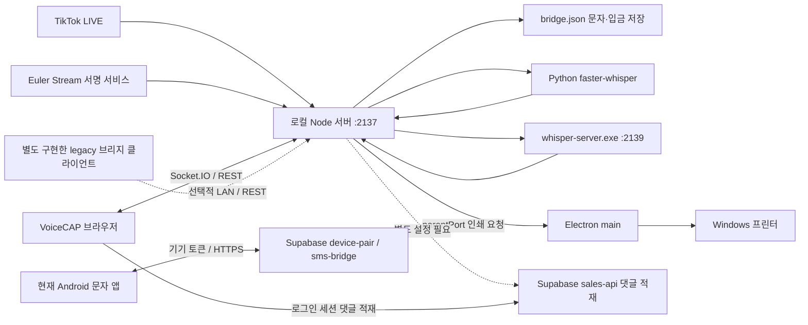
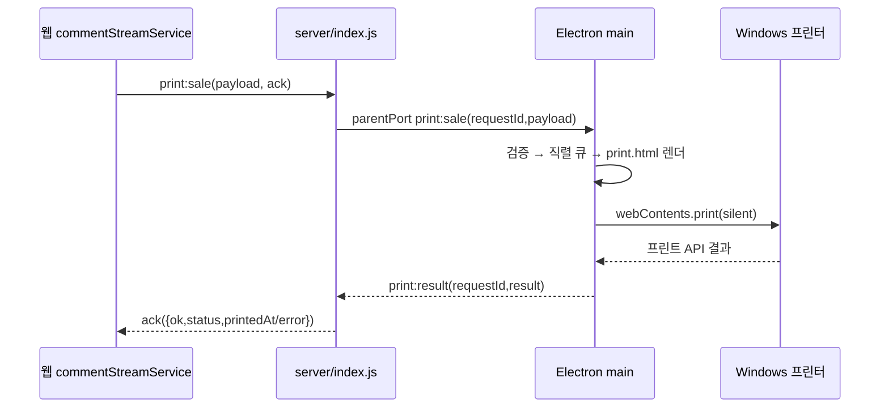

# 04. 로컬 서버·Windows 댓글 도우미·오프라인 음성 인식 설계도

[전체 설계도](../../PROJECT_REPLICATION_BLUEPRINT.md) · [이전: 백엔드·DB](03_BACKEND_DATABASE.md) · [다음: Android](05_ANDROID_DESIGN.md)

이 문서는 2026-09-26에 확인한 저장소의 실제 소스를 기준으로 작성했다. 목표는 새 Windows PC에서 댓글 수집, 로컬 음성 인식, 문자 브리지, 프린터 연결을 재현하고, 초보 개발자가 각 부품의 책임과 연결 방식을 이해하게 하는 것이다. 실제 API 키, 고객 문자, 결제 내역은 이 문서에 포함하지 않았다.

**먼저 알아둘 점:** Git 소스만 복제해서는 기존 PC와 동일한 실행 환경이 되지 않는다. Python 패키지, STT 모델, 프린터 드라이버, 사용자별 설정, 필요한 비밀키를 별도로 준비해야 한다. 또한 서버 파일에 존재하지만 실제 실행 프로그램에 연결되지 않은 기능이 있으므로, 아래의 **현구현**과 **추가 개발 필요**를 구분해서 읽는다.

## 1. 이 구성 요소가 하는 일

### 1.1 초보자를 위한 용어

| 용어 | 이 프로젝트에서의 뜻 |
|---|---|
| 로컬 서버 | 사용자의 Windows PC에서 실행되는 Node.js 프로그램. 인터넷에 배포하는 Supabase 함수와 별개다. |
| `127.0.0.1` / `localhost` | 현재 프로그램이 실행되는 컴퓨터 자신. Android에서 이 주소는 PC가 아니라 Android 기기 자신이다. |
| 포트 | 같은 컴퓨터의 여러 프로그램을 구분하는 번호. 기본 로컬 서버는 `2137`, Vulkan STT는 `2139`다. |
| Socket.IO | 브라우저와 로컬 서버 사이에 댓글·음성·상태를 실시간으로 보내는 통신 라이브러리다. 일반 REST 요청과 연결 방식이 다르다. |
| Electron | 웹 기술로 Windows 설치형 앱을 만드는 런타임. 이 프로젝트에서는 창·트레이·자동 시작·업데이트·프린터를 담당한다. |
| STT | 음성을 글자로 바꾸는 기능. 인식된 문장에서 판매 정보를 해석하는 AI 단계와는 별개다. |
| 워커 | 별도 프로세스에서 오래 걸리는 작업을 하는 프로그램. 여기서는 Python 음성 인식 프로세스가 대표적이다. |
| 모델 | 음성 인식에 필요한 대용량 학습 데이터 파일. 소스 코드와 별도다. |
| `venv` | Python 패키지를 다른 프로그램과 분리해서 설치하는 폴더다. |
| IPC | Electron 내부 프로세스 사이의 통신이다. 브라우저용 HTTP·Socket.IO와 혼동하지 않는다. |
| ASAR | 설치형 Electron 앱의 코드를 묶는 파일. Python·EXE처럼 외부 실행이 필요한 파일은 밖으로 풀어야 한다. |

### 1.2 전체 연결 그림



**현재 Android 앱은 PC 로컬 서버가 아니라 Supabase `device-pair`·`sms-bridge` Edge Function에 연결한다.** Node의 문자 API는 남아 있는 legacy 경로이며 현재 Android 앱과 endpoint·인증·요청 형식이 다르다. Android에 PC IP·로컬 API 키·판매자 ID를 입력하는 설정 화면도 없다. 별도 Node 서버를 LAN에 열더라도 현재 Android 앱이 자동으로 연동되지는 않는다. Electron 앱은 내부 서버를 `127.0.0.1:2137`로 강제한다.

### 1.3 실행 방법 두 가지

| 구분 | 개발용 독립 서버 | Windows 댓글 도우미 |
|---|---|---|
| 실행 | `server`에서 `npm start` | `desktop/comment-helper`에서 `npm start` 또는 설치 EXE |
| Node.js | 개발자가 설치 | 개발 실행에는 필요. 완성된 설치 앱에는 Electron 런타임 포함 |
| 서버 코드 | `server/*.js` 원본 | 원본을 stage한 사본을 Electron `utilityProcess`로 실행 |
| 주소 | 환경변수 `HOST`·`PORT` 사용 | `main.cjs`의 `127.0.0.1:2137` 강제 |
| 실제 자동 인쇄 | 지원하지 않음. 실패 응답을 반환 | Electron 메인이 Windows 인쇄 수행 |
| legacy API의 LAN 접근 | `HOST=0.0.0.0`과 방화벽 설정으로 가능. 현재 Android와 직접 호환되지 않음 | 현재 기본 구성으로 불가 |
| 창·트레이·자동 업데이트 | 없음 | 있음 |

**두 방식을 동시에 실행하지 않는다.** Electron 시작 코드에는 2137 포트를 점유한 다른 PID를 `taskkill /F`로 종료하는 로직이 있다. 프로세스 이름을 확인하지 않으므로 다른 개발 서버도 종료될 수 있다. 이 문서는 해당 동작을 안전한 표준 설계로 권장하지 않는다. 새 구현에서는 포트 충돌을 알리고 실행을 중단하는 방식으로 변경하는 것이 좋다.

코드 근거: [서버 진입점](../../server/index.js), [Electron 진입점](../../desktop/comment-helper/main.cjs).

## 2. 파일별 설계와 수정 위치

| 파일 | 책임 | 수정할 때 확인할 상대편 |
|---|---|---|
| [server/index.js](../../server/index.js) | 환경 설정, HTTP·Socket.IO, TikTok 연결, STT 초기화, 인쇄 IPC 중계 | 웹 `commentStreamService.ts`, Electron `main.cjs` |
| [server/bridgeApi.js](../../server/bridgeApi.js) | legacy 문자·입금 HTTP 입력 검증, API 키 확인, 이벤트 발행 | 웹 legacy SMS 서비스 또는 별도 구현할 클라이언트. 현재 Android는 Edge Function 사용 |
| [server/bridgeStore.js](../../server/bridgeStore.js) | 문자·입금 JSON 읽기/쓰기, 중복 수신 방지 | `bridgeApi.js` |
| [server/sttBridge.js](../../server/sttBridge.js) | Python 경로 탐색, STT 설정, 워커 생명주기, 소켓 음성 중계 | 웹 STT 서비스, Python 워커 |
| [server/stt_worker.py](../../server/stt_worker.py) | faster-whisper 모델 로드, CPU/CUDA, PCM 발화 분할·전사 | Node의 줄 단위 JSON 프로토콜 |
| [server/vulkanRunner.js](../../server/vulkanRunner.js) | whisper.cpp 실행·모델 다운로드·로컬 추론 HTTP | `server/bin/whisper-vulkan` 실행 파일과 DLL |
| [server/cloudCommentPublisher.js](../../server/cloudCommentPublisher.js) | 댓글 배치와 재시도, `ingest-comments` 호출 | Supabase sales-api |
| [server/cloudPrintWorker.js](../../server/cloudPrintWorker.js) | 클라우드 인쇄 작업 claim/lease/begin/ack 순서 | 현재 실행 진입점에 연결되지 않음 |
| [server/printJobStore.js](../../server/printJobStore.js) | 클라우드 워커용 작업 상태와 payload hash 저장 | `cloudPrintWorker.js`; 직접 인쇄 이력과 별개 |
| [desktop/comment-helper/main.cjs](../../desktop/comment-helper/main.cjs) | Electron 메인, 서버 실행, 트레이, 로그, 프린터, 자동 업데이트 | `preload.cjs`, 서버 parentPort |
| [desktop/comment-helper/preload.cjs](../../desktop/comment-helper/preload.cjs) | 화면에 허용된 `window.voicecap` API만 노출 | UI `renderer.js` |
| [desktop/comment-helper/ui/renderer.js](../../desktop/comment-helper/ui/renderer.js) | 상태·프린터·STT 장치 선택 화면 | preload API |
| [desktop/comment-helper/ui/print.js](../../desktop/comment-helper/ui/print.js) | 전표 텍스트를 DOM `textContent`로 설정 | `print.html`, `print.css` |
| [desktop/comment-helper/scripts/stage-server.cjs](../../desktop/comment-helper/scripts/stage-server.cjs) | 서버 사본, DLL, 빌드 런타임 설정 생성 | 원본 `server/`, Electron package 빌드 설정 |
| [desktop/comment-helper/scripts/setup-offline-stt.bat](../../desktop/comment-helper/scripts/setup-offline-stt.bat) | Python 찾기/설치 시도, venv·패키지 설치 | 별도의 모델 준비·실행 검증 필요 |
| [desktop/comment-helper/scripts/upload-release.cjs](../../desktop/comment-helper/scripts/upload-release.cjs) | GitHub Release 생성·기존 에셋 교체 | 기존 저장소명이 하드코딩되어 있음 |

`desktop/comment-helper/server`는 생성물이다. 이 폴더를 직접 수정하면 다음 `npm start`, `npm run pack`, `npm run dist`의 stage 단계에서 사라진다. 반드시 `server/` 원본을 수정한다. 새로운 서버 파일을 추가하면 stage 스크립트의 `serverFiles` 목록에도 추가해야 한다.

## 3. 버전과 새 PC 준비물

### 3.1 npm 버전 기준

`package.json`의 `^`는 허용 범위이고 실제 재현 기준은 각 `package-lock.json`이다. 둘 다 `lockfileVersion: 3`이다.

| 항목 | server lock | desktop helper lock |
|---|---:|---:|
| 앱 자체 버전 | 1.0.0 | 1.3.7 |
| express | 4.22.2 | 4.22.2 |
| cors | 2.8.6 | 2.8.6 |
| dotenv | 16.6.1 | 16.6.1 |
| socket.io | 4.8.3 | 4.8.3 |
| tiktok-live-connector | 2.4.4 | 2.4.4 |
| electron | 해당 없음 | 44.0.0 |
| electron-builder | 해당 없음 | 26.15.3 |
| electron-updater | 해당 없음 | 6.8.9 |

복제할 때 `npm install`로 새 버전을 해석하기보다 `npm ci`로 lock을 적용한다. 루트, `server`, `desktop/comment-helper`는 서로 별도의 npm 프로젝트이므로 루트 한 번 설치로 모두 준비되지 않는다. `server/package.json`은 Node `>=18`을 선언하지만 웹 빌드 도구의 요구 버전과 동일하다고 가정하면 안 된다. 전체 개발 환경은 프로젝트 전체 설치 문서의 Node 버전으로 통일한다.

코드 근거: [server package](../../server/package.json), [server lock](../../server/package-lock.json), [helper package](../../desktop/comment-helper/package.json), [helper lock](../../desktop/comment-helper/package-lock.json).

### 3.2 준비물 체크표

| 준비물 | 필요한 기능 | 확인 방법 |
|---|---|---|
| Windows x64 | 현재 helper의 NSIS 배포 대상 | Windows 설정 → 시스템 → 정보 |
| Git, 호환되는 Node/npm | 소스 설치·개발·빌드 | `git --version`, `node --version`, `npm --version` |
| 마이크와 브라우저 마이크 권한 | 음성 입력 | Windows 입력 장치 테스트 후 웹앱 테스트 |
| Python 3.11 x64를 우선 검토 | faster-whisper CPU/CUDA 경로 | `py -3.11 --version`; 설치 스크립트도 3.11 자동 설치를 시도 |
| GPU 드라이버 | CUDA 또는 Vulkan 가속 | 장치 관리자, NVIDIA는 `nvidia-smi` |
| Windows 프린터 드라이버와 정확한 용지 크기 | 전표 출력 | Windows 테스트 페이지, helper 프린터 목록 |
| 초기 인터넷 연결 | npm, Python 패키지, 모델 다운로드, TikTok 접속 | 각 다운로드/댓글 연결 확인 |
| Euler Stream 키 또는 서비스가 허용하는 무키 연결 | TikTok 서명 | `/status`의 `hasEulerApiKey`; 실제 LIVE 댓글 테스트 |

GPU 없이 CPU 경로도 구현되어 있다. 다만 이 저장소는 최소 RAM/VRAM·초당 인식 성능의 공식 보증값이나 재현 가능한 성능 측정표를 제공하지 않는다. **작업용 권장 시작점**은 RAM 16GB 이상, SSD 여유 공간 10GB 이상을 확보하고 `base` 모델로 기능을 확인하는 것이다. 이것은 코드의 필수 조건이나 측정된 성능 보증이 아니다. 여러 모델·CUDA 패키지를 보관하면 더 많은 공간이 필요하다.

코드의 “AMD 16GB”, “DirectX 12/Vulkan”, “초고속” UI 문구를 실제 하드웨어 검증 결과로 해석하지 않는다. `isAvailable()`은 EXE와 DLL 존재 여부만 확인하며 GPU의 Vulkan 실행 가능성이나 VRAM 용량까지 측정하지 않는다.

## 4. 독립 Node 서버 설치 절차

아래 명령은 PowerShell용이다. 소스를 `C:\dev\voice-pin-anti`에 복제했다는 예시이며 다른 경로라면 바꾼다.

```powershell
Set-Location C:\dev\voice-pin-anti\server
npm ci
if (-not (Test-Path -LiteralPath .env)) {
    Copy-Item -LiteralPath .env.example -Destination .env
}
notepad .env
```

이미 설정한 `.env`가 있다면 복사 명령으로 덮어쓰지 않는다. 환경변수 파일의 기본 형태는 다음과 같다. `<...>`는 설명용 자리표시자이므로 실제 발급값/경로로 바꾼다.

```dotenv
PORT=2137
HOST=127.0.0.1
EULERSTREAM_API_KEY=<발급받은 키>
ALLOWED_ORIGINS=http://localhost:3000,http://127.0.0.1:3000,http://localhost:5173,http://127.0.0.1:5173
SMS_BRIDGE_API_KEY=<로컬 API 클라이언트와 공유할 충분히 긴 무작위 키>
SMS_BRIDGE_DATA_FILE=C:/Users/<Windows사용자>/AppData/Local/voicecap-comment-helper/data/bridge.json
```

현재 [Vite 설정](../../vite.config.ts)의 개발 서버 포트는 **3000**이다. 5173은 서버가 추가로 허용하는 다른 개발용 origin이며 이 프로젝트의 실제 기본 포트를 대신하지 않는다. 기본 운영 도메인을 계속 쓴다면 `.env.example`의 도메인도 유지한다. 환경변수를 직접 설정한 상태에서는 `dotenv` 기본 동작상 이미 존재하는 환경변수가 파일보다 우선한다. 예상한 값이 적용되지 않으면 서버를 실행한 PowerShell의 환경변수와 `.env`를 함께 점검한다.

```powershell
npm start
```

이 PowerShell은 서버가 실행되는 동안 열어 둔다. 종료는 `Ctrl+C`다. 다른 PowerShell에서 확인한다.

```powershell
Invoke-RestMethod http://127.0.0.1:2137/status
```

정상 응답에서 `ok: true`, `service: voicecap-comment-server`를 확인한다. TikTok은 방송 연결 전 `idle`이어도 정상이다. STT는 패키지/모델 준비 전 `LOADING` 또는 `ERROR`일 수 있으므로 HTTP 기동과 STT 완료를 구분한다. `/` 루트 페이지는 등록되어 있지 않으므로 `http://127.0.0.1:2137/`의 `Cannot GET /`만으로 서버 고장이라고 판단하지 않는다.

### 4.1 설정 전체 목록

| 변수 | 읽는 코드와 역할 | 새 PC에서 해야 할 일 |
|---|---|---|
| `HOST` | `index.js`, 기본 `127.0.0.1` | 별도 legacy LAN 클라이언트를 구현할 때만 `0.0.0.0` 검토. 현재 Android 연결 설정이 아님 |
| `PORT` | `index.js`, 기본 `2137` | 웹 클라이언트 주소와 맞춘다. helper는 현재 고정 |
| `EULERSTREAM_API_KEY` | TikTok 서명 키 | 안전한 별도 경로로 재발급/전달 |
| `ALLOWED_ORIGINS` | 쉼표로 구분한 웹 origin | 도메인 변경 시 실제 origin 추가 |
| `SMS_BRIDGE_API_KEY` | `/api` 라우터 인증 | 로컬 API와 legacy 웹/별도 클라이언트가 공유. 현재 Android의 기기 토큰과 별개 |
| `SMS_BRIDGE_DATA_FILE` | 문자·입금 JSON 경로 | 사용자에게 쓰기 권한이 있는 절대 경로 권장 |
| `PYTHON_PATH` | STT Python 실행 파일 최우선 선택 | 새 PC에 실제 존재하는 `python.exe` 절대 경로 |
| `VOICECAP_STT_DUMP_DIR` | Python STT 디버깅용 WAV 저장 | 평소 비워 둔다. 켜면 실제 음성이 파일에 남는다 |
| `VOICECAP_SALES_API_URL` | Node CloudCommentPublisher의 ingest 주소 | Node 직접 업로드 경로를 쓸 때 설정. 웹 로그인 세션 업로드에는 필수 아님 |
| `VOICECAP_DEVICE_TOKEN` | 댓글 업로드의 `x-voicecap-device-token` | 별도로 발급한 기기 자격값 설정 |
| `VOICECAP_WORKSPACE_ID` | 댓글 업로드 workspace 식별자 | 연결할 작업공간과 일치 |
| `VOICECAP_DEVICE_ID` | collectorId | 기기 등록 정보와 일치 |
| `VOICECAP_CAPTURE_PATH` | Electron UI 진단 PNG 저장 | 일반 실행에는 불필요 |
| `GH_TOKEN` / `GITHUB_TOKEN` | 릴리스 업로드 자격 | 빌드만 할 때는 필요 없음 |

Euler 키 탐색 순서는 독립 서버에서는 환경변수 → `server/eulerstream_key.txt` → 저장소 루트 `eulerstream_key.txt`다. helper stage는 환경변수와 **루트 키 파일만** 읽으며 `server/.env`의 키를 읽어 설치 프로그램으로 옮기지 않는다.

`.env.example`의 `SMS_BRIDGE_DATA_FILE=./data/bridge.json` 같은 상대 경로는 `index.js` 위치가 아니라 **프로세스 작업 디렉터리**를 기준으로 해석된다. 기본값을 아예 지정하지 않으면 `server/data/bridge.json`을 사용한다. Electron 설치형 앱은 이 기본값이 `app.asar` 안쪽을 가리킬 수 있으므로 문자 기능에는 쓰기 가능한 절대 경로를 별도로 지정해야 한다.

### 4.2 현재 Android 경로와 legacy 로컬 문자 API 구분

현재 Android의 [BridgeClient.java](../../android/voicecapSMS/app/src/main/java/com/voicecap/sms/BridgeClient.java)는 `device-pair`의 `claim`으로 기기 토큰과 workspace를 받고, `sms-bridge`에 `incoming`, `outbox-claim`, `outbox-status`, `messages`, `status` 등의 action을 POST한다. 인증 헤더는 `X-VoiceCAP-Device-Token`이다. API base URL은 [BridgePreferences.java](../../android/voicecapSMS/app/src/main/java/com/voicecap/sms/BridgePreferences.java)가 읽는 빌드 설정 `VOICECAP_API_BASE_URL`이다.

Node의 legacy 경로는 `/api/sms/incoming`·`GET /api/sms/outbox` 등 REST 경로, `sellerId`, `x-voicecap-key`를 사용한다. 두 계약은 다음처럼 다르다.

| 항목 | 현재 Android | legacy Node 브리지 |
|---|---|---|
| 서버 | Supabase Edge Function | PC Node 서버 |
| 등록 | 페어링 코드로 기기 claim | 로컬 공통 키를 별도 설정 |
| 인증 | `X-VoiceCAP-Device-Token` | `x-voicecap-key` |
| 대상 구분 | 기기 토큰에 연결된 workspace | 요청의 `sellerId` |
| 발신 가져오기 | POST `sms-bridge`, `action: outbox-claim` | GET `/api/sms/outbox?sellerId=...` |
| 주소 설정 | 빌드 시 API base URL | 별도 클라이언트의 PC URL |

따라서 **새 PC·휴대전화의 현재 앱을 재현할 때는 Android 페어링과 Edge Function을 설정한다. PC 2137 포트를 LAN에 열 필요가 없다.** 기존 `server/README.md`·`.env.example`에 남아 있는 Android PC IP 입력 설명을 현재 앱의 사용법으로 따라 하면 안 된다.

legacy API 자체를 재현하거나 새 LAN 어댑터를 개발할 때만 다음을 적용한다.

1. helper를 종료하고 독립 Node 서버 방식으로 실행한다.
2. `HOST=0.0.0.0`, `SMS_BRIDGE_API_KEY`, 쓰기 가능한 데이터 경로를 지정한다.
3. 별도로 구현한 클라이언트에 `http://<PC의 LAN IP>:2137`, 동일한 로컬 키, 요청용 `sellerId`를 설정한다.
4. Windows 방화벽은 필요한 사설 네트워크 접근만 허용하고 로컬 REST 계약으로 검증한다.

**추가 개발 필요:** 현재 Android를 이 legacy API에 연결하려면 인증·workspace/seller 매핑·claim 및 상태 갱신·중복 처리까지 변환하는 어댑터 또는 Android 클라이언트 변경이 필요하다. 설치형 helper에 LAN 기능도 넣으려면 `main.cjs`의 host·데이터 파일·인증 설정을 추가로 통합해야 한다. 이 어댑터는 현재 구현되어 있다고 가정하지 않는다.

## 5. HTTP API 상세 계약

기본 주소는 `http://127.0.0.1:2137`이다. 요청 본문은 JSON이며 Express 전체 본문 제한은 **16MB**다.

`createBridgeRouter`가 `/api`에 먼저 연결되고 그 내부 인증 미들웨어가 항상 실행된다. 따라서 `SMS_BRIDGE_API_KEY`가 비어 있지 않으면 아래 **모든 `/api/...` 경로에** `x-voicecap-key` 헤더가 필요하다. `/status`와 Socket.IO에는 이 키 검사가 적용되지 않는다.

| 메서드·경로 | 입력 | 출력·역할 |
|---|---|---|
| `GET /status` | 없음 | 서비스 상태, Euler 키 유무, TikTok 통계, STT 상태, 소켓 접속 수 |
| `GET /api/bridge/status` | 인증 헤더 | 브리지 상태, 인증 활성 여부, 발송 대기 건수 |
| `GET /api/sms/messages` | `sellerId`, 선택 `limit` | 판매자별 문자 목록. 기본 1000개, 최신순 |
| `POST /api/sms/incoming` | `sellerId`, `phoneNumber`, `body`, 선택 `externalId`, `receivedAt`, `attachments`, `category`, `saleIds` | 새 수신 201, 중복 200. `duplicate` 반환 |
| `GET /api/sms/outbox` | `sellerId`, 선택 `limit` | `QUEUED` 또는 `SENDING` 발신. 기본 100개, 오래된 순 |
| `POST /api/sms/outbox` | `sellerId`, `phoneNumber`, `body`, 선택 `category`, `saleIds` | 발신 큐 생성 201. 그 자체로 휴대전화 발송은 아님 |
| `PATCH /api/sms/outbox/:id/status` | `status`, 선택 `sentAt`, `error` | `QUEUED/SENDING/SENT/FAILED` 중 상태 갱신. 없는 ID는 404 |
| `GET /api/payments` | `sellerId`, 선택 `limit` | 입금 목록. 기본 1000개 |
| `POST /api/payments/incoming` | `sellerId`, `payerName`, 양수 `amount`, 선택 `externalId`, `paidAt`, `memo`, `invoiceId` | 입금 등록. 새 항목 201, 중복 200 |
| `GET /api/stt/status` | 없음 | `state`, 모델·장치·오류 등 |
| `POST /api/stt/device` | `{ "device": "cpu" }` 등 | `setDevice()` 호출 직후 상태. 로딩 완료를 기다리는 응답이 아님 |
| `POST /api/stt/detect` | 빈 객체 | 장치 재감지를 요청하고 현재 상태 반환 |
| `GET /api/ai-models` | `endpointUrl` query | 원격/로컬 모델 목록 프록시 |
| `POST /api/ai-health` | `slotNumber`, `tier`, `tempSlotConfig`, 선택 `newSecret` | AI 연결 상태의 helper 측 점검 결과 |

문자·입금 목록 `limit`는 1~2000 범위로 제한된다. `sellerId`는 요청 문자열로 검증하며 사용자 로그인 JWT와 연결해서 소유권을 검증하는 구조는 아니다. 발신 상태 수정은 ID로 대상을 찾고 요청의 판매자 소유권을 별도 검사하지 않는다. 여러 판매자가 같은 서버/키를 공유하는 운영 모델에서는 추가 권한 검증이 필요하다.

첨부 이미지는 Node 서버에서 최대 8개, `mimeType`이 `image/`로 시작하는 값, 각 `dataUrl` 문자열 길이 8×1024×1024 이하를 허용한다. 이것은 이미지 파일의 실제 바이트 수 8MB와 같은 뜻이 아니며, 요청 전체 16MB 제한도 적용된다. 현재 Android가 사용하는 Edge Function의 첨부 제한과는 별도다. legacy 어댑터를 만들 때도 여러 이미지의 합계와 base64 확장으로 전체 본문 제한에 걸리는지 확인한다.

AI 모델 목록 프록시는 `endpointUrl`로 전달받은 주소에 HTTP 요청한다. `/v1/models`, `/models` 등으로 정규화하고 목록이 없으면 `/api/tags`를 시도한다. AI health의 TIER1은 HTTP 500 미만을 연결 성공으로 취급하므로 **401/403도 네트워크 연결 성공으로 표시될 수 있다**. TIER2·TIER3는 실제 모델 추론 없이 준비 상태를 만든다. 초보 개발자는 초록 상태만 보고 AI 추론이 정상이라고 결론내리지 말고 실제 주문 해석 결과까지 확인해야 한다.

### 5.1 안전한 읽기 확인 예시

아래 예시의 `Read-Host`에는 자신이 새 PC에 설정한 브리지 키를 입력한다. 명령 예시에 실제 키를 붙여 문서나 Git에 남기지 않는다.

```powershell
$bridgeKeyForCheck = Read-Host '새 PC의 SMS 브리지 키'
$bridgeHeadersForCheck = @{ 'x-voicecap-key' = $bridgeKeyForCheck }
Invoke-RestMethod -Uri 'http://127.0.0.1:2137/api/bridge/status' -Headers $bridgeHeadersForCheck
Invoke-RestMethod -Uri 'http://127.0.0.1:2137/api/stt/status' -Headers $bridgeHeadersForCheck
Remove-Variable bridgeKeyForCheck, bridgeHeadersForCheck
```

현재 Android는 이 로컬 `outbox`를 읽지 않는다. 별도 legacy 발송 클라이언트/어댑터를 연결한 환경에서는 큐 등록이 실제 문자 발송으로 이어질 수 있으므로, 자신의 테스트 휴대전화 번호와 테스트 판매자 데이터로 검증한다. 현재 Android의 발송 검증은 Edge Function의 큐와 페어링된 기기를 기준으로 수행한다.

## 6. Socket.IO 계약과 댓글 수집

### 6.1 이벤트 목록

| 방향 | 이벤트 | 핵심 payload·의미 |
|---|---|---|
| 웹 → 서버 | `collect:start` | `{ username }`. `@아이디` 또는 TikTok URL을 정규화 |
| 웹 → 서버 | `collect:stop` | 현재 수집 중단 |
| 웹 → 서버 | `cloud:config` | 댓글 클라우드 적재 설정. 현재 웹 클라이언트는 `sessionId`만 전달 |
| 웹 → 서버 | `print:sale` | 판매 전표 payload와 acknowledgement 콜백 |
| 서버 → 전체 클라이언트 | `tiktok:status` | `state`, `username`, `message`, `viewerCount`, `totalComments`, `lastCommentAt`, `reconnects`, `hasEulerApiKey` |
| 서버 → 전체 클라이언트 | `tiktok:stats` | 주로 시청자 수 변경, 상태와 같은 형식 |
| 서버 → 전체 클라이언트 | `comment:new` | `id`, `uniqueId`, `nickname`, 선택 `userId`, `content`, ISO `receivedAt` |
| 서버 → 전체 클라이언트 | `sms:message` | 수신 등록 또는 발신 상태 갱신 |
| 서버 → 전체 클라이언트 | `sms:outbox` | 발신 큐 신규 등록 |
| 서버 → 전체 클라이언트 | `payment:new` | 입금 신규 등록 |
| 웹 → 서버 | `stt:get_status` / `stt:detect_devices` | 현재 상태 조회 / 장치 감지 |
| 웹 → 서버 | `stt:set_device` | `{ device, computeType? }`. 실제 computeType 선택은 코드의 분기 기준 사용 |
| 웹 → 서버 | `stt:load_model` | `{ model, device?, computeType? }` |
| 웹 → 서버 | `stt:start` | `{ sessionId, generation, model?, prompt? }` |
| 웹 → 서버 | `stt:audio` | 16kHz·모노·PCM16 little-endian 바이너리 또는 `{ data: base64 }` |
| 웹 → 서버 | `stt:stop` | `{ sessionId? }` |
| 서버 → 웹 | `stt:status` | `DISCONNECTED/LOADING/READY/LISTENING/ERROR`, 요청 모델·실제 모델·장치·오류 |
| 서버 → 웹 | `stt:transcript` | `session_id`, `generation`, `text`, `is_final`, `confidence`, `provider`, `duration`, `infer_time` 등 |
| 서버 → 웹 | `stt:error` | Python 워커 오류 정보 |
| 서버 → 웹 | `stt:listening_started` / `stt:listening_stopped` | 청취 시작/중지 확인 |

`generation`은 같은 회차에서도 재시작 이전에 도착한 낡은 음성 결과를 구분하는 번호다. 프런트엔드는 `session_id`와 `generation`이 현재 청취와 일치하는지 확인해야 한다. 소켓 연결 전체에는 사용자 인증이 없고 `io.emit`은 접속자 전체로 전송하므로, 여러 판매자를 격리하는 서버로 바로 사용하면 안 된다.

### 6.2 댓글 수집 순서

1. 브라우저가 Socket.IO로 접속한다. 현재 웹 서비스는 WebSocket transport를 사용한다.
2. 서버가 현재 `tiktok:status`, STT 상태를 보낸다.
3. `collect:start`가 들어오면 기존 타이머/연결을 정리하고 `TikTokLiveConnection`을 생성한다.
4. TikTok CHAT의 `content` 또는 이전 `comment` 필드를 본문으로 사용한다. 사용자 handle은 `user.displayId`를 우선 사용한다.
5. 댓글 ID는 TikTok `common.msgId`, 없으면 시간과 누적 수로 생성한다.
6. `comment:new`를 웹으로 전달하고 CloudCommentPublisher에도 적재한다.
7. 방송 오프라인·서명 오류 등으로 실패하면 3→6→12→24→30초 간격으로 재시도한다. README의 “항상 30초”보다 실제 코드를 우선한다.
8. 정상 방송 종료 이벤트는 `ended`로 바꾸고 재접속을 멈춘다. 새 수집 시작으로 다음 방송을 연결한다.
9. 모든 소켓 클라이언트가 떠나면 TikTok 수집을 종료한다. 웹을 닫아도 영구 수집하는 독립 크롤러는 아니다.

코드 근거: [댓글 웹 서비스](../../src/services/commentStreamService.ts), [TikTok 서버](../../server/index.js).

### 6.3 클라우드 댓글 적재는 웹 경로와 Node 경로가 따로 있다

| 경로 | 구현 | 필요한 설정 |
|---|---|---|
| 현재 웹의 로그인 세션 업로드 | [CommentCaptureContext.tsx](../../src/context/CommentCaptureContext.tsx)가 소켓 댓글을 받아 `productSalesApi.ingestComments()` 호출 | 로그인된 웹 사용자, 활성 수집/방송 session, 정상 sales-api |
| Node 직접 업로드 | `CloudCommentPublisher`가 TikTok 댓글을 별도 배치 | `VOICECAP_SALES_API_URL`, 기기 토큰, workspace 등의 Node 환경 설정 |

웹은 댓글을 즉시 화면에 표시하면서 현재 방송 session이 있는 댓글을 메모리 큐에 넣는다. 기본 100ms 뒤 같은 session의 최대 50개를 업로드하고 `pollFeed()`로 판매 피드를 다시 읽는다. 실패한 배치는 큐 앞에 돌려놓고 남은 큐를 1초 뒤 다시 처리한다. 따라서 **Node용 `VOICECAP_SALES_API_URL`이 없어도 로그인한 웹 경로로 클라우드 댓글 적재가 가능하다.** 웹 큐 역시 메모리이므로 탭 종료 시 지속되는 outbox라고 가정하지 않는다.

별도 Node CloudCommentPublisher는 기본 20개 또는 500ms 단위로 `action: ingest-comments`를 보낸다. `operationId`, `sessionId`, `collectorId`, 선택 `workspaceId`, 정규화된 댓글 배열을 포함한다. 기본 최초 1회와 재시도 최대 3회 후 실패한 배치를 버린다. 이 큐도 메모리에만 있어 앱 종료 후 복구되지 않는다.

**Node 경로의 현구현 제한:** `apiUrl`이나 `fetchFn`이 없으면 “미설정 모드”로 `sentCount`만 증가시키며 실제 HTTP 전송을 하지 않는다. 이 통계는 Node 업로드 성공의 증거가 아니며 웹 경로의 업로드 성공/실패를 나타내지도 않는다. 최종 검증은 실제 클라우드 데이터로 한다.

웹의 `configureCloudPublishing()`은 helper에 `sessionId`만 보낸다. 빌드 런타임 설정 파일도 Euler 키만 저장한다. **Node 직접 업로드 경로를 별도로 활성화하려면** `VOICECAP_SALES_API_URL`, 기기 토큰, workspace를 실행 환경에 제공하고 Supabase 기기 인증 계약과 일치하는지 확인해야 한다. 현재 helper UI에는 이 자격값을 발급·등록하는 완결된 화면이 없다. 두 경로를 동시에 켜면 동일 댓글을 양쪽에서 전달할 수 있으므로 플랫폼 메시지 ID 기반의 서버 중복 처리가 맞는지 확인한다.

## 7. 문자·입금 데이터 저장 설계

현재 로컬 데이터베이스는 SQLite나 PostgreSQL이 아닌 하나의 JSON 파일이다.

```json
{
  "messages": [],
  "payments": []
}
```

| 항목 | 저장 내용 |
|---|---|
| 수신 문자 | `id: sms-<UUID>`, 판매자, 외부 ID, 전화번호, 본문, INCOMING, category, RECEIVED, saleIds, attachments, 수신/생성 시각 |
| 발신 문자 | 같은 문자 기본 필드, OUTGOING, QUEUED/SENDING/SENT/FAILED, sentAt, error |
| 입금 | `id: bank-<UUID>`, 판매자, 외부 ID, 입금자, 금액, paidAt, 메모, saleIds, invoiceId, `matchStatus: UNMATCHED` |

수신 문자·입금의 중복 방지 키는 `(sellerId, externalId)`다. `externalId`를 보내지 않으면 재요청을 같은 항목으로 식별할 수 없다. 발신 큐 생성에는 같은 방식의 중복 방지가 없다.

저장은 전체 상태를 `<파일>.tmp`에 쓰고 원래 파일로 이름을 바꾸는 방식이다. 프로세스 간 잠금은 없으므로 **두 서버가 같은 파일을 쓰면 안 된다**. 읽기 실패 시 빈 상태로 시작하므로, 파일 손상 후 자동 정상처럼 보이는 상태와 실제 데이터가 모두 존재하는 상태를 구분해야 한다.

이 파일을 사용하는 legacy 환경의 기존 업무 데이터를 이전할 때는 Node 서버와 연결된 별도 클라이언트/어댑터를 멈추고 원본을 보호 백업한 뒤 옮긴다. `SENDING`도 발송 목록에 포함되므로 이동 전 대기/발송중 항목을 운영자가 확인한다. 임의로 큐를 재생하면 중복 문자 발송이 가능하다. 현재 Android의 클라우드 문자 데이터는 이 로컬 파일을 복사한다고 이전되지 않는다. 새 개발 PC는 실제 고객 데이터 대신 빈 저장소로 시작한다.

## 8. Electron 앱 실행·패키징 설계

### 8.1 개발 실행

```powershell
Set-Location C:\dev\voice-pin-anti\desktop\comment-helper
npm ci
npm start
```

`npm start`는 stage 후 Electron을 실행한다. stage는 기존 생성물 `desktop/comment-helper/server`를 삭제한 뒤 서버 원본 9개 파일과 `server/bin`을 복사하고 `build-runtime/runtime-config.json`을 만든다. 따라서 생성물 폴더에 개인 파일이나 원본 코드를 보관하지 않는다.

Electron 메인 프로세스의 시작 순서는 다음과 같다.

1. 단일 인스턴스 잠금을 얻고, 이미 실행 중이면 기존 창을 표시한다.
2. 로그 디렉터리를 준비하고 프린터 설정·최근 출력 이력을 읽는다.
3. 창과 트레이를 생성한다. 화면은 `ui/index.html`을 연다.
4. `utilityProcess.fork`로 stage된 `server/index.js`를 실행한다.
5. 설치 앱이면 최초 한 번 로그인 시 자동 시작을 등록한다.
6. 2.5초마다 `/status`로 서버 상태를 확인한다. HTTP timeout은 1.8초다.
7. 서버가 비정상 종료되면 3초 후 다시 시작한다.
8. 설치 앱이면 10초 후 및 6시간마다 업데이트를 확인한다.

창의 X는 앱 종료가 아니라 트레이 숨김이다. 서버 종료가 필요한 작업은 트레이의 종료를 사용한다. 개발 실행은 실제 Windows 로그인 자동 시작을 등록하지 않는다.

### 8.2 프로세스 권한 분리

창은 `contextIsolation: true`, `nodeIntegration: false`, `sandbox: true`로 구성되어 있다. 웹 화면에서 Node 파일 시스템에 직접 접근하지 않고 `preload.cjs`가 노출하는 `window.voicecap` 메서드로 필요한 작업만 요청한다.

화면 API에는 상태 조회·서버 재시작·웹 열기·로그 열기·자동 시작·프린터 조회/설정/테스트·STT 장치 선택/감지·숨기기·종료가 있다. 원격 웹페이지를 Electron의 권한 높은 창에 직접 로드하는 구조가 아니라, 로컬 UI를 사용하고 웹앱은 외부 브라우저로 연다.

### 8.3 빌드

```powershell
Set-Location C:\dev\voice-pin-anti\desktop\comment-helper
npm run pack
```

`pack`은 설치 전에 폴더 형태로 시험할 Windows x64 앱을 만든다. 실제 설치 파일은 다음과 같다.

```powershell
npm run dist
```

주요 산출물은 `release/VoiceCAP-Comment-Helper-Setup.exe`, 대응 `*.blockmap`, `latest.yml`이다. `release`는 Git에서 제외된다.

NSIS 설정은 사용자별 설치, one-click, 관리자 권한 상승 없음, 바탕화면·시작 메뉴 바로가기, 설치 직후 실행이다. 빌드 리소스는 `assets/icon.ico`, 앱 표시 아이콘은 `assets/icon.png`를 사용한다. 다른 운영체제 배포는 현재 npm script/패키지 설정만으로 재현되지 않는다.

`server/stt_worker.py`와 `server/bin/whisper-vulkan/**`는 `asarUnpack`으로 실제 디스크에 풀린다. Python 인터프리터, venv, 모델 파일까지 설치 파일에 포함되는 것은 아니다.

### 8.4 키와 릴리스 저장소

stage는 Euler 키를 `server/eulerstream_key.txt`와 `build-runtime/runtime-config.json`에 기록한다. 후자는 앱 `resources/runtime-config.json`으로 들어간다. 이 파일들이 Git에서 제외되어도 **설치 파일을 받은 사람에게 키가 전달되는 구조**다. 공개 배포용 비밀 저장 장치가 아니다. 기존 동작 재현에는 이 구조를 이해하되, 새 서비스 운영용 설계에서는 사용자/기기별 토큰으로 교체하는 것이 좋다.

자동 업데이트 저장소는 package의 `nettman001-hub/voice-pin-web`, 업로드 스크립트도 같은 owner/repo가 별도로 하드코딩되어 있다. 새 GitHub 저장소로 복제하면 두 곳과 사용자 웹앱 URL `https://www.voicecap.shop/live`, origin 목록을 함께 검토한다.

`npm run upload`는 GitHub 토큰을 읽어 `comment-helper-v<version>` 정식 릴리스를 생성하고 기존 동명 파일을 삭제·교체한다. `npm run release`는 빌드 후 이 업로드까지 실행한다. **개발 PC에서 기능을 재현할 때는 `pack` 또는 `dist`까지 사용한다.** 원래 배포 저장소를 수정하는 release 명령은 새 저장소 설정과 배포 의도가 확정된 뒤 사용한다.

## 9. 프린터 설계와 확인

### 9.1 현재 실제 연결된 직접 출력 경로



payload 필드는 `saleId`, `printRevision`, `buyerNickname`, 양수 `amount`, `recognizedAt`, 선택 `sessionId`/`sessionCode`다. 중복 식별자는 `${saleId}:${revision}`이다. 서버만 직접 실행하면 parentPort가 없어 “댓글 도우미 앱에서만 자동 출력할 수 있습니다” 실패를 반환한다.

메인은 Promise 큐로 순서대로 출력한다. 숨겨진 창에서 닉네임·원 단위 금액·회차 3줄을 렌더링하고 실제 DOM 텍스트를 확인한 다음 `webContents.print`를 호출한다. 회차가 없으면 현재 코드는 `1회차`를 사용한다. 마지막 미리보기는 `last-print.png`에 저장한다.

최근 성공 ID는 `print-history.json`의 `jobIds` 최대 500개로 저장한다. 같은 ID가 있으면 물리 출력을 생략하고 `PRINTED`를 반환한다. 이 이력은 무한한 중복 방지 장치가 아니며, 새 PC로 이력을 옮기지 않으면 예전 작업을 새 작업처럼 판단할 수 있다.

웹 ack timeout은 15초, 서버의 Electron 응답 timeout은 20초다. 프린터 대기나 큐 지연 때문에 웹에서 실패가 표시된 뒤 실제 인쇄가 이루어질 가능성을 고려한다. 실제 출력 확인 전 반복 재인쇄를 누르지 않도록 운영 절차를 정한다. `PRINTED`는 이 코드가 받은 Electron 인쇄 성공을 뜻하며 종이가 실제로 배출되었다는 센서 확인은 아니다.

### 9.2 용지와 드라이버

| 선택 | 코드가 지정하는 페이지 크기 |
|---|---|
| `LABEL_50_30` | 50×30mm |
| `RECEIPT_80` | 80×80mm |
| `RECEIPT_58` | 58×80mm |
| `A4` | `printPageSize()`는 A4를 반환하지만 실제 옵션에는 사용자 크기를 넣지 않음 |

현재 CSS의 `@page` 및 print용 body 크기는 50×30mm를 기본으로 고정하고 있다. 영수증/A4용 클래스는 일부 글꼴·패딩만 바꾸므로 **각 용지 모드가 드라이버에서 정확히 맞는지는 실물 검증이 필요**하다. A4 선택이 모든 CSS/드라이버 값을 완전히 A4로 바꾼다고 가정하지 않는다.

새 PC에서 Windows 드라이버를 설치한 뒤 helper에서 프린터 이름을 다시 선택한다. 기존 PC의 `printerName`은 다른 PC에서 존재하지 않을 수 있다. 테스트 출력은 세 줄이 한 장에 인쇄되는지, 앞부분이 잘리지 않는지, 빈 라벨이 추가 배출되지 않는지 확인한다. CSS의 상단 8.5mm 패딩 등은 기존 장비 보정값이므로 새 프린터의 결과를 기준으로 조정한다.

### 9.3 클라우드 인쇄 워커는 별도 미연결 구성

`CloudPrintWorker` 클래스에는 다음 흐름이 구현되어 있다.

`claim-print-jobs` → 로컬 CLAIMED 저장 → 10초마다 lease 갱신 → `begin-print-job` → SUBMITTING 확인 → `printFn` → `acknowledge-print-job` → SUBMITTED/FAILED. 예외는 로컬 UNKNOWN으로 기록한다. 기본 poll 주기는 2초이고 5개씩 claim한다.

그러나 현재 `server/index.js`와 Electron `main.cjs`에는 `new CloudPrintWorker(...).start()` 호출이 없다. 기본 `printFn`도 실제 인쇄 대신 임의 spoolJobId를 만드는 테스트용 기본값이다. 파일 존재·단위 테스트 통과·릴리스 설명의 표현만으로 클라우드 프린트 큐가 Windows에서 작동한다고 판단하면 안 된다.

**추가 개발 필요:** 실행 진입점 연결, 서버 endpoint/기기 인증 제공, 실제 Electron `printFn`, 작업 복구 화면, 토큰/lease/에러 규약 확인이 필요하다. 이 작업을 하기 전 새 PC 합격 기준은 현재 직접 인쇄 경로로 정한다.

## 10. 오프라인 STT 두 엔진

### 10.1 공통 입력과 상태

브라우저가 마이크를 읽어 **16,000Hz, mono, signed PCM16 little-endian** 오디오를 소켓으로 보낸다. 1초당 원본 바이트는 32,000이다. MP3/WebM 파일을 그대로 `stt:audio`에 보내는 프로토콜이 아니다.

Node 브리지는 현재 소유 소켓을 기록한다. 다른 소켓의 audio/stop은 제한하지만 새로운 `stt:start`는 소유권을 바꿀 수 있다. 다중 탭을 독립적인 STT 세션으로 지원하는 설계는 아니다. 소유 소켓이 끊기면 청취를 멈춘다.

| 항목 | Python faster-whisper | whisper.cpp Vulkan |
|---|---|---|
| 실행 파일 | 선택한 `python.exe` + `stt_worker.py` | `whisper-server.exe` |
| 추론 장치 | CPU int8 / NVIDIA CUDA | Vulkan 지원 GPU 경로 |
| Node와 통신 | stdin/stdout의 줄 단위 JSON | `127.0.0.1:2139` HTTP |
| 음성 전달 | PCM을 base64 JSON으로 인코딩 | PCM에 WAV 헤더를 붙여 multipart `/inference` |
| 모델 형식 | faster-whisper/CTranslate2 모델 폴더 | `ggml-*.bin` |
| Python 필요 | 필요 | Vulkan 경로 자체에는 불필요 |
| 전사 provider | `LOCAL_WHISPER` | `VULKAN_WHISPER` |
| confidence | segment logprob에서 산출한 값 | 현재 코드에서 고정 0.95 |
| 모델 저장 | Hugging Face 캐시/라이브러리 동작 | `%LOCALAPPDATA%\voicecap-comment-helper\models` |

동일한 모델 이름이어도 두 엔진의 파일 형식과 추론 설정이 다르므로 파일을 서로 바꿔 끼울 수 없다. 같은 음성의 결과까지 최대한 재현하려면 모델 이름뿐 아니라 엔진·패키지 버전·연산 정밀도·마이크 입력 조건도 맞춘다.

### 10.2 장치 선택의 현구현

초기 Windows GPU 이름은 PowerShell `Get-CimInstance Win32_VideoController`로 확인하며 NVIDIA를 우선 선택한다. NVIDIA는 CUDA와 `large-v3-turbo`, AMD는 Vulkan 바이너리가 있으면 Vulkan과 `large-v3-turbo`, Intel은 Vulkan이 있으면 Vulkan과 `small`, 기타는 `base`를 우선 제안한다. 실제 Python 워커는 시작 시 `base`를 로드하고 후속 메시지로 모델을 바꿀 수 있으므로 **화면의 요청 모델과 실제 READY 모델을 따로 확인**한다.

설정 파일에 CPU를 저장했더라도 초기 하드웨어 권장값이 Vulkan이면 생성자가 Vulkan으로 다시 바꾸는 분기가 있다. 따라서 “CPU로 저장했으니 다음 시작도 CPU”를 보장하지 않는다.

웹의 `stt:set_device`는 Vulkan 시작/정지와 Python 시작을 나누어 처리한다. 반면 helper UI가 호출하는 REST `/api/stt/device`의 `setDevice()`는 Python `load_model`만 보내고 Vulkan 생명주기를 처리하지 않는다. helper UI에서 장치 이름만 바뀌고 실제 엔진 전환이 이루어지지 않을 수 있다.

또한 helper가 REST에 보내는 `postServerJson()`에는 `x-voicecap-key`가 없다. `SMS_BRIDGE_API_KEY`를 설정하면 helper UI의 STT 장치 변경·재감지가 401이 될 수 있다. 이는 사용자의 설치 실수로만 취급할 문제가 아니라 현재 연결 코드의 차이다.

### 10.3 Python 설치와 엔진 준비

저장소의 배치 파일은 다음을 수행한다.

1. PATH의 `python`, `py`, 일부 표준 경로에서 인터프리터 탐색.
2. 없으면 `winget install Python.Python.3.11` 시도.
3. `%LOCALAPPDATA%\voicecap-comment-helper\venv` 생성.
4. pip 업그레이드 후 `faster-whisper ctranslate2 numpy` 설치.
5. `nvidia-smi`가 PATH에 있으면 `nvidia-cublas-cu12 nvidia-cudnn-cu12` 설치 시도.

실행 방법은 다음과 같다. 일반 UI에 “STT 엔진 설치” 버튼이 연결되어 있다고 가정하지 않는다. 현재 코드에는 설치 파일을 실행하는 preload/IPC 경로가 없다.

```powershell
Set-Location C:\dev\voice-pin-anti\desktop\comment-helper
.\scripts\setup-offline-stt.bat
```

이 스크립트는 Python 패키지 버전을 고정하지 않고 모든 설치 실패를 확실하게 중단시키지 않으므로 마지막 “성공” 문구가 완전한 성공 증거가 아니다. PATH에서 발견한 Python이 의도한 3.11인지도 확인하지 않는다. Windows 배치의 괄호 블록 안 `%errorlevel%` 확장 방식 때문에 기대한 에러 검증과 다르게 동작할 여지도 있다. 초보자는 아래처럼 특정 인터프리터를 지정하는 수동 경로와 확인 명령을 함께 사용하는 편이 이해하기 쉽다.

```powershell
$voicecapVenvPath = Join-Path $env:LOCALAPPDATA 'voicecap-comment-helper\venv'
py -3.11 -m venv $voicecapVenvPath
$voicecapPythonPath = Join-Path $voicecapVenvPath 'Scripts\python.exe'
& $voicecapPythonPath -m pip install --upgrade pip
& $voicecapPythonPath -m pip install faster-whisper ctranslate2 numpy
& $voicecapPythonPath -m pip check
& $voicecapPythonPath -c "import sys, faster_whisper, ctranslate2, numpy; print(sys.executable); print('STT imports OK')"
```

각 명령의 종료 코드가 0인지 확인하고 다음 단계로 진행한다. 수동 설치 예시도 현재 프로젝트의 무버전 설치를 재현할 뿐 정확한 버전 고정을 제공하지 않는다. 기존 PC와 같은 Python 패키지 환경이 필요한 경우 다음 절의 freeze 절차를 먼저 따른다.

NVIDIA 가속은 GPU 드라이버와 해당 CTranslate2 버전에 맞는 CUDA/cuDNN 라이브러리가 필요하다. 공식 faster-whisper 문서는 Python 3.9 이상, 최근 CTranslate2의 CUDA 12·cuDNN 9 요구 사항을 설명한다. Windows DLL 준비는 라이브러리 설치 방법에 따라 달라지므로 무조건 pip 두 줄이면 성공한다고 보장하지 않는다. [faster-whisper 공식 요구 사항](https://github.com/SYSTRAN/faster-whisper#requirements).

워커는 Windows Python site-packages의 `nvidia/*/bin`을 PATH/DLL 경로에 더한다. CUDA 모델 로딩 후 짧은 dummy 추론도 수행하고 CUDA float16 실패 시 CUDA int8, 다시 CPU int8로 폴백한다. GPU가 있어도 READY의 `device`가 CPU일 수 있다. 실제로 선택된 장치를 확인한다.

### 10.4 Python 경로 우선순위

1. 존재하는 `PYTHON_PATH` 환경변수 경로.
2. `%LOCALAPPDATA%\voicecap-comment-helper\venv\Scripts\python.exe`.
3. `%APPDATA%\voicecap-comment-helper\venv\Scripts\python.exe`.
4. 앱 resources의 Python, 일부 `C:\Python...` 경로와 사용자 Python 설치 경로.
5. 코드에 남아 있는 Hermes 개발 환경 경로.
6. PATH의 `python`.

일반 후보는 먼저 `import faster_whisper`, 다음 `import numpy` 성공 여부를 짧게 검사한다. 전용 venv와 `PYTHON_PATH`는 파일 존재를 우선하므로 패키지가 망가져도 그 경로가 선택될 수 있다. `/status`의 `stt.pythonPath`로 실제 선택을 확인하고 해당 인터프리터에 설치한다. 다른 Python에 설치하고 “패키지는 있는데 찾지 못한다”고 혼동하지 않는다.

### 10.5 Python 패키지·모델을 동일하게 옮기는 방법

저장소에는 STT용 `requirements.txt`/lock이 없다. 정상 작동 중인 기존 PC에서 **STT가 사용하는 인터프리터를 확인한 후** 의존성을 별도 인수인계 파일로 고정해야 한다.

```powershell
$voicecapPythonPath = Join-Path $env:LOCALAPPDATA 'voicecap-comment-helper\venv\Scripts\python.exe'
& $voicecapPythonPath --version
& $voicecapPythonPath -m pip freeze | Set-Content -Encoding utf8 .\requirements-stt-lock.txt
```

위 파일은 명령을 실행한 현재 폴더에 생성된다. 이 문서 작성 작업에서 생성한 파일이 아니며, 운영자가 재현 패키지를 준비할 때 사용하는 예시다. 개발자가 이를 저장소에서 관리하기로 했다면 모델/바이너리 버전 기록과 함께 별도 변경으로 추가한다. 새 PC에서는 같은 Python 계열과 아키텍처를 사용한다.

```powershell
& $voicecapPythonPath -m pip install -r .\requirements-stt-lock.txt
& $voicecapPythonPath -m pip check
```

모델은 패키지와 별개다. `WhisperModel("base")`처럼 크기 이름으로 로드하면 대응 CTranslate2 모델을 Hugging Face에서 내려받는다. 캐시가 준비되지 않은 첫 실행은 완전한 오프라인이 아니다. [faster-whisper 모델 로딩 설명](https://github.com/SYSTRAN/faster-whisper#model-conversion).

온라인 상태에서 우선 CPU base 모델을 로드해 패키지와 모델 준비를 분리 검증할 수 있다.

```powershell
& $voicecapPythonPath -c "from faster_whisper import WhisperModel; m=WhisperModel('base', device='cpu', compute_type='int8'); print('base CPU model ready')"
```

실제로 사용할 모델이 `large-v3-turbo`라면 그 모델도 준비해야 한다. Hugging Face 캐시 위치는 Python 실행 사용자의 캐시 설정과 `HF_HOME`/관련 라이브러리 설정에 따라 달라질 수 있다. 소스는 다운로드 디렉터리를 명시하지 않으므로 임의의 `.bin` 하나만 옮기지 말고 해당 모델의 전체 캐시 구조/파일을 확인해 옮긴다. 사용자 이름이 다른 PC에 기존 `venv` 폴더를 통째로 복사하는 방법은 인터프리터 경로가 달라질 수 있으므로 재설치 방식으로 준비한다.

### 10.6 Vulkan 바이너리와 모델

현재 Git에 추적된 `server/bin/whisper-vulkan` 파일은 다음 7개다.

| 파일 | 역할 |
|---|---|
| `whisper-server.exe` | 현재 Node 코드가 실행하는 HTTP 전사 서버 |
| `whisper-cli.exe` | 함께 보관된 CLI; 현재 자동 실행 경로는 server EXE |
| `whisper.dll` | Whisper 라이브러리 |
| `ggml.dll` | ggml 공통 라이브러리 |
| `ggml-base.dll` | ggml 기반 연산 |
| `ggml-cpu.dll` | CPU 백엔드 |
| `ggml-vulkan.dll` | Vulkan 백엔드 |

이 파일들은 Git clone에 포함되며 합계 약 60MB다. 반면 소스에서 참조하는 모델 파일은 사용자 폴더에서 별도 관리한다. 바이너리의 정확한 upstream commit·빌드 옵션을 기록한 별도 manifest는 이 범위의 소스에서 확인되지 않았다. 기존 동작을 복제하려면 우선 저장소의 동일 바이너리를 사용하고 SHA-256으로 사본이 같은지 비교한다.

```powershell
Set-Location C:\dev\voice-pin-anti
Get-ChildItem -LiteralPath .\server\bin\whisper-vulkan -File | Get-FileHash -Algorithm SHA256
```

Vulkan 모델 경로는 `%LOCALAPPDATA%\voicecap-comment-helper\models`이며, LOCALAPPDATA가 없을 때 APPDATA, 그다음 임시 폴더를 사용한다. 모델 매핑은 다음과 같다.

| 선택 이름 | 실제 파일 |
|---|---|
| `tiny` | `ggml-tiny.bin` |
| `base` | `ggml-base.bin` |
| `small` | `ggml-small.bin` |
| `medium` | `ggml-medium.bin` |
| `large` 또는 `large-v3-turbo` | `ggml-large-v3-turbo.bin` |
| `large-v3` | `ggml-large-v3.bin` |

현재 코드는 파일이 10,000,000바이트보다 크면 모델이 있다고 판단한다. 없으면 Windows `curl.exe -L`로 `https://huggingface.co/ggerganov/whisper.cpp/resolve/main/<파일명>`에서 받는다. 다운로드 URL은 `main`을 사용하고 checksum·고정 revision을 확인하지 않으므로 “같은 이름을 다시 다운로드”가 바이트 단위 동일성을 보장하지 않는다. 10MB를 넘은 부분 다운로드도 존재 판정을 통과할 수 있다. 모델을 다른 PC로 옮길 때도 SHA-256을 비교한다. GGML 모델 준비 방식은 [whisper.cpp 공식 모델 문서](https://github.com/ggml-org/whisper.cpp/blob/master/models/README.md)를 참고한다.

바이너리 탐색 순서는 ASAR 밖으로 풀린 경로, 소스 `server/bin`, 앱 resources의 후보 폴더, 사용자 LocalAppData의 bin, 개발용 scratch 후보 순이다. 모델을 `server/bin` 옆에 놓기만 해서는 자동으로 찾지 않는다.

실행 옵션은 `--host 127.0.0.1 --port 2139`, 한국어, 스레드 4, timestamp 비활성화다. 시작 후 최대 15초 동안 HTTP 준비를 기다리고 추론은 `/inference`에 10초 timeout으로 요청한다. 모델이 크거나 PC가 느리면 이 timeout을 검토해야 한다. 2139에 다른 프로그램이 있으면 응답만으로 준비 상태가 잘못 판단될 수 있으므로 프로세스와 포트를 함께 확인한다.

### 10.7 발화 분할과 알려진 차이

공통 파라미터는 RMS 0.012, 최소 발화 0.45초, 무음 0.45초, pre-roll 0.25초, 최대 버퍼 6초다. pre-roll은 발화 직전의 소리를 보관해 첫 자음이 빠지는 것을 줄이는 버퍼다.

Python은 계속 말하는 경우에도 6초 한도에서 분할하고, stop 시 남은 유효 발화를 한 번 전사한다. Vulkan 구현은 최대 시간 검사도 **무음 분기 안에서만** 수행하므로 끊김 없는 긴 발화가 정확히 6초마다 분할된다고 보장하지 않는다. stop에서는 남은 버퍼를 버린다. 두 엔진의 종료 직전 음성 결과가 달라질 수 있다.

Python 전사는 `language=ko`, `beam_size=1`, `temperature=0`, `best_of=1`, `repetition_penalty=1.1`, `condition_on_previous_text=False`, 추가 VAD 300ms를 사용한다. 동일 글자/단어 반복, 높은 무음 확률 등 이상 전사는 `is_abnormal` 표시와 이유를 보낸다. Node 워커 stdin 대기가 약 1.5MB를 넘으면 오디오를 일부 버리고 `droppedChunks`를 늘린다. 프런트엔드는 이상 전사와 지연 통계를 처리해야 한다.

Vulkan은 결과 confidence가 0.95로 고정되어 있고 Python과 같은 이상 전사 판정 코드가 없다. 이 값을 두 엔진 간 동일한 확률 척도로 비교하면 안 된다.

## 11. 다른 PC로 옮길 항목과 옮기지 않을 항목

| 항목 | Git에 포함 | 복제 방법·주의점 |
|---|---|---|
| 서버·Electron 원본, lock | 포함 | 동일 commit과 작업 변경분 확보 |
| Vulkan EXE/DLL 7개 | 포함 | 원본 그대로, hash 비교 |
| `node_modules` | 제외 | 각 프로젝트에서 `npm ci` |
| helper stage 서버·build-runtime | 제외 | `npm run stage`로 생성 |
| helper release EXE | 제외 | 기존 검증 설치 파일을 전달하거나 새 PC에서 빌드 |
| Euler 키·실제 `.env` | 제외 | 안전한 별도 채널로 값 전달/재발급 |
| STT Python/venv·패키지 | 미포함 | 같은 Python 버전으로 venv 재생성, freeze 적용 |
| STT 모델 캐시 | 미포함 | 엔진별 모델을 미리 다운로드하거나 검증한 파일 복사 |
| `%APPDATA%\voicecap-comment-helper\stt-settings.json` | 미포함 | 선택한 장치·모델. 새 PC GPU와 맞는지 확인 |
| `bridge.json` 문자/입금 | 제외 | 실제 업무 이전일 때만 보호 백업 후 이동 |
| Electron `app.getPath('userData')`의 `print-settings.json` | 미포함 | 새 PC에서 프린터 이름 재선택 |
| 같은 userData의 `print-history.json` | 미포함 | 업무 이전 시 중복 출력 판단 정책과 함께 검토 |
| 같은 userData의 `auto-start-initialized` | 미포함 | 신규 설치가 직접 초기화하도록 두는 편이 명확 |
| 로그·`last-print.png`·STT WAV dump | 미포함 | 고객/음성 정보가 포함될 수 있어 개발용 기본 복제 대상에서 제외 |
| 클라우드 워커 `print-jobs.json` | 별도 | 워커 연결 시 지정 storageDir 또는 기본 cwd. 직접 인쇄 이력과 다름 |

Electron의 `userData`와 `logs` 실제 위치는 `app.getPath()` 결과다. STT는 자체적으로 `voicecap-comment-helper` 폴더명을 사용하므로 두 경로를 무조건 같다고 단정하지 않는다. 앱의 로그 열기를 사용하거나 개발 시 경로를 확인한 뒤 필요한 파일만 이전한다. 폴더 전체를 무조건 덮어쓰는 복제는 새 PC 프린터·장치 설정까지 옛 값으로 바꿀 수 있다.

## 12. 보안 경계와 운영 전 수정 후보

여기는 추상적인 보안 체크리스트가 아니라 현재 복제 구성에 직접 영향을 주는 코드 특성이다.

| 현재 동작 | 실무 의미 | 추가 개발 시 개선 방향 |
|---|---|---|
| origin이 없으면 허용, localhost/127.0.0.1은 목록 밖 포트도 허용 | CORS만으로 프로그램 인증을 제공하지 않음 | 로컬 pairing/기기 토큰과 Socket.IO 인증 도입 |
| Socket.IO에 API 키·판매자 방 격리 없음 | LAN 노출 시 댓글·STT·문자 이벤트가 다른 접속자에게도 전송될 수 있음 | 인증된 사용자/기기별 room, 이벤트 권한 검증 |
| `/api`에 선택적 공통 키, `/status` 무인증 | 키 미설정이면 민감한 REST도 열림 | 배포 기본 키 생성, 상태 노출 범위 정리 |
| AI endpoint를 요청자가 지정 | 서버가 지정 주소로 연결하는 프록시가 됨 | 허용 주소 범위·프로토콜·timeout 검증 |
| 설치 파일에 Euler 키 포함 | 설치 파일 수신자가 추출 가능 | 판매자·기기별 제한 토큰 |
| JSON 저장·로그·전표 미리보기는 평문 | 개발 파일과 개인정보 파일 분리 필요 | 최소 보관·접근권한·암호화 백업 정책 |
| 2137 점유 프로세스 강제 종료 | 다른 프로그램을 종료할 수 있음 | 소유 프로세스 식별 또는 포트 충돌 안내 |

PNA 응답 헤더가 들어 있다는 것만으로 모든 브라우저의 로컬 네트워크 접근이 항상 허용되는 것은 아니다. 새 브라우저/프로필에서 마이크와 로컬 네트워크 권한, 실제 Socket.IO 연결을 확인한다. 도메인을 바꾸면 원본 서버 설정뿐 아니라 helper가 강제하는 origin 목록도 바뀌어야 한다.

## 13. 순서대로 검증하는 합격 기준

문서 작성 과정에서 실제 TikTok 방송 연결, 문자 발송, 프린터 출력, 새 PC GPU 추론을 수행한 것은 아니다. 아래는 **새 PC에서 수행해야 하는 검증 절차**다.

| 단계 | 실행·관찰 | 합격 기준 |
|---|---|---|
| 1. 소스/자산 | commit·lock·바이너리 hash 확인 | 인수인계 대상과 일치 |
| 2. npm | server와 helper에서 각각 `npm ci` | 오류 없이 완료 |
| 3. 기본 서버 | 독립 실행 또는 helper 한 가지만 실행, `/status` 조회 | 올바른 서비스, 2137 하나만 LISTEN |
| 4. 댓글 | 자체 LIVE 계정으로 연결, 테스트 댓글 | 수집 상태·시청자·닉네임·본문이 웹에 도착 |
| 5. STT 준비 | `/status` STT 확인 | 요청 모델과 실제 model/device 확인, READY |
| 6. STT 음성 | 마이크로 닉네임+금액 발화, 멈춤 | 전사와 세션 식별이 정상, 과도한 droppedChunks 없음 |
| 7. 오프라인 STT | 모델 준비 후 인터넷을 끊은 별도 STT 테스트 | 로컬 전사 계속 가능. TikTok/클라우드 접속 실패와 구별 |
| 8. 인쇄 | Windows 테스트 페이지, helper 테스트 출력 | 지정 프린터·용지 한 장, 세 줄 정상 |
| 9. 판매 출력 | 자체 테스트 판매 생성 | 실제 프린트와 웹 결과 일치, 동일 revision 중복 없음 |
| 10. 현재 Android 문자 | Edge Function 배포, 앱 페어링, 본인 전화번호로 테스트 | 기기 토큰 인증·클라우드 수신/발신 상태 정상. PC LAN API는 사용하지 않음 |
| 10a. 선택적 legacy API | 별도 테스트 클라이언트로 Node REST 호출 | 로컬 수신 중복 방지·큐 상태·API 키 401 검증. 실제 발송에는 별도 어댑터 필요 |
| 11. 재시작 | 트레이 종료→재실행, 필요 시 Windows 재로그인 | 설정 지속, 중복 프로세스 없음, 자동 시작 설정 일치 |
| 12. 클라우드 댓글 | 로그인한 웹/활성 session에서 수집 후 DB 확인. Node 직접 업로드는 별도로 설정·검증 | 사용하는 경로를 구분하고 실제 클라우드 데이터 존재 확인 |

STT의 오프라인 검증은 인터넷 없이도 **음성 인식 엔진**이 작동하는지 확인하는 것이다. 웹 로그인·TikTok 수집·클라우드 AI·Supabase까지 오프라인으로 작동한다는 뜻은 아니다.

### 13.1 기존 단위 테스트 실행

server 테스트는 브리지의 개인정보 파일을 직접 읽지 않지만 `sttBridge` 초기화가 실제 장치/Python을 탐색하고 일부 상태 메시지가 사용자 STT 설정을 저장할 수 있다. 기존 설정 보호를 위해 테스트 PowerShell 안에서 APPDATA/LOCALAPPDATA를 임시 디렉터리로 격리한다. 아래 명령은 테스트 후 환경변수를 원래대로 돌리고 임시 경로를 표시하며, 자동 삭제하지 않는다.

```powershell
Set-Location C:\dev\voice-pin-anti\server
$voicecapOldAppData = $env:APPDATA
$voicecapOldLocalAppData = $env:LOCALAPPDATA
$voicecapTestProfile = Join-Path $env:TEMP ('voicecap-test-' + [guid]::NewGuid().ToString('N'))
New-Item -ItemType Directory -Path $voicecapTestProfile | Out-Null
try {
    $env:APPDATA = $voicecapTestProfile
    $env:LOCALAPPDATA = $voicecapTestProfile
    npm test
} finally {
    $env:APPDATA = $voicecapOldAppData
    $env:LOCALAPPDATA = $voicecapOldLocalAppData
}
Write-Output $voicecapTestProfile
```

helper UI 단위 테스트는 다음과 같다.

```powershell
Set-Location C:\dev\voice-pin-anti\desktop\comment-helper
npm test
```

테스트 파일은 [서버 test 디렉터리](../../server/test), [helper renderer 테스트](../../desktop/comment-helper/ui/renderer.test.cjs), [전표 테스트](../../desktop/comment-helper/ui/print.test.cjs)다. 이 테스트가 성공해도 실제 TikTok 서명, GPU DLL 호환, 모델 다운로드, 종이 출력, 통신사 발송 성공까지 검증한 것은 아니다.

## 14. 문제 해결 표

| 증상 | 먼저 확인할 것 | 다음 조치 |
|---|---|---|
| 2137 접속 실패 | 앱이 트레이에 있는지, `/status` 주소인지, 포트 충돌 | helper 로그 확인. 독립 서버와 helper 동시 실행 금지 |
| `Cannot GET /` | 루트 URL에 접근했는지 | `/status`로 확인 |
| 독립 서버가 갑자기 종료 | helper를 켰는지 | 2137 점유 PID 정리 동작 확인, 한 방식만 실행 |
| `/api` 401 | `SMS_BRIDGE_API_KEY`, `x-voicecap-key` 일치 | 브라우저 주소창 대신 헤더 포함 REST 호출 |
| helper 장치 변경만 실패 | API 키 설정 여부, REST와 Socket 구현 차이 | 웹 STT 경로로 검증, 인증 전달/공통 전환 함수 연결 수정 |
| 웹이 helper를 못 찾음 | 서버 origin, 실제 포트, 브라우저 권한 | 개발 도메인과 helper 하드코딩 origin 확인 |
| TikTok `waiting_live` | 입력 계정의 실제 LIVE 여부 | 계정 확인 후 재시도 상태 관찰 |
| TikTok 서명 오류 | 키 유무, 서비스 한도, 네트워크 | 발급 계정 설정 확인. 키 값을 로그/문서에 공유하지 않음 |
| 댓글은 보이는데 DB에는 없음 | 웹 로그인·활성 session·ingest-comments 응답. Node 직접 경로면 apiUrl/deviceToken/workspace도 확인 | 웹 업로드 실패/재시도와 Node 미설정 sentCount를 구분하고 실제 DB 적재 검증 |
| Python 실행 실패/ENOENT | `stt.pythonPath` 실제 존재 | 올바른 `PYTHON_PATH` 또는 전용 venv 준비 |
| `NO_FASTER_WHISPER` | 선택된 Python의 패키지 | 그 인터프리터로 import/pip check 실행 |
| `MODEL_LOAD_FAILED` | 모델 다운로드, 메모리, DLL 로그 | 먼저 base/CPU로 분리 진단, 필요한 엔진/모델 재검증 |
| CUDA 선택했지만 CPU READY | 드라이버/DLL 오류로 fallback | 로그 확인 후 호환 라이브러리 조합 고정 |
| Vulkan 준비 시간 초과 | 바이너리 7개, GPU 드라이버, 2139, 모델 무결성 | 엔진 로그/포트 확인, 작은 모델로 분리 검증 |
| Vulkan 다운로드 반복/로드 실패 | `curl.exe`, 네트워크, 부분 다운로드 파일 | 모델 크기만 아니라 hash로 검증 후 검증된 파일 사용 |
| STT READY인데 글자 없음 | 마이크 입력, PCM 형식, 선택 소켓/세션 | 실제 음성 바이트와 session/generation 확인 |
| STT가 오래 지연 | 모델·장치·droppedChunks·CPU/GPU 사용량 | 작은 모델 검증, 입력 음질 점검 |
| 새 PC에 모델을 옮겼는데 못 찾음 | Python 캐시와 Vulkan 모델 경로 혼동 | 엔진별 형식·경로에 맞춰 복사 |
| Android 문자 동기화 실패 | 앱 빌드의 Edge API base URL, 페어링·기기 토큰, sms-bridge 응답 | 현재 Android는 PC 로컬 API에 연결하지 않음. PC 방화벽 대신 클라우드 설정 점검 |
| legacy Node에 문자를 넣어도 Android가 처리하지 않음 | 서로 다른 endpoint·인증·큐를 사용 중인지 | 정상적인 현재 구조 차이. 클라우드 큐를 사용하거나 별도 어댑터 개발 |
| 문자 저장 에러 | asar 내부/읽기 전용 경로인지 | `SMS_BRIDGE_DATA_FILE`을 사용자 쓰기 가능한 절대 경로로 지정 |
| 프린터 없음 | Windows 드라이버와 계정별 프린터 등록 | Windows에서 테스트 후 helper 재조회 |
| 첫 줄 잘림/빈 라벨 | 실제 드라이버 용지 크기, 인쇄 CSS 보정 | 50×30mm 테스트부터 맞추고 다른 규격은 별도 검증 |
| UI를 닫아도 실행됨 | 트레이 앱 정상 동작 | 종료 메뉴 사용 |
| 업데이트가 원래 서비스로 연결 | 두 GitHub owner/repo와 앱 URL | 자신의 배포 대상으로 변경하고 version 정책 검토 |

## 15. 초보 개발자가 다시 구현할 때의 작업 순서

다음은 현재 소스 재현 후 기능을 독립적으로 다시 만들거나 개선할 때 사용할 구현 순서다. **아래 개선 항목은 이 문서 작성으로 소스에 적용된 변경이 아니다.**

1. Express `/status`와 Socket.IO 왕복부터 만든다. 브라우저 연결 상태가 보이는지 확인한다.
2. TikTok connector를 연결해 공통 댓글 형식으로 정규화한다. 네트워크 오류·방송 종료·재연결을 상태 머신으로 구분한다.
3. 문자 저장소를 독립 클래스로 만들고 수신 중복, 큐 상태, 저장 실패를 테스트한다. 여러 프로세스가 필요하면 JSON 파일 대신 적절한 DB/트랜잭션으로 전환한다.
4. Electron main/preload/UI를 나누고 부모·자식 프로세스 시작/종료를 구현한다. 포트 충돌 시 임의 PID를 종료하지 않는다.
5. 실제 프린터 없이 먼저 전표 DOM을 검증하고, Windows 드라이버 설치 후 하나의 용지 규격부터 실물 출력한다.
6. Python CPU base 모델부터 STT JSON 통신을 연결한다. 마이크 PCM 형식, 세션 번호, 오류 이벤트, 버퍼 과부하 처리를 확인한다.
7. NVIDIA/Vulkan 가속을 별도 어댑터로 추가하고 REST와 Socket.IO가 같은 장치 전환 함수를 부르게 통합한다.
8. Python 패키지 lock, 모델 checksum, 바이너리 upstream commit/build 옵션을 문서화해 새 PC 재현성을 높인다.
9. Electron의 데이터 디렉터리·LAN 접속·비밀값·origin을 하나의 명확한 설정 체계로 옮긴다. helper UI와 REST 인증도 일치시킨다.
10. 마지막으로 클라우드 댓글/인쇄를 연결한다. mock 성공·미설정 상태와 실제 업로드 성공을 구분하고 클라우드 인쇄 워커는 실제 `printFn`을 주입한다.
11. 소스 단위 테스트, 두 PC 환경 비교, 실제 마이크/프린터/Android 테스트를 모두 거친 설치 파일을 만든다.

이 순서에서 각 단계의 합격 결과를 남기면, 새 PC에서 발생한 문제가 웹·로컬 통신·Python·GPU·프린터·클라우드 중 어디에 있는지 좁혀 찾을 수 있다.
