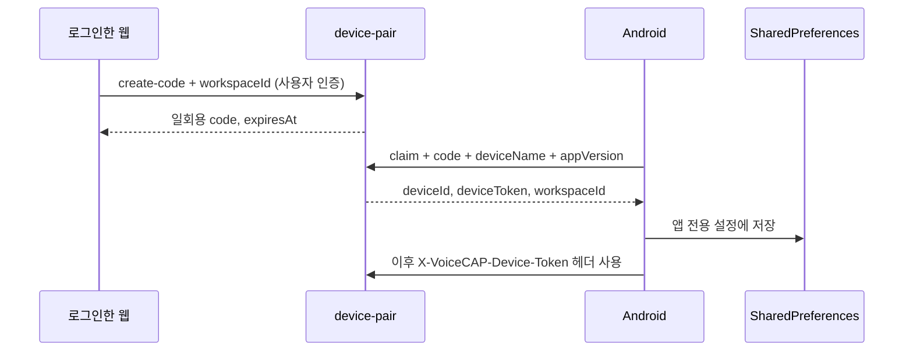

# 5. Android 문자·상품 판매 앱 설계

[전체 설계도](../../PROJECT_REPLICATION_BLUEPRINT.md) · [설치 절차](01_NEW_PC_SETUP.md) · [다음: 구현·검증](06_IMPLEMENTATION_AND_ACCEPTANCE.md)

## 5.1 앱의 역할과 기술

Android 앱은 PC 웹을 그대로 감싼 WebView가 아니다. Java와 Android 기본 View로 만든 별도 앱이다. `MainActivity`에 **판매관리**와 **문자연동** 두 탭이 있고, Supabase Edge Function과 JSON으로 통신한다.

| 항목 | 현재 코드 |
|---|---|
| 루트 | `android/voicecapSMS` |
| Java namespace | `com.voicecap.sms` |
| 설치 패키지 applicationId | `shop.voicecap.smsbridge` |
| 앱 버전 | `versionName 1.3.3`, `versionCode 7` |
| 최소 Android | API 26 |
| compile / target SDK | 35 / 36 |
| Gradle / AGP | 9.3.1 / 9.1.1 |
| 화면 | Android 기본 `Activity`, `LinearLayout`, `AlertDialog` 등 |
| HTTP | `HttpURLConnection`, JSON 직렬화 |
| 단위 테스트 | JUnit 4.13.2, org.json 20240303 |

근거: [app/build.gradle](../../android/voicecapSMS/app/build.gradle), [build.gradle](../../android/voicecapSMS/build.gradle), [MainActivity.java](../../android/voicecapSMS/app/src/main/java/com/voicecap/sms/MainActivity.java).

기존 Android README의 target API 35 설명과 현재 코드의 target 36은 다르다. 복제할 때는 Gradle 값을 기준으로 한다. `compileSdk`는 빌드에 사용한 API, `targetSdk`는 앱이 대상으로 선언하는 동작 규칙이므로 같은 의미가 아니다.

## 5.2 클래스별 책임

아래 Java 경로의 공통 기준은 `app/src/main/java/com/voicecap/sms/`다.

| 파일 | 책임 | 수정하는 상황 |
|---|---|---|
| `MainActivity.java` | 탭·생명주기·문자 역할·권한·카메라 권한 | 탭 이동·권한 안내 변경 |
| `SmsBridgeView.java` | 연결 코드·동의·권한·수동 동기화 화면 | 휴대폰 연결 UX 변경 |
| `BridgePreferences.java` | 장치 ID/토큰/workspace/동의 보관 | 장치 설정 구조 변경 |
| `BridgeClient.java` | `device-pair`, `sms-bridge` HTTP 요청 | 문자·페어링 계약 변경 |
| `BusinessContactStore.java` | 업무 고객 번호 정규화·집합 관리 | 업무 문자 판별 개선 |
| `SmsSyncManager.java` | 수신 SMS/MMS 선별 업로드·발송 큐 처리 | 동기화·문자 처리 수정 |
| `SmsReceiver.java`, `MmsReceiver.java` | 시스템 수신 이벤트 → 작업 예약 | 이벤트 연동 문제 |
| `BootReceiver.java`, `SyncScheduler.java` | 재부팅 및 주기 작업 | 백그라운드 동기화 변경 |
| `SmsSyncJobService.java` | 별도 스레드에서 동기화 실행 | 작업 취소·중복 관리 |
| `SmsRoleUtils.java` | 기본 문자 앱·권한 확인 | 권한 조건 변경 |
| `RespondViaMessageService.java` | 기본 문자 앱 역할용 응답 서비스 | 문자 역할 구성 변경 |
| `sales/SalesRepository.java` | 판매 기능의 인터페이스 | API 기능 확장 |
| `sales/RealSalesRepository.java` | 실제 `sales-api` 통신 | 실제 서버 계약 연결 |
| `sales/FakeSalesRepository.java` | 가짜 데이터·동작 | 서버 없이 화면/로직 실험 |
| `sales/model/SalesModels.java` | JSON ↔ Java 모델 | 필드·상태·응답 변경 |
| `sales/ui/ProductSalesView.java` | 상품·댓글·구매자 선택·판매 확정 | 판매 화면 변경 |
| `sales/ui/ProductRegistrationDialog.java` | 상품 초안·사진·번호 이미지·확정 | 카메라·상품 등록 변경 |
| `sales/ui/BuyerConfirmDialog.java` | 구매자 검색·확인 | 닉네임/구매자 처리 변경 |
| `sales/ui/ProductChangeDialog.java` | 수정 미리보기·확정 | 판매 상품 일괄 수정 |
| `sales/ui/SalesSettingsDialog.java` | 상품 판매 설정 | 기능 토글 변경 |

화면에서 직접 HTTP를 여러 번 작성하지 않고 Repository의 메서드를 호출한다. 그러면 화면 동작과 네트워크 구현을 분리하여 Fake/Real을 바꿔 검증할 수 있다.

## 5.3 시작과 화면 생명주기

```text
MainActivity.onCreate
  → BridgePreferences.configured 검사
      설정 있음: RealSalesRepository
      설정 없음: FakeSalesRepository
  → 판매 탭 / 문자 탭 생성
  → 이전 탭 복원
  → 주기 SMS 작업 예약

판매 탭 표시 또는 onResume
  → ProductSalesView.start
  → get-bootstrap
  → 활성 회차 있으면 get-sales-feed 반복

문자 탭 선택 또는 onPause
  → ProductSalesView.stop
  → 대기 중 피드 타이머 제거
```

판매 피드는 정상 응답 후 1.5초, 오류 후 3초 뒤 다시 조회한다. 활성 회차가 없으면 피드 조회를 진행하지 않는다. 서버의 `get-bootstrap`은 회차를 읽기만 하므로 신규 테스트에서는 웹에서 회차를 시작하는 과정을 포함한다.

현재 페어링 성공 콜백은 메시지와 입력칸만 갱신한다. 이미 만든 `FakeSalesRepository`를 즉시 `RealSalesRepository`로 바꾸는 연결은 확인되지 않았다. 따라서 **처음 연결 성공 뒤 앱을 완전히 다시 실행**해 실제 판매 저장소로 전환되는지 확인한다. 이 동작을 개선하려면 repository 재생성, 기존 polling 중지, 화면 재바인딩을 한 작업으로 구현한다.

## 5.4 기기 페어링



코드는 서버에서 발급·만료·사용 여부를 관리한다. 현재 안내와 서버 구현상 10분 유효한 일회용 코드다. 일반 사용자가 Supabase service role 키를 휴대폰에 입력하는 구조가 아니다.

`BridgePreferences` 저장소 이름은 `voicecap_sms_bridge`이며 주요 값은 `device_id`, `device_token`, `workspace_id`, `device_name`, `data_transfer_consent`다. 앱 백업은 manifest에서 비활성화되어 있다. 토큰 저장은 앱 전용 SharedPreferences를 사용하며 Keystore 암호화 계층 구현은 이 파일에 없다.

API 주소는 빌드 시의 `BuildConfig.VOICECAP_API_BASE_URL`이다. 신규 서비스는 반드시 새 Supabase 함수 base URL로 빌드한다. 앱 설정 화면에서 서버 주소를 바꾸는 방식이 아니다.

새로 페어링된 장치의 DB 기본 capability는 `SMS`다. 상품·판매 탭을 쓰려면 웹의 **기기 권한 및 출력 장치 관리**(`/seller/devices`, `/devices` 별칭)에서 해당 휴대폰에 `SALES_READ`, `SALES_WRITE`, `PRODUCT_WRITE`를 선택하고 저장한다. 문자용 `SMS`는 필요한 경우 유지한다. 그렇지 않으면 재실행하여 Real Repository로 바뀌어도 `get-bootstrap` 등이 `CAPABILITY_DENIED`로 실패한다. 관련 구현은 [DeviceManagementPage.tsx](../../src/pages/seller/DeviceManagementPage.tsx)와 `sales-api/update-device-capabilities`다.

## 5.5 문자 동기화를 시작하는 조건

`SmsSyncManager.syncNow`는 다음 조건을 순서대로 확인한다.

1. 업무 문자 전송 안내에 동의했는가.
2. 이 앱이 현재 기본 SMS 앱인가.
3. 필요한 SMS/MMS 권한을 가지고 있는가.
4. 장치 ID·토큰·workspace가 저장되어 있는가.

조건을 통과하면 기존 업무 고객 번호를 서버에서 갱신하고, 최근 SMS·MMS를 올리고, 발송 대기 문자를 처리한다. 이 네 조건 중 하나가 빠지면 API 주소가 맞더라도 동기화가 시작되지 않는다.

Manifest에 `READ_SMS`, `RECEIVE_SMS`, `SEND_SMS`, `RECEIVE_MMS`, `RECEIVE_WAP_PUSH`, 인터넷·재부팅 관련 권한 등이 있다. 카메라는 상품 사진에 사용한다. 릴리스는 일반 HTTP를 차단하고 디버그 빌드는 개발 접속을 위해 허용한다. 단, HTTP 허용과 현재 API 계약 호환은 다른 문제다.

## 5.6 어떤 문자를 서버로 보내는가

처음 보는 전화번호의 문자를 전부 업로드하지 않는다. 최초 구매정보 판별은 다음 세 묶음의 표현을 모두 포함하는지 검사한다.

| 묶음 | 현재 인식 표현 |
|---|---|
| 구매자 | `닉네임`, `구매자`, `buyer` 중 하나 |
| 주소 | `주소`, `배송지`, `address` 중 하나 |
| 주문 | `상품`, `제품`, `가격`, `금액`, `price` 중 하나 |

예시: `닉네임: 하늘 / 주소: 테스트시 테스트로 1 / 상품: 0007 / 금액: 9000`.

이 문자가 발견되면 번호를 업무 고객 목록에 등록하고 `PURCHASE_INFO`로 업로드한다. 이미 업무 고객으로 등록된 번호의 후속 문자는 `CUSTOMER_INQUIRY`로 보낸다. 조건에 맞지 않는 미등록 번호 문자는 건너뛴다. 등록 고객이 이후 개인 문자를 보냈을 때도 번호 기준으로 선택될 수 있다는 실제 경계를 이해한다.

`BusinessContactStore.normalize`는 숫자와 `+`를 추출하고 `+82`/`82` 시작 번호를 국내 `0` 형식으로 정규화한다. 변경할 때는 같은 고객이 다른 표기로 중복되는지 테스트한다.

### 수신 처리의 구체적 제한

| 항목 | 구현 값 |
|---|---|
| 한 번에 조회하는 SMS | 최근 100건 |
| 한 번에 조회하는 MMS | 최근 30건 |
| 수신 외부 ID | `device-sms-<기기 DB ID>`, `device-mms-<기기 DB ID>` |
| 로컬 중복 표시 | `uploaded_<externalId>` boolean |
| MMS 이미지 수 | 최대 8개 |
| 이미지 하나 크기 | 최대 4 MiB |
| 수신 시간 전송 | 현재 요청 시각을 `receivedAt`로 사용 |

`receivedAt`은 현재 코드에서 통신사 원본 수신시각을 그대로 전달하는 값이 아니다. 대량 과거 메시지 전체 이관이나 정확한 수신 시각 복구는 추가 작업이 필요하다. 앱 데이터를 삭제하면 로컬 업로드 표시도 없어지므로 서버의 중복 처리까지 함께 검사한다.

## 5.7 백그라운드 처리

`SmsReceiver`와 `MmsReceiver`는 수신 이벤트 안에서 긴 업로드를 하지 않고 `SyncScheduler.scheduleNow`를 호출한다. `JobScheduler` 작업은 네트워크가 있을 때 실행하며 즉시 작업의 override deadline은 30초다. 주기 작업은 15분 간격으로 요청된다. 이것은 OS가 항상 정확히 그 시각에 실행한다는 보장은 아니다.

`SmsSyncJobService`는 executor에서 동기화하고 `jobFinished`를 호출한다. 현재 코드에서는 이벤트별 executor 생성·작업 취소·중복 동기화 제어를 정교하게 관리하는 별도 계층이 없다. 실기기 절전·화면 꺼짐·재부팅 시나리오를 반드시 확인한다.

또한 수신 Receiver 자체가 SMS를 Telephony Provider에 기록하거나 MMS를 다운로드하는 완전한 메시지 앱 구현은 아니다. 현재 흐름은 Provider에 있는 메시지를 읽는다. 기본 SMS 앱 역할을 가졌다는 이유만으로 모든 기기에서 새 수신 SMS/MMS가 자동으로 저장·다운로드된다고 보장할 수 없다. 실기기에서 실제 수신 메시지의 Provider 반영과 업로드를 확인하고, 필요하면 기본 문자 앱 저장·MMS 수신 처리를 구현한다.

## 5.8 발송 큐

```text
웹에서 발송 요청 → 서버 customer_messages의 발신 대기 행
  → Android outbox-claim(limit 20)
  → SmsManager.divideMessage
  → 한 부분: sendTextMessage
  → 여러 부분: sendMultipartTextMessage
  → API 요청 성공 처리: outbox-status SENT
  → Java 예외: outbox-status FAILED
```

현재 `SENT`는 Android의 발송 요청이 예외 없이 호출되었다는 의미다. sent/delivery PendingIntent를 통한 통신사 최종 결과 추적은 연결되어 있지 않다. “수신자에게 도착함” 표시로 해석하면 안 된다. 실문자 시험은 지정한 테스트 번호로 수행하고 요금·발송 결과를 확인한다.

서버 claim과 기기 발송 사이 또는 발송 후 상태 갱신 전에 앱이 중단되는 경우를 별도로 설계해야 한다. 재시도했다고 동일 문자를 무조건 다시 발송하는 방식은 피하고 서버 상태·발송 시도 기록으로 판정한다.

## 5.9 상품 등록과 사진

```text
번호/상품명/단가 입력
  → prepare-product(operationId)
  → draftId / productCode / upload URL 수신
  → 사진 ON: 전면 카메라 2초 카운트다운
       실제 촬영 → 갤러리 저장 → 미리보기 → JPEG PUT 업로드
  → 사진 OFF 또는 촬영 실패/거절: 번호 이미지 경로
  → 필요 시 update-product-draft
  → commit-product(expectedDraftRevision, expectedSessionRevision)
  → 새 activeProduct와 session 반영
```

숫자만 입력하면 상품번호로 취급하고 `0007`의 앞자리 0을 보존한다. 상품번호를 `int`로 바꾸면 이 규칙이 깨진다. 단가는 원화 정수 `Long`, 미입력은 `null`이다. 금액 0과 미입력은 서로 다르다.

실제 사진은 현재 `android.hardware.Camera`를 사용한다. 카메라와 surface 생명주기, 회전, 권한 거절, 전면 카메라가 없는 기기를 검사해야 한다. 번호 이미지는 “사진 성공”으로 위장하지 않고 image kind와 fallback 확인 상태로 구분한다.

신규 DB에서는 [3장](03_BACKEND_DATABASE.md)의 상품번호 제약·예약 만료 컬럼 문제를 해결해야 이 흐름 전체를 검증할 수 있다.

## 5.10 구매자 선택과 판매 확정

1. `get-sales-feed`로 회차 댓글·상품·구매자 통계를 가져온다.
2. 댓글에 대응하는 구매자를 선택한다.
3. 닉네임만으로 확실하지 않으면 `search-buyers`/`confirm-buyer`로 확인한다.
4. 선택 구매자별 수량을 변경한다.
5. `commit-sales`에 `operationId`, `sessionId`, `productId`, 예상 revision, `buyers`를 보낸다.
6. 응답의 판매 ID·금액·수량·출력 작업 상태를 반영한다.

상품 수정은 `preview-product-change`로 영향과 preview token을 받는 단계와 `commit-product-change`로 확정하는 단계를 나눈다. 오래된 revision이면 사용자에게 최신 데이터를 다시 보여준 뒤 재검토하도록 구현한다.

## 5.11 네트워크 계층과 오류 처리

`RealSalesRepository`는 단일 executor에서 네트워크를 실행하고 UI 변경은 main Handler로 돌려보낸다. 요청은 `POST <base>/sales-api`, 헤더는 `Content-Type: application/json`, `X-VoiceCAP-Device-Token`이다. 연결 timeout 10초, 읽기 timeout 15초다.

성공 응답은 `{ "ok": true, "data": ... }`, 실패 응답은 `error` 객체를 Java `SalesError`로 바꾼다. 네트워크 예외에는 `NETWORK_ERROR`, 재시도 가능 플래그를 사용한다. 호출 버튼을 연속 눌렀을 때의 중복·대기 상태와 API의 재시도 가능 의미를 구분한다.

`operationId`가 있는 요청 본문은 `voicecap_sales_ops` SharedPreferences에도 기록한다. 그러나 이것만으로 자동 복구 큐가 완성된 것은 아니다. 재시작 뒤 읽어 재전송·조회·정리하는 전체 처리 흐름이 연결되었는지 확인해야 한다. 응답을 못 받은 판매를 다시 만들기 전에 `get-operation`으로 원래 작업을 조회하는 설계가 필요하다.

## 5.12 빌드·서명·산출물

기본 설치는 [1장](01_NEW_PC_SETUP.md)의 JDK/SDK 명령을 따른다.

```powershell
Set-Location C:\dev\voice-pin-anti\android\voicecapSMS
.\gradlew.bat :app:testDebugUnitTest :app:assembleDebug '-PVOICECAP_API_BASE_URL=https://YOUR_PROJECT_REF.supabase.co/functions/v1'
```

| 산출물 | 위치 |
|---|---|
| 디버그 APK | `app/build/outputs/apk/debug/app-debug.apk` |
| 단위 테스트 HTML | `app/build/reports/tests/testDebugUnitTest/index.html` |
| 단위 테스트 XML | `app/build/test-results/testDebugUnitTest/` |
| 릴리스 AAB | `app/build/outputs/bundle/release/app-release.aab` |

릴리스 서명은 아래 환경변수 네 개를 모두 요구한다. 일부만 설정하면 빌드가 실패한다.

| 변수 | 값 |
|---|---|
| `VOICECAP_UPLOAD_KEYSTORE` | 원래 배포 키 파일의 절대 경로 |
| `VOICECAP_UPLOAD_STORE_PASSWORD` | 키 저장소 비밀번호 |
| `VOICECAP_UPLOAD_KEY_ALIAS` | alias |
| `VOICECAP_UPLOAD_KEY_PASSWORD` | 개별 키 비밀번호 |

변수를 안전하게 설정한 후 `:app:bundleRelease`를 실행한다. 네 변수가 모두 없는 상태의 산출물 생성은 유효한 배포 서명 완료와 다르다. 기존 배포 앱 업데이트는 원래 서명/스토어 키 체계를 인수해야 한다. 현재 package ID를 변경하면 별도 앱이 된다. Play 배포 정책은 제출 시점의 Console에서 확인하며, 저장소의 과거 배포 안내를 현재 정책 승인으로 간주하지 않는다.

## 5.13 초보 개발자의 구현 순서와 합격 기준

| 단계 | 작업 | 합격 기준 |
|---|---|---|
| 1 | 프로젝트 빌드와 Fake 화면 | 서버 없이 두 탭 표시, 테스트 통과 |
| 2 | JSON 모델·Repository 인터페이스 | 공통 fixtures를 Java 모델로 읽고 필드 손실 없음 |
| 3 | 실제 API 연결·페어링·capability 부여 | 같은 workspace 연결, 판매 권한 확인, 폐기 토큰 거절 |
| 4 | 판매 피드 | 화면을 떠나면 polling 중지, 회차 일치 |
| 5 | 상품 등록 | 앞자리 0·0원·미입력·사진 실패 처리 |
| 6 | 판매 확정·수정 | 중복 요청·revision 충돌·미리보기 처리 |
| 7 | 문자 선택·업로드 | 미등록 개인문자 제외, 테스트 구매정보·후속문의 동기화 |
| 8 | 발송 큐 | 테스트 번호 발송 및 실패/상태 갱신 확인 |
| 9 | 실기기 회복 | 화면 회전·절전·재부팅·네트워크 재연결 검증 |

문서 작성 시 JBR 21.0.9 환경에서 `:app:testDebugUnitTest :app:assembleDebug`는 성공했다. 실제 휴대폰 설치·SMS 발송·카메라·스토어 배포를 실행한 결과는 아니다. 전체 인수 시나리오는 [6장](06_IMPLEMENTATION_AND_ACCEPTANCE.md)에서 이어진다.
