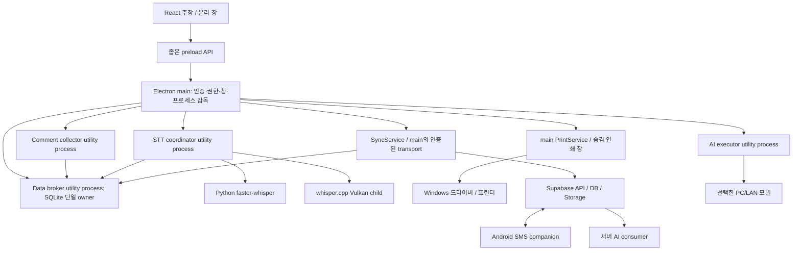
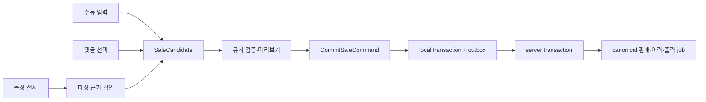

# 02. Windows 앱 구조와 댓글 도우미 완전 통합

[문서 첫 화면](README.md) · [데이터·API·동기화](03_DATA_API_SYNC.md)

작성 기준: 2026-09-26. 제품명은 **VoiceCAP Studio for Windows**다. 이 문서는 현재 소스를 조사하여 만든 **새 앱의 목표 설계**이며, 문서에 등장하는 새 모듈·IPC·복구 기능은 아직 구현된 것으로 간주하지 않는다. 실제로 만드는 것은 `windows-app-blueprint` 설계 폴더다. 향후 구현 저장소 예시는 `voicecap-studio/`다.

## 1. 가장 먼저 이해할 구조

판매자는 설치 프로그램 하나로 앱을 설치하고, 앱 안에서 로그인·방송·댓글·음성 인식·상품·판매·고객·문자·정산·배송·출력을 처리한다. 현재의 별도 댓글 도우미 화면은 **설정 → 장치 및 연결**과 **방송 화면의 연결 상태 영역**으로 흡수한다. 별도 도우미 설치, 브라우저 실행, `localhost:2137` 접속을 정상 사용의 선행 조건으로 두지 않는다.

화면은 기존 React·TypeScript를 재사용하되 업무 저장을 화면에서 직접 실행하지 않는다. Electron의 main이 인증과 권한을 확인하고, 내부 서비스가 댓글·동기화·출력을 담당한다. Supabase는 여러 PC와 Android가 공유하는 최종 업무 데이터의 기준이다. 인터넷이 끊기면 PC가 안전하게 접수한 명령을 보관하고, 재접속 후 서버가 최종 확정한다.

| 용어 | 초보 개발자를 위한 뜻 |
|---|---|
| renderer | 버튼·표·대화상자를 그리는 React 화면 프로세스. 파일과 운영체제 권한은 주지 않는다. |
| main | 앱 수명·창·권한·로그인 토큰·프린터·업데이트를 책임지는 Electron 프로세스다. |
| preload | 화면과 main 사이에 정해진 기능만 열어 주는 통로다. |
| IPC | 같은 앱의 프로세스 사이에 메시지를 주고받는 방식이다. 서버에 공개하는 HTTP API와 다르다. |
| utility process | UI와 분리해 Node 작업을 실행하는 자식 프로세스. 멈추거나 재시작되어도 창은 살아 있도록 구성한다. |
| broker | 여러 호출의 권한·순서·중복을 관리하는 조정자다. |
| outbox | 인터넷 전송 전에 디스크에 저장하는 발신 대기열이다. 메모리 배열과 달리 앱이 꺼져도 남는다. |
| revision | 특정 판매나 상품이 몇 번 수정됐는지 나타내는 버전이다. 남의 최신 수정을 덮지 않도록 사용한다. |
| canonical | 여러 사본 가운데 업무적으로 최종 확정된 기준 데이터라는 뜻이다. |

## 2. 현재 구현에서 가져올 것과 바꿀 것

| 현재 소스와 확인한 동작 | 새 앱의 처리 |
|---|---|
| [기존 Electron main](../desktop/comment-helper/main.cjs): 창·트레이·자동 시작·프린터·utilityProcess 실행 | 운영체제 연결 방식은 재사용하고 전체 앱 main으로 재구성한다. |
| [기존 preload](../desktop/comment-helper/preload.cjs): `window.voicecap`의 좁은 helper API | 판매·음성·장치별 타입이 있는 API로 확장한다. 임의 `invoke(channel)`은 노출하지 않는다. |
| [Node 서버](../server/index.js): Express/Socket.IO, TikTok, STT, print parentPort 중계 | HTTP 등록과 핵심 서비스를 분리한다. 기본 설치 앱은 내부 IPC로만 호출한다. |
| main이 2137 점유 PID를 `taskkill /F` 하는 코드 | 삭제 대상이다. 타 프로그램을 죽이는 포트 확보는 하지 않는다. |
| [댓글 발행기](../server/cloudCommentPublisher.js): 메모리 배열, 배치·재시도 | SQLite durable queue로 바꾸고 댓글 업로드 주체를 한 개로 통합한다. |
| [클라우드 인쇄 워커](../server/cloudPrintWorker.js): claim/begin/ack 클래스 존재 | 현재 main/server 기동에 연결되지 않은 부분이다. 실제 인증·필드 변환·main 인쇄와 연결해야 한다. |
| [STT bridge](../server/sttBridge.js), [Python worker](../server/stt_worker.py), [Vulkan runner](../server/vulkanRunner.js) | 엔진 어댑터로 가져오고 프로세스 감독·세션 세대·모델 검증을 보강한다. |
| [원격 데이터 서비스](../src/services/remoteWorkspaceService.ts): 브라우저에서 직접 Supabase 업무 쓰기 | 모든 Windows 쓰기는 공통 command broker를 거친다. 기존 데이터 읽기는 adapter로 호환한다. |
| [판매 API](../src/services/productSalesApi.ts)와 [음성 후보](../src/services/voiceSaleCandidate.ts) | 타입·파싱 규칙을 재사용하되 음성·수동·댓글 판매의 저장 흐름을 통일한다. |
| [로그인 기억 서비스](../src/services/authCredentialsService.ts): 비밀번호를 base64로 localStorage 보관 | 이관하지 않는다. 비밀번호 기억 기능 대신 main의 보호된 세션 보관을 사용한다. base64는 암호화가 아니다. |
| [Android 클라이언트](../android/voicecapSMS/app/src/main/java/com/voicecap/sms/BridgeClient.java) | Supabase `device-pair`/`sms-bridge`를 사용하는 문자 동반 앱으로 유지한다. |

`desktop/comment-helper/server`는 stage로 생성되는 사본이다. 실제 재사용 소스는 `server/`다. 사본을 새 앱의 원본으로 삼지 않는다. 현재 상태의 상세 근거는 [기존 로컬 서버 설계](../docs/replication/04_LOCAL_SERVER_DESKTOP_STT.md)와 [기존 DB 설계](../docs/replication/03_BACKEND_DATABASE.md)에 있다.

## 3. 기술 기준과 제품 경계

| 항목 | 기본 설계 | 이유·확인할 점 |
|---|---|---|
| 데스크톱 런타임 | Electron, 기존 lock 기준 44.0.0 | 기존 helper의 프린터·Node·STT 연결을 재사용한다. “2026년 최신 권장판”이라는 뜻이 아니다. 출시 시 지원 버전과 보안 패치 검토가 별도 필요하다. |
| UI | React + TypeScript, Vite 기반 패키지 | 기존 기능의 업무 로직을 옮기기 쉽고 한 UI 체계로 통합할 수 있다. |
| 로컬 업무 보관 | SQLite, 단일 owner 프로세스 | 다중 창의 중복 쓰기·순서 뒤집힘을 방지하고 중단 후 복구한다. |
| 원격 기준 데이터 | Supabase Postgres/Auth/Storage/Realtime + Edge Functions | 기존 서버 및 Android와 호환한다. 원자성·RLS 보완은 출시 선행 조건이다. |
| 댓글 | 기존 TikTok connector를 별도 utility process에서 실행 | UI 응답과 외부 연결 실패를 분리한다. TikTok 연동 가능성은 실제 플랫폼으로 검증한다. |
| 로컬 STT | Python faster-whisper CPU/CUDA 및 whisper.cpp Vulkan 어댑터 | 장치별 선택·실패 시 CPU 전환을 지원한다. |
| 인쇄 | Electron main의 숨김 인쇄 창 + 영속 작업대장 | 판매 기록과 출력 상태를 구분해 중복·재출력을 관리한다. |
| 설치 | Windows x64, 사용자별 설치, 새 `appId=shop.voicecap.studio` | 기존 helper와 설정·업데이트 채널이 섞이지 않도록 한다. ARM64 네이티브는 별도 검증 대상이다. |

SQLite 바인딩을 `better-sqlite3` 등의 native module로 선택하면 일반 Node에서 설치가 성공한 것만으로 완료가 아니다. **Electron 44의 Node ABI·x64 대상에 맞는 빌드/재빌드, ASAR unpack, 설치 패키지에서의 DB 개방 시험**까지 통과해야 한다. 버전은 구현 단계에서 호환성을 확인한 후 lockfile에 고정한다. 확인 없이 최신 native module 버전을 이 설계의 검증 버전으로 적지 않는다.

## 4. 프로세스 지도



그림의 service가 반드시 각각 별도 OS 프로세스여야 한다는 의미는 아니다. Data broker·댓글·STT는 장애 분리가 중요한 최소 구분이다. SyncService와 AuthBroker는 main에서 비동기 네트워크를 수행하고, DB 접근만 Data broker에 위임한다. main에는 무거운 파싱·이미지 연산·동기 파일 읽기를 넣지 않는다. Node utility process는 renderer sandbox와 같은 보안 장벽이 아니다. 사용자 권한의 코드이므로 검증된 패키지와 필요한 자격만 전달한다. [Electron utilityProcess 공식 문서](https://www.electronjs.org/docs/latest/api/utility-process)

### 4.1 프로세스별 책임과 금지 항목

| 영역 | 허용 | 금지 |
|---|---|---|
| renderer | 화면 상태, 입력 검증, 파형·가상화 표, 안전한 표시 모델 | Node `fs`, shell, 장기 토큰, service-role, 직접 DB 쓰기 |
| preload | 명시한 함수별 IPC, 구독 해제 함수, JSON 가능한 값 | ipcRenderer 전체 노출, 임의 채널, event 객체 노출 |
| main | 로그인·토큰, IPC sender 확인, 기능 권한, 프린터·파일 대화상자 | 사용자 입력을 shell 명령으로 실행, 비신뢰 URL의 무제한 외부 열기 |
| Data broker | 마이그레이션, local transaction, outbox, 검색·페이지 읽기 | 클라우드 service-role 보관, renderer 임의 SQL 실행 |
| collector | 연결 1개, 댓글 정규화, 재연결, 수집 상태 | 판매 직접 생성, 화면별 별도 업로드, workspace 임의 전환 |
| STT | PCM 처리, 엔진 선택, 취소, 전사 상태 | 인식 결과를 검증 없이 판매 확정, 원음 상시 저장 |
| AI executor | 할당된 작업·설정 버전으로 추론하고 결과 제안 | AI 응답에 포함된 URL/명령 실행, 무조건 판매 수정 |
| PrintService | 서버 확정 job과 payload에 한정한 출력 | 임의 HTML/URL 인쇄, 임의 exe 실행, UNKNOWN 자동 재출력 |

### 4.2 계획하는 폴더 구조

다음은 **향후 구현 예시**이며 현재 생성된 소스 트리가 아니다.

```text
voicecap-studio/
  apps/desktop/
    main/                 # windows, auth, ipc, print, updater, lifecycle
    preload/              # window.voicecapStudio 노출
    renderer/             # 화면, 접근성, 토큰, 라우트
    resources/            # 아이콘, 글꼴, 인쇄 템플릿
    electron-builder.yml  # Windows 패키지 설정
  packages/domain/        # 판매·상품·정정 순수 규칙
  packages/contracts/     # schema, IPC, HTTP, event 타입
  packages/broker/        # command 조정, SQLite 단일 owner, 복구
  packages/storage/       # migration, repository, outbox, search
  packages/cloud/         # main의 인증된 Supabase adapter
  packages/comments/      # TikTok adapter, normalize, collector
  packages/audio/         # 입력 선택, PCM, 장치 복구
  packages/stt/           # coordinator, python/vulkan adapter
  packages/printing/      # queue, 전표, main 출력 adapter
  packages/ai/            # PC executor, prompt/result 검증
  packages/ui/            # 디자인 토큰, 공통 UI, 접근성
  supabase/functions/     # 기존 서버 함수와 신규 command
  supabase/migrations/    # 서버 schema와 이관 단계
  runtime/                # 검증한 runtime manifest와 조립 도구
  tests/fixtures/         # 합성 댓글·문자·판매 데이터
```

전체 트리와 개발 명령의 기준은 [07 개발·패키징 문서](07_BUILD_RELEASE_AND_HANDOVER.md)다. `domain`은 React·Electron·Supabase를 import하지 않는 순수 TypeScript로 만든다. 예를 들어 `validateSaleCandidate()`는 판매 값의 오류만 반환한다. 저장·인쇄·API 호출은 service가 맡는다. 이 경계를 지키면 웹 기능 이식과 테스트가 쉬워진다.

## 5. 댓글 도우미의 통합 방식

### 5.1 사용자가 보는 변화

| 기존 별도 도우미 기능 | 통합 앱 위치 | 내부 담당 |
|---|---|---|
| TikTok ID 입력, 시작/중지, 상태 | 방송 화면 → 댓글 연결 | CommentService |
| 서버 재시작·연결 점검 | 설정 → 진단 → 댓글 연결 복구 | ProcessSupervisor |
| 자동 시작·트레이·종료 | 설정 → 일반 / Windows 트레이 | AppLifecycle |
| 프린터 선택·용지·시험 출력 | 설정 → 프린터 / 방송 상태 표시 | PrintService |
| STT 장치 탐지·CPU/GPU·모델 | 설정 → 음성 인식 | SttService |
| 로그 폴더·도우미 버전·업데이트 | 설정 → 진단 / 앱 정보 | Diagnostics / Updater |
| 웹앱 열기 | 제거하고 해당 내장 화면으로 이동 | Router |

처음 실행하면 로그인 → workspace 선택 → 마이크 확인 → 댓글 연결 확인 → 선택적 STT 모델 다운로드 → 프린터 시험 순서로 안내한다. 문자 기능은 Android 페어링으로 이어진다. 프린터나 GPU가 없는 사용자는 그 기능을 나중에 설정할 수 있고 다른 업무는 계속할 수 있다.

### 5.2 댓글 처리 순서

1. main이 사용자·workspace·회차·`COMMENT_INGEST` 허가를 확인한다.
2. workspace와 회차에 대해 실행 중인 collector가 하나인지 확인한다. 다중 PC의 대표 collector는 서버 lease와 fencing generation으로 결정한다.
3. collector가 TikTok 연결을 열고 수신 댓글을 `CommentReceived` 구조로 정규화한다. 외부 닉네임/댓글은 일반 문자열로 취급한다.
4. Data broker가 `(workspace, session, platform, liveRoom, platformMessageId)` 기준 중복을 판정하고 원문·수집 시각·순서를 보관한다. 플랫폼 ID가 없을 때는 재시도 동안 변하지 않는 로컬 UUID를 생성하고 identity 품질을 `LOCAL_ONLY`로 표시한다. 내용 해시만으로 서로 다른 실제 댓글을 합치지 않는다.
5. **같은 SQLite transaction**에서 댓글 캐시와 업로드 outbox를 저장한다. 디스크 저장 성공 후 화면에 “수집됨”을 알린다. 서버 반영 여부는 별도 표시한다.
6. SyncService만 서버로 배치 전송한다. renderer와 collector가 별도로 같은 댓글을 올리지 않는다.
7. 서버 응답의 canonical comment ID를 연결하고 outbox를 완료한다. 동일 operation ID 재시도는 같은 결과를 반환한다.
8. UI는 증분 이벤트와 페이지 조회로 목록을 갱신한다. Realtime 자기 이벤트는 revision·event ID로 중복 적용하지 않는다.

연결 상태는 `IDLE → CONNECTING → LIVE → RECONNECTING → LIVE`와 `STOPPING/ERROR`로 표현한다. 실제 방송 종료는 네트워크 단절과 구분한다. 사용자 중지는 재연결 타이머를 취소한다. 지수 backoff에 jitter를 넣고 무한 고속 재시도를 막는다. 외부 서비스가 지나간 댓글 재전송을 보장한다고 가정하지 않으며, 수집 중단 구간은 타임라인에 표시한다.

### 5.3 HTTP 호환 모드

통합 앱 정상 경로에서 Express·Socket.IO 2137 API는 필요하지 않다. 기존 웹앱과 임시 공존이 필요한 이행 기간에만 별도 compatibility adapter를 허용한다.

- 기본값 OFF이며, ON 상태·허용 origin·종료 예정 버전을 진단 화면에 표시한다.
- `127.0.0.1`에만 bind한다. 포트 충돌 시 설명하고 멈춘다. 점유 프로세스를 강제 종료하지 않는다.
- 세션마다 발급하는 임시 자격과 Origin 검증, 요청 크기·속도 제한이 필요하다. CORS만으로 인증을 대신하지 않는다.
- 내부 command broker를 호출하므로 DB·댓글·출력의 두 번째 소유자가 생기지 않는다.
- 통합 앱으로 데이터 이관·기능 동등성 확인 후 폐기한다. 현재 Android는 이 모드를 사용하지 않는다.

## 6. 음성·수동·댓글 판매를 같은 처리로 합치기

기존 화면에는 직접 `sales`를 저장하는 경로와 `commit-sales` 경로가 함께 존재한다. 새 앱은 입력 방식만 다르고 최종 업무 명령은 동일하다.



미리보기의 타이머 완료와 “지금 저장” 클릭은 같은 candidate ID의 command를 사용한다. 두 요청이 동시에 와도 판매는 한 번만 생성된다. 회차 변경·상품 변경·후속 음성 수정은 후보 revision을 올리고 이전 타이머를 무효화한다. 닉네임이 같아도 다른 플랫폼 사용자이면 buyer ID로 구분한다. 단가 미정과 0원은 다른 값이다.

음성 인식 중 단가·수량·구매자를 확실히 알 수 없으면 `PENDING_REVIEW` 후보로 보관하고 사유와 원문을 보여 준다. AI는 보완안을 제시할 수 있지만 최신 sale revision·증거가 달라지면 결과를 자동 적용하지 않는다. 오프라인 판매는 “PC 저장됨 · 서버 확정 대기”이며 확정 매출과 분리해서 집계한다. 자세한 contract는 [03 문서](03_DATA_API_SYNC.md)에 있다.

## 7. STT·마이크·캡처 구조

### 7.1 엔진을 바꿔도 UI가 같은 계약을 쓰게 한다

`SttService` 인터페이스는 `listDevices`, `prepareModel`, `start`, `pushAudio`, `stop`, `cancel`, `getStatus`다. renderer는 Python 명령줄·모델 경로·Vulkan HTTP 포트를 알 필요가 없다.

| 어댑터 | 입력/출력 | 구현 주의 |
|---|---|---|
| Python CPU/CUDA | PCM → worker → 전사 segment | 배포한 전용 Python runtime/venv를 사용한다. 사용자 전역 Python을 조용히 변경하지 않는다. |
| whisper.cpp Vulkan | PCM/WAV → 전용 child의 추론 → segment | child 전용 loopback 포트와 경로를 감독한다. renderer 접근·외부 bind를 막는다. 가용성은 실제 추론으로 확인한다. |
| Deepgram / Soniox 등 기존 클라우드 STT | 서비스 규격에 맞는 음성 stream → segment | 기존 공급자 기능을 보존한다. 장기 API 키를 renderer에 저장하지 않으며 제공되는 임시 토큰 또는 main의 연결 중계를 사용한다. |

오디오 계약은 `sessionId`, `generation`, `streamId`, `sequence`, `sampleRate`, `channels`, `format`, `capturedAt`, `ArrayBuffer`를 포함한다. 목표 PCM 규격은 mono 16kHz signed 16-bit이며 엔진 요구값이 다르면 adapter에서 변환한다. 패킷 크기·최대 버퍼를 제한하고 역압을 둔다. audio frame마다 JSON/base64 변환과 전체 React state 업데이트를 하지 않는다.

### 7.2 오래된 결과가 새 회차에 들어가지 않게 한다

`generation`은 STT 시작·중단·엔진 전환·복구 때 증가하는 번호다. 워커가 돌려준 `sessionId/generation`이 현재 값과 다르면 결과를 버린다. `segmentId`와 final revision으로 같은 발화를 중복 후보로 만들지 않는다. partial은 자막 표시용이고 final만 업무 파싱에 들어간다. 이미 확정한 final의 정정은 덮어쓰기 대신 이력 있는 correction 이벤트로 처리한다.

### 7.3 모델·runtime 관리

- manifest에 엔진 버전, 모델 ID, 파일 크기, SHA-256, 배포 URL, 라이선스/출처, 지원 architecture를 둔다.
- 다운로드는 `.partial` 파일로 받고 재개 가능 여부를 확인한다. 크기·해시 검증 후 같은 볼륨에서 이름을 바꿔 완료 파일로 확정한다.
- 모델은 설치 폴더나 `app.asar`에 쓰지 않는다. 앱 userData 아래 버전별 cache에 저장한다.
- 모델 교체 전에 디스크 여유를 검사하고 현재 정상 모델을 보존한다. 실패하면 기존 모델로 되돌린다.
- 새 PC에서 CPU 작은 모델로 기능 확인 후 GPU를 선택한다. CUDA/Vulkan 실패 시 사용자에게 사유를 보이고 CPU를 제안한다.
- 모델 로딩과 워커 기동 timeout, 제한된 재시작 횟수, 취소 가능 다운로드, 로그 용량 제한을 구현한다.
- Python EXE·DLL·모델 배포 권리는 출시 검토에 포함한다. 실행 파일과 GPU DLL을 개발 PC에서 임의로 복사해 판매 패키지로 확정하지 않는다.

### 7.4 마이크·화면 캡처

마이크는 명시적으로 선택한 앱 창에만 허용하고 장치 이름·입력 레벨·권한 거부·장치 제거 상태를 보여 준다. 창을 닫아 트레이로 보낼 때 녹음 지속 여부는 첫 설정에서 정하고 녹음 중 트레이 표식을 유지한다. 자동 시작이 자동 녹음을 의미하지 않는다.

기존 [화면 캡처 서비스](../src/services/screenCaptureService.ts)의 업무 목적과 영역 선택을 유지한다. main의 화면/창 선택 정책과 renderer의 캡처 영역 좌표를 연결하되 DPI 배율·음수 모니터 좌표·모니터 제거를 처리한다. 창·화면 선택은 사용자에게 보여 주고 무제한 전체 화면 자동 수집으로 바꾸지 않는다. 이미지 최대 크기·포맷 검증·민감 화면 제외를 지원한다. 앱 캡처 이미지와 OAuth/비밀번호 화면은 분리한다.

### 7.5 기존 TAB_AUDIO 기능의 Windows 이전

기존 웹의 `TAB_AUDIO`는 브라우저의 화면 공유·탭 오디오 기능에 기대는 경로다. **Electron이 외부 Chrome의 탭 목록과 탭 소리 선택 UI를 그대로 제공한다고 가정하지 않는다.** 판매자가 방송 소리를 인식한다는 업무 목적을 보존하면서 입력 종류·실제 수집 범위를 명시한다.

| 새 입력 모드 | 설계 | 사용자에게 보여 줄 범위 |
|---|---|---|
| 마이크 | 선택한 `getUserMedia` 입력 | 마이크 이름·음량·음소거 |
| 시스템 소리 | main의 `session.setDisplayMediaRequestHandler`와 `desktopCapturer`로 선택 화면/창 및 Windows `loopback` 요청 | 화면 선택과 별도로 **시스템 전체 소리**임을 표시 |
| 특정 앱/브라우저 소리 | 검증한 전용 capture adapter가 있을 때만 활성화 | 실제 프로세스/앱 이름·포함되는 하위 프로세스·제외되지 않는 소리 |
| 앱 내부 재생 소리 | 통제한 내부 webContents 소스를 지원하는 버전에서 검증 | 해당 내부 재생 창. 외부 Chrome 탭과 구분 |

Electron 공식 계약의 `audio: 'loopback'`는 시스템 오디오를 뜻한다. 비디오로 특정 창을 골랐다고 오디오도 그 창 하나로 격리되는 것은 아니다. `WebFrameMain` 오디오도 그 frame의 webContents 범위이지 외부 브라우저 탭 접근권을 주는 API가 아니다. 잠금 버전 44와 Windows 테스트 환경에서 실제 지원을 확인한 뒤 mode를 노출한다. [Electron display media 계약](https://www.electronjs.org/docs/latest/api/session#sessetdisplaymediarequesthandlerhandler-opts), [desktopCapturer 예제](https://www.electronjs.org/docs/latest/api/desktop-capturer)

시스템 소리는 다른 앱 알림까지 포함할 수 있으므로 시작 전에 범위를 알리고 앱 자체 알림음·TTS·모니터링 재생을 음성 입력으로 되먹임하지 않는다. 미리보기 audio는 mute하고 헤드폰·입출력 라우팅을 설명한다. 마이크와 loopback 동시 입력은 별도 source stream으로 추적하고 의도하지 않은 이중 인식을 방지한다. 같은 방송 소리가 마이크와 스피커를 통해 두 번 들어오는 경우를 검증한다.

권한 요청은 명시한 시작 동작에서 하고 취소·권한 거부·audio track 없음·장치 제거를 각각 표시한다. capture track의 `ended`와 장치 변경 시 입력을 정지하고 generation을 증가시킨다. OBS/TikTok Studio와 동시 사용, 가상 오디오 장치, Bluetooth 장치 변경, 기본 출력 장치 변경, 앱 효과음 포함 여부를 별도 합격 시험으로 둔다.

외부 특정 탭 하나만 분리하는 동등성이 필수인 배포에서는 검증된 native/process audio 또는 명시적으로 허용된 브라우저 연동 방식을 별도 어댑터로 완성해야 한다. process audio도 여러 탭을 합칠 수 있으므로 탭 단위 격리를 광고하지 않는다. 그 시험을 통과하기 전에는 “TAB_AUDIO 이전 완료”로 처리하지 않는다. 특정 프로세스 loopback의 효율 개선은 후속 연구 후보이며 현재 구현된 기능이 아니다.

## 8. 인쇄 통합과 복구

현재 `print_jobs` 서버 모델을 새 기준으로 사용한다. 기존 `sales.print_status`는 호환 표시로만 변환한다. 기존 [인쇄 handler](../supabase/functions/sales-api/handlers/print.ts)는 조회 후 갱신 방식의 claim이므로 두 PC 경쟁을 안전하게 막는 원자적 RPC로 교체해야 한다.

1. 서버가 확정 판매와 같은 transaction에서 immutable payload의 print job을 만든다.
2. 선택된 output device만 원자적 claim을 받는다. job별 lease token과 generation을 발급한다.
3. PC가 job ID·payload hash·sale revision·lease를 SQLite에 기록한다.
4. 서버 begin이 성공하면 local 상태를 `SUBMITTING`으로 commit한다.
5. main이 검증된 텍스트와 정해진 템플릿만 숨김 창에 넣고 Windows 인쇄를 호출한다.
6. callback 결과를 local journal에 먼저 저장한 뒤 서버 ack를 보낸다. ack 전송 실패는 ack만 재시도한다.
7. callback 전에 프로세스가 죽었거나 제출 여부를 알 수 없으면 `UNKNOWN`이다. 화면에서 사용자가 종이·스풀러를 확인하고 재출력 여부를 결정한다.

**실물 인쇄의 exactly-once는 보장할 수 없다.** 앱 DB와 프린터는 하나의 transaction이 아니다. Electron callback 성공은 출력 제출 수준의 신호이며 종이 정상 배출 확인은 별개다. 완료 문구는 “프린터로 보냄”, 불확실하면 “출력 확인 필요”로 구분한다. [Electron webContents.print 공식 문서](https://www.electronjs.org/docs/latest/api/web-contents#contentsprintoptions-callback)

중복 방지는 payload 내용만으로 하지 않는다. 같은 내용의 정당한 재출력도 존재하기 때문이다. `jobId + kind + reprintSequence + saleRevision`을 식별 기준으로 쓰고, hash는 내용 변조 검사에 사용한다. 재출력은 이유·실행자를 기록한 **새 job**이다. 판매 수정·취소는 과거 출력 payload를 바꾸지 않고 correction/cancel job을 만든다.

출력 직전 서버 연결이 끊겼다면 새 claim/begin을 진행하지 않는다. 이미 `SUBMITTING`인 건은 journal을 근거로 복구한다. 임의 “오프라인 확정 전표”를 자동 출력하지 않는다. 필요하면 향후 제품 옵션으로 “서버 미확정” 워터마크가 있는 별도 임시표를 정의한다.

## 9. AI 작업을 실제 실행하는 구성

현재 [selfHostedAdapter](../supabase/functions/sales-api/handlers/aiAdapters/selfHostedAdapter.ts)는 `helperDispatcher` 함수 주입을 전제로 하는 경로가 있다. HTTP JSON에 JavaScript 함수를 실을 수 없고, Edge Function에서의 `127.0.0.1`은 판매자의 PC가 아니다. 다음 실제 실행 주체가 필요하다.

| 작업 경로 | producer | consumer | 결과 확정 |
|---|---|---|---|
| CLOUD | 공통 업무 API가 `ai_tasks` 등록 | 서버에 배포한 지속 가능한 worker/scheduled consumer | task claim token·설정/판매 revision 확인 후 서버 저장 |
| PC_HELPER / SAME_PC | 서버 task queue | 연결한 Windows 앱의 AI executor | 사용자 PC가 추론 결과를 제출, 서버가 검증 |
| PC_HELPER / LAN | 같은 queue | 허용한 LAN endpoint를 쓰는 Windows executor | 동일 검증; 사용자가 지정한 endpoint만 접근 |
| SERVER_DIRECT / EXTERNAL | 같은 queue | 서버 consumer | 공개 HTTPS 목적지 검증·redirect 제한·응답 크기 제한 |

consumer는 atomic claim, lease 갱신, attempt ID, timeout, 취소, crash 복구, backoff, circuit breaker를 구현한다. PC가 꺼진 작업은 계속 PROCESSING으로 남지 않고 lease 만료 후 재분배/대기한다. cloud fallback은 사용자가 적용한 설정과 예산에 따라 허용될 때만 실행한다. PC 모델 사용 설정을 조용히 유료 cloud로 바꾸지 않는다.

AI 결과는 schema·참조 evidence ID·금액/수량 범위·workspace·현재 revision을 검사한다. 댓글이나 고객 문자에 포함된 명령문은 데이터일 뿐 시스템 지시가 아니다. 공급자 응답은 화면에 HTML로 실행하지 않는다. 설정 초안과 적용 버전을 분리하고 실행 작업에는 snapshot을 고정한다. 규칙만으로 해결 가능한 판매 후보를 먼저 처리하고 AI 호출 대상은 불확실한 건으로 한정한다.

## 10. 인증·IPC·파일 권한

### 10.1 renderer의 보안 기본값

`nodeIntegration: false`, `contextIsolation: true`, `sandbox: true`, `webSecurity: true`를 모든 업무 창과 인쇄 창에 적용한다. UI는 앱에 포함한 로컬 콘텐츠를 등록된 `app://voicecap` 같은 custom protocol로 불러온다. production에서는 remote script/eval을 허용하지 않는 CSP를 적용한다. 개발 서버 origin 허용은 개발 빌드에만 둔다. Electron은 IPC sender·navigation·외부 URL 검증도 함께 요구한다. [Electron 보안 공식 지침](https://www.electronjs.org/docs/latest/tutorial/security)

IPC handler는 URL 접두어 문자열 비교만 하지 않는다. URL을 parse하고 protocol·host·frame·등록된 webContents ID를 함께 확인한다. 주창, 읽기 전용 분리 창, 인쇄 창에 기능 allowlist를 각각 둔다. workspace는 요청 본문을 신뢰해 선택하지 않고 main의 인증 context와 대조한다. schema 검증 후에도 서버에서 같은 권한을 다시 확인한다.

파일 열기/저장은 main의 대화상자를 통해 사용자가 고른 대상에 한정한다. renderer가 임의 `C:\...` 경로를 넘겨 쓰게 하지 않는다. 외부 링크는 HTTPS와 허용 host/path를 확인해 기본 브라우저로 연다. `file:`, `javascript:`, `cmd:`, 임의 custom protocol은 거절한다. 새 창과 navigation은 기본 거절 후 필요한 앱 route만 허용한다.

### 10.2 로그인 토큰과 deep link

main AuthBroker가 세션을 소유한다. renderer에는 표시 이름·역할·로그인 상태만 전달하고 refresh token을 전달하지 않는다. Windows 자동 로그인 보관은 `safeStorage`로 보호한 refresh token을 사용한다. safeStorage는 Windows 사용자 보호 경계이며, 같은 사용자 권한의 악성 프로세스나 탈취된 main으로부터 모든 비밀을 보호하는 vault는 아니다. 사용할 API는 잠금 버전 Electron 44의 타입/런타임을 기준으로 확인한다. 최신 문서의 API 이름을 검증 없이 복사하지 않는다. [Electron safeStorage](https://www.electronjs.org/docs/latest/api/safe-storage)

시스템 브라우저 인증이 필요한 경우 `voicecap-studio://auth/callback`을 제안 redirect로 등록한다. PKCE verifier·일회용 state·만료 시각은 main이 관리한다. callback scheme/host/path, state, 진행 중 인증 요청을 확인하고 authorization code를 main에서 한 번 교환한다. URL의 access token/role/workspace를 그대로 신뢰하지 않는다. 앱이 이미 떠 있으면 single-instance 이벤트로 기존 main이 callback을 받는다. 인증 실패·이전 state 재사용·사용자 취소를 구분한다. [Supabase PKCE 흐름](https://supabase.com/docs/guides/auth/sessions/pkce-flow)

기존 저장 비밀번호는 migration에서 읽거나 복사하지 않는다. 최초 실행에 재로그인하며 기억할 이메일만 선택적으로 수동 입력한다. 로그아웃은 세션 폐기·메모리 토큰 제거·관련 worker 중단·화면 데이터 제거를 포함한다. 미전송 자료가 있으면 개수와 처리 방법을 보여 주고 다른 계정으로 자동 전송하지 않는다. service-role과 운영 공용 공급자 키는 앱 번들에 넣지 않는다.

### 10.3 저장 위치와 진단

`app.getPath('userData')` 아래에 `data/`, `models/`, `logs/`, `cache/`, `backups/`를 둔다. 경로를 문자열로 특정 사용자명에 고정하지 않는다. 기존 helper userData는 읽기 전용 migration 입력으로 취급한다. 로그는 request/operation ID와 오류 코드 중심이며 토큰·비밀번호·고객 문자 본문·주소·원음을 기본 출력하지 않는다.

safeStorage가 SQLite 전체를 자동 암호화하는 것은 아니다. 로컬 DB는 사용자별 NTFS 권한·최소 캐시·보관 기간·잠금 화면으로 관리하며, 로컬 고객정보 암호화가 판매 정책에 포함되면 별도 암호화 DB 구현과 Electron native 호환 시험을 출시 전에 완료한다. 진단 ZIP은 민감정보 마스킹과 포함 항목 미리보기를 제공한다.

## 11. 앱 생명주기·다중 창·Windows 환경

| 사건 | 필수 동작 |
|---|---|
| 두 번 실행 | single-instance lock으로 기존 창 활성화. collector·DB owner를 추가 실행하지 않음 |
| 주창 닫기 | 설정에 따라 종료 또는 트레이 최소화. 수집/녹음 지속 여부를 명시 |
| 로그아웃/조직 전환 | 새 명령 접수 중지 → 현재 command 저장 → worker 정지 → context 교체 → 새 데이터 조회 |
| 절전 진입 | 음성 스트림 종료, 메모리 프레임 폐기, 마지막 상태 저장, lease 갱신 중단 |
| 절전 복귀 | 토큰·네트워크·회차·lease 재검증, STT generation 증가, 사용자 녹음 재개 상태 표시 |
| Windows 종료 | 새 작업 중지와 이미 저장된 queue 보존. 종료 이벤트가 항상 충분한 시간을 준다고 가정하지 않음 |
| worker crash | 해당 기능 상태를 ERROR로 표시, 제한된 backoff 재시작, UI·다른 업무 유지 |
| renderer crash | 로컬 DB와 수집 service는 유지, 창 복원 후 snapshot+cursor로 다시 연결 |
| 모니터 제거 | 저장한 창 bounds를 현재 workArea 안으로 보정 |
| DPI/배율 변경 | DIP 좌표와 캡처 실제 pixel 좌표 변환, 100/125/150/200%에서 확인 |
| 분리 창 열기 | main의 동일 workspace snapshot 사용, command 중복 방지, 창별 권한 적용 |

Windows 전원·잠금 이벤트는 Electron `powerMonitor`의 지원 이벤트를 기준으로 구현한다. 임의 타이머만으로 절전 복귀를 판정하지 않는다. [Electron powerMonitor](https://www.electronjs.org/docs/latest/api/power-monitor)

## 12. 설치·업데이트와 방송 보호

기존 helper의 자동 다운로드/앱 종료 시 설치 설정을 그대로 가져오지 않는다. 새 `shop.voicecap.studio` 앱과 서명한 설치 파일, 전용 stable/beta 채널, 검증 가능한 release manifest를 사용한다. 업데이트 파일의 hash와 게시자 서명을 확인하고 서명 불일치 시 적용하지 않는다.

방송·녹음·판매 commit·인쇄 `SUBMITTING` 중에는 재시작 업데이트를 연기한다. 다운로드도 방송 중 CPU/디스크 사용을 제한하거나 사용자 설정에 따라 유휴 시간으로 미룬다. “다운로드됨”과 “적용됨”을 구분하고 지금 적용/나중에 적용을 제공한다.

업데이트 시작 전 outbox가 영속화되었는지, migration 호환 범위와 백업 상태를 확인한다. 새 버전 startup health가 실패하면 이전 서명 버전 복원 절차를 안내한다. **electron-updater가 DB rollback까지 자동 보장한다고 가정하지 않는다.** DB 변경은 expand/contract와 호환 버전 범위를 갖추어야 하며, 이전 바이너리가 읽지 못하는 DB를 자동으로 열지 않는다. 세부 설치·개발 명령은 패키징 문서의 미구현 계획과 연결한다.

## 13. 구현 순서와 통합 합격 기준

1. 앱 shell·로그인·창·preload schema·Data broker 기동을 만든다. 합성 데이터로 앱 재시작 후 복구를 확인한다.
2. 기존 웹 읽기 화면을 화면별로 옮기고 모든 수정 경로를 command API로 교체한다. legacy 직접 저장 호출이 Windows bundle에서 실행되지 않는지 확인한다.
3. 댓글 service를 HTTP에서 분리하고 durable queue·대표 collector·중복 방지·UI 상태를 연결한다.
4. 음성·수동·댓글 후보를 같은 domain command에 연결한다. 회차 변경과 타이머 경합에서 한 번만 저장되는지 확인한다.
5. 프린터 service와 서버 claim 개선을 연결한다. UNKNOWN 복구와 합법적인 재출력을 구분한다.
6. STT runtime·모델·장치 설정을 통합하고 CPU/GPU 실패·모델 다운로드 중단을 확인한다.
7. Android 문자·정산·배송·관리자 기능을 실제 서버 권한과 함께 연결한다.
8. 서명 패키지·업데이트·절전·다중 모니터·기존 helper 이관을 새 Windows 사용자 계정에서 검증한다.

성능 수치는 [06의 측정 전 목표](06_IMPLEMENTATION_AND_TEST_PLAN.md)를 단일 기준으로 사용한다. 로컬 버튼 피드백 p95 100ms, durable 저장 접수 p95 150ms 등을 합성 부하와 명시한 하드웨어에서 검증한다. worker 실패가 주창 종료로 번지지 않아야 하며 수신 확인한 durable queue의 앱 재시작 유실은 0건이어야 한다. STT 지연은 모델·CPU/GPU별로 측정하며 단일 수치로 광고하지 않는다.

완료의 의미는 “도우미 창을 숨김”이 아니다. 별도 helper 설치 없이 전 기능이 실행되고, 댓글·판매·인쇄 producer가 하나씩이며, 앱·worker 강제 종료 뒤 상태를 설명하고 복구할 수 있어야 한다.
