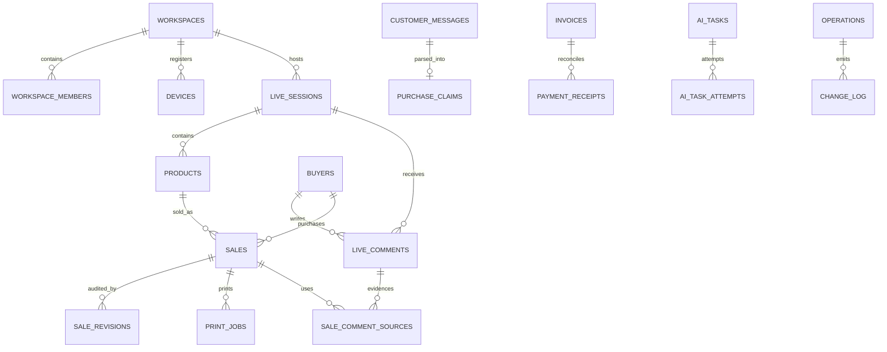

# 03. 데이터 모델·업무 API·IPC·오프라인 동기화

[문서 첫 화면](README.md) · [앱 구조·도우미 통합](02_ARCHITECTURE_AND_HELPER_INTEGRATION.md)

기준일: 2026-09-26. **현재**는 이 저장소의 구현을, **목표/신규**는 VoiceCAP Studio for Windows를 만들 때 추가할 설계를 뜻한다. 아래 SQL·JSON·타입은 설계 예시이며 그대로 배포하여 완료된 기능으로 취급하지 않는다. 운영 DB·비밀키·실제 고객 자료는 이 문서 작성 과정에서 읽지 않았다.

## 1. 저장소를 세 종류로 나누는 이유

| 저장소 | 보관할 것 | 최종 기준 여부 |
|---|---|---|
| renderer 메모리 | 열린 화면·검색어·선택 행·저장 전 입력 | 화면 편의 상태. 앱이 꺼지면 복구에 사용하지 않음 |
| Windows SQLite | 내려받은 데이터, 접수한 command, 댓글 대기열, 인쇄 journal, 동기화 cursor | PC가 접수했음을 보장하는 로컬 기록. 서버 확정과 구분 |
| Supabase Postgres/Storage | 조직별 최종 업무 기록·권한·수정 이력·첨부 원본·공유 job | 여러 PC와 Android가 공유하는 canonical 기준 |

현재 웹은 [storageService](../src/services/storageService.ts)의 localStorage, [remoteWorkspaceService](../src/services/remoteWorkspaceService.ts)의 직접 DB 접근, [productSalesApi](../src/services/productSalesApi.ts)의 상품 API가 함께 있다. 새 앱은 이 경로들을 **동일한 도메인 명령**으로 정리한다. localStorage 전체를 SQLite JSON 한 행에 넣는 방식으로 이관하지 않는다.

서버 응답을 받기 전에 화면에서 초록색 “확정”으로 표시하지 않는다. `LOCAL_SAVED`, `SYNCING`, `CONFIRMED`, `CONFLICT`, `REJECTED`를 별도 상태로 보여 준다. 매출 합계는 확정값과 미전송 임시값을 구분한다.

## 2. ID·금액·시간·상태 규칙

| 항목 | 목표 규칙 |
|---|---|
| 새 entity ID | UUID. 로컬에서 생성해 서버까지 동일하게 유지 가능하도록 계약을 설계 |
| 기존 sale/message/invoice ID | 현재 DB의 text ID를 보존. 기존 `sale-...`를 UUID로 무조건 cast하지 않음 |
| operationId | 사용자 의도 한 번마다 UUID. timeout·재시도·창 복원 때 변경 금지 |
| jobId / attemptId | 작업 자체와 실행 시도를 분리. 재출력은 새 job, 같은 job 재전송은 같은 ID |
| workspaceId | 모든 업무 접근의 필수 범위. 서버 인증 context와 일치해야 함 |
| sessionId | 내부 UUID와 사람이 읽는 회차명을 분리. 기존 임시 회차 text는 migration map 사용 |
| productCode | 목표는 회차별 표시번호. 유일키는 `(workspace_id, session_id, product_code)` |
| buyerId | 플랫폼 사용자 신원. 닉네임은 변경 가능한 표시 문자열 |
| 금액 | 원화 정수. 단가 0과 미정 null을 구분. 수량 1~999, 단가 상한 99,999,999 유지 |
| 총액 | 서버에서 `quantity × unitPrice` 계산. 가능한 곱은 기존 32-bit integer를 넘을 수 있으므로 `amount bigint` 또는 검증된 더 낮은 업무 상한으로 통일 |
| 시간 | 저장/통신은 UTC ISO8601, 화면은 Asia/Seoul. 사용자 PC 시각을 정합성 기준으로 삼지 않음 |
| revision | 1부터 시작, 변경마다 증가. 수정 명령에는 expected revision 필수 |
| 삭제 | 공유 데이터는 tombstone 또는 업무 취소를 우선. 즉시 물리 삭제하면 다른 PC가 삭제를 놓칠 수 있음 |

JavaScript로 원화 계산 시 `Number.isSafeInteger`를 확인한다. 위 가격·수량 범위의 곱은 JS 안전 정수 범위 안이지만 PostgreSQL `integer` 범위 밖일 수 있다. nullable 가격을 `price || 0`으로 처리하지 않는다. 수량 누락과 0도 같은 값으로 간주하지 않는다.

## 3. 원격 데이터 모델

### 3.1 현재 주요 관계와 목표 관계



`OPERATIONS → CHANGE_LOG`는 신규 목표다. 현재 `sales.session_id`는 text이며 `live_sessions` FK가 아니고, `pending_corrections.workspace_id`도 text다. 위 그림의 업무 관계가 현재 DB에 모두 FK로 강제된다고 생각하지 않는다. 기존 JSON `sale_ids` 연결도 후속 정규화 대상이다. 실제 근거: [현재 DB 설계](../docs/replication/03_BACKEND_DATABASE.md), [기존 마이그레이션](../supabase/migrations/).

### 3.2 테이블별 유지·확장 지침

| 묶음 | 현재 테이블 | Windows 전환 때 할 일 |
|---|---|---|
| 계정·조직 | `profiles`, `workspaces`, `workspace_members`, `workspace_settings` | 회원 role·정지 상태와 workspace 권한을 모든 API에서 동일하게 검사. 설정 namespace별 schemaVersion 추가 |
| 기기 | `devices`, `device_pairing_codes` | Windows 통합앱 종류 추가 또는 기존 WINDOWS_HELPER 호환 mapping. token hash·revoked·capability 유지. 실행 중 앱 instance와 설치 device ID 구분 |
| 방송·상품 | `live_sessions`, `products`, `product_drafts`, `product_code_reservations` | 회차별 코드 unique, 예약 만료와 확정 영구 보존, 원자적 회차 전환 |
| 댓글·신원 | `buyers`, `live_comments`, `sale_comment_sources` | 대표 collector lease, 플랫폼 메시지 중복키, 수집 세대, 서버 cursor, evidence 참조 유지 |
| 판매 | `sales`, `sale_revisions`, `verified_sales` | 단일 command 저장, revision/CAS, amount 범위 정리, 취소 이력, 검수 권한·중복 방지 |
| 문자·고객 | `customer_messages`, `purchase_claims` | 수신 external ID와 발신 operation ID 멱등성, 발신 lease, 파싱 결과/수동 보정 이력 |
| 정산·배송 | `invoices`, `payment_receipts`, `shipments` | 판매 연결 무결성·revision·확정 작업의 원자성. JSON sale_ids는 단계적으로 연결표로 전환 |
| 출력 | `print_jobs` | 원자적 claim, output device 조건, job별 fencing, UNKNOWN 복구, immutable payload schemaVersion |
| AI·정정 | `ai_settings`, `ai_secrets`, `ai_settings_history`, `ai_health_status`, `ai_tasks`, `ai_task_attempts`, `ai_circuit_breaker`, `pending_corrections` | 조직 RLS, 적용 설정 snapshot, 실제 consumer, lease, stale result 거절, 키 보호 |
| 감사·사용량 | `audit_logs`, `stt_usage_logs` | 성공·거절·수정·재출력의 actor, operation ID 기록. 원문/키를 메타데이터에 무제한 기록하지 않음 |
| 신규 동기화 | `workspace_sync_state`, `change_log`, `collector_leases`, `legacy_id_map` | 변경 순서·삭제·장치 수집권·기존 ID 변환을 관리 |

`invoice_sales`, `shipment_sales`, `claim_sales`, `payment_sale_allocations` 같은 연결표는 각 판매에 대한 참조를 명시하고 `(workspace_id, sale_id)`가 같은 조직인지 검증한다. 금액 배분이 필요한 입금 연결에는 `allocated_amount`를 둔다. 원래 JSON 배열을 바로 삭제하지 않고 읽기 호환 기간에 backfill·대조한다.

## 4. 로컬 SQLite 구조

### 4.1 단일 owner

Data broker utility process **한 개만** DB 연결과 쓰기를 소유한다. renderer·STT·댓글·main은 SQL을 직접 실행하지 않는다. broker를 통해 타입이 정해진 요청만 보낸다. 시작 시 migration이 끝나기 전 업무 command를 받지 않는다. DB가 잠겨 있으면 새 빈 DB로 조용히 시작하지 않고 복구 화면을 연다.

초기 설정 목표는 `foreign_keys=ON`, `journal_mode=WAL`, `synchronous=FULL`, 유한한 `busy_timeout`이다. WAL은 읽기와 쓰기 동시성을 돕지만 writer는 한 번에 하나이며 네트워크 파일시스템 공유용이 아니다. OneDrive 동기화 폴더·NAS의 같은 DB 파일을 여러 PC가 열게 하지 않는다. 실시간 데이터 공유는 서버 동기화를 사용한다. [SQLite WAL 공식 문서](https://www.sqlite.org/wal.html)

### 4.2 테이블 목록

| 신규 local 테이블 | 핵심 컬럼·키 | 목적 |
|---|---|---|
| `schema_migrations` | version PK, checksum, applied_at, app_version | 어떤 schema가 적용되었는지 확인 |
| `workspaces_cache` | workspace_id PK, role_snapshot, permissions_json, verified_at | 최근 로그인 조직 표시. 서버 권한의 영구 대체가 아님 |
| `entity_cache` | PK(workspace_id, entity_type, entity_id), server_revision, body_json, deleted_at, server_cursor | 확정 데이터 cache. 업무별 읽기 view/index를 추가 |
| `sale_drafts` | draft_id PK, workspace/session/product/buyer, base_revision, draft_revision, values_json, origin, state | 미확정 후보 및 오프라인 수동 입력 |
| `command_outbox` | operation_id PK, workspace, actor_user_id, device_id, command_type, payload_json, payload_hash, status, attempt_count, next_attempt_at, last_error | 다시 보내도 같은 사용자 의도임을 보관 |
| `command_dependencies` | PK(operation_id, depends_on), FK→outbox | 이미지 준비→상품확정→판매 등 순서 |
| `comment_queue` | comment_local_id PK, workspace/session/room/platform_message_id, collector_generation, body_json, status, operation_id | 업로드 전 댓글 영속 보관 |
| `transcript_segments` | PK(stream_id, generation, segment_id), workspace/session, final_revision, text, start_ms, end_ms, source | 전사 표시·후보 생성 근거. 원음 기본 저장 없음 |
| `print_journal` | job_id PK, workspace/sale/revision/kind, payload_hash/json, lease/generation, state, submitted_at, ack_state, last_error | 인쇄 제출 전후의 재시작 복구 |
| `ai_execution_journal` | attempt_id PK, task_id, lease_token, settings_version, evidence_version, state, result_json | PC 추론 복구. 결과는 서버 검증 전 제안 상태 |
| `sync_checkpoints` | PK(workspace_id, stream), applied_cursor, snapshot_version, last_sync_at | 증분 재수신 위치 |
| `processed_events` | PK(workspace_id, event_id), cursor, processed_at | Realtime·poll·재연결의 중복 적용 방지 |
| `asset_cache` | asset_id PK, workspace, remote_path, local_relative_path, sha256, byte_size, state, last_accessed_at | 캡처·상품 이미지 cache/업로드 대기 |
| `app_settings` | PK(scope, setting_key), schema_version, value_json | 창 위치·마이크·프린터·테마. 비밀번호·원문 토큰 저장 금지 |
| `migration_runs` | run_id PK, input_hash, source_version, state, stats_json, report_path | 이전 웹/helper 자료 이관을 반복 가능하게 기록 |

`entity_cache.body_json`은 원격 snapshot을 보존하기 위한 것이다. 판매 목록의 정렬·검색·합계를 위해 `(workspace, session, recognized_at)`와 상태·buyer 등의 별도 indexable 컬럼 또는 `sales_cache` projection을 둔다. 매 화면 렌더마다 모든 JSON을 읽어 합계를 계산하지 않는다. 확정 cache와 미확정 draft를 같은 row에 덮어써서 서버 값을 잃지 않는다.

### 4.3 outbox 최소 SQL 예시

아래는 **미구현 예시**다. 실제 migration에는 payload size·상태 전이·참조 integrity 검사와 해당 SQLite 버전에서 지원되는 기능 확인을 추가한다.

```sql
CREATE TABLE command_outbox (
  operation_id TEXT PRIMARY KEY,
  workspace_id TEXT NOT NULL,
  actor_user_id TEXT NOT NULL,
  device_id TEXT NOT NULL,
  command_type TEXT NOT NULL,
  payload_json TEXT NOT NULL,
  payload_hash TEXT NOT NULL,
  status TEXT NOT NULL CHECK (status IN
    ('PENDING','IN_FLIGHT','ACKED','CONFLICT','REJECTED','CANCELLED')),
  attempt_count INTEGER NOT NULL DEFAULT 0,
  next_attempt_at TEXT,
  last_error_code TEXT,
  created_at TEXT NOT NULL,
  updated_at TEXT NOT NULL
);
CREATE INDEX outbox_due
  ON command_outbox(workspace_id, status, next_attempt_at, created_at);
CREATE TABLE command_dependencies (
  operation_id TEXT NOT NULL REFERENCES command_outbox(operation_id),
  depends_on TEXT NOT NULL REFERENCES command_outbox(operation_id),
  PRIMARY KEY (operation_id, depends_on),
  CHECK (operation_id <> depends_on)
);
```

의존성 cycle은 등록 시 broker에서 거절한다. DB migration과 outbox schemaVersion을 분리하여 앱 버전 변경 때 오래된 명령도 해석할 수 있도록 한다. 처리 완료 자료의 보관 기간을 정하되 미완료 command와 UNKNOWN print를 자동 정리하지 않는다.

## 5. 모든 업무 변경의 공통 명령

### 5.1 목표 TypeScript 계약

```ts
// 신규 설계 예시. 현재 소스에 구현된 API가 아니다.
type CommandEnvelope<T> = {
  schemaVersion: 1;
  operationId: string;
  workspaceId: string;
  command: string;
  createdAt: string;
  context: { deviceId: string; clientVersion: string; sessionId?: string };
  expected: { sessionRevision?: number; productRevision?: number; saleRevision?: number };
  payload: T;
};

type CommitSalePayload = {
  candidateId: string;
  candidateRevision: number;
  origin: 'VOICE' | 'MANUAL' | 'COMMENT';
  productId: string;
  buyerId: string;
  quantity: number;
  evidence: { commentIds: string[]; transcriptSegmentIds: string[] };
};
```

`actor_user_id`, role, permission은 renderer payload에서 받더라도 신뢰하지 않는다. main의 로그인 세션에서 채우고 서버가 다시 검증한다. 가격·총액은 서버의 현재 상품·판매 규칙으로 계산한다. 브라우저에서 넘어온 `origin`을 관리자 권한처럼 사용하지 않는다.

### 5.2 업무 command 목록

| command 그룹 | 계획하는 명령 | 현재 연결 근거 |
|---|---|---|
| 회차 | `StartSession`, `EndSession`, `ActivateProduct` | sales-api sessions/products |
| 상품 | `PrepareProduct`, `CommitProduct`, `PreviewProductChange`, `CommitProductChange` | product draft와 preview token 기존 흐름 |
| 판매 | `CommitSale`, `CorrectSale`, `CancelSale`, `VerifySale`, `ResolvePendingSale` | commit-sales, 정정/보류 API, legacy 직접 쓰기 통합 |
| 댓글 | `StartCollector`, `StopCollector`, `IngestComments`, `DeleteComments` | local collector와 sales-api |
| 고객·문자 | `UpdatePurchaseClaim`, `QueueSms`, `CancelQueuedSms` | sms-bridge 및 legacy commerce 쓰기를 새 업무 경계로 구성 |
| 정산 | `CreateInvoice`, `QueueInvoiceMessage`, `MatchPayment`, `UnmatchPayment` | invoices/payment_receipts 직접 쓰기를 원자적 명령으로 구성 |
| 배송 | `CreateShipment`, `UpdateShipment`, `QueueShippingMessage` | shipments 및 sms outbox |
| 설정 | `SaveWorkspaceSettings`, `SaveRecognitionRules`, `ApplyAiSettings`, `UpdateDevicePermissions` | workspace_settings·AI/device 함수 |
| 출력 | `RequestPrint`, `RequestReprint`, `ResolveUnknownPrint` | 기존 print_jobs 확장 |

음성 판매와 수동 판매는 `CommitSale`을 공유한다. 상품 없는 기존 자유 입력 판매는 legacy-compatible sale payload variant로 보존하되 같은 broker·transaction·audit을 통과한다. “모든 기존 판매가 반드시 product FK를 가져야 한다”고 강제해 과거 기능/자료를 잃지 않는다. 신규 상품 판매와 legacy 자유입력의 필수 필드는 discriminated schema로 구분한다.

### 5.3 local transaction 순서

1. 입력 schema·현재 창 권한·workspace·수량·후보 revision을 확인한다.
2. 이미 같은 candidate+revision을 접수했으면 기존 operation을 돌려준다.
3. SQLite transaction에서 draft 상태를 접수됨으로 바꾸고 outbox·dependency를 함께 insert한다.
4. commit 성공 이후에만 `LOCAL_SAVED` 응답을 보낸다. 디스크 가득 참이면 입력을 유지하고 `LOCAL_STORAGE_FULL`을 보인다.
5. SyncService가 전송하고 canonical 응답을 받는다.
6. **다른 local transaction**에서 entity cache 갱신·outbox ACKED·임시 후보 정리·이벤트 cursor를 함께 기록한다.

네트워크 요청을 연 채로 SQLite transaction을 오래 유지하지 않는다. 두 transaction 사이에서 앱이 죽으면 outbox 재전송이 회복 수단이다.

## 6. 서버에서 판매를 한 번에 확정하는 방법

현재 [sales handler](../supabase/functions/sales-api/handlers/sales.ts)는 operations 확인, 판매 insert, 댓글 소비, print job, revision 갱신을 여러 요청으로 처리한다. 새 구현은 DB transaction 함수 하나에 모은다.

### 6.1 목표 처리 순서

1. Edge에서 사용자 JWT/기기 토큰, 정지·revoked, workspace, capability를 검사한다.
2. 제한된 DB 함수에 검증된 actor context와 command를 전달한다. 공개 사용자가 임의 actor를 전달하는 RPC는 금지한다. SECURITY DEFINER를 사용하면 search_path 고정·EXECUTE 권한 회수·내부 membership 검사까지 포함한다.
3. DB의 `UNIQUE(workspace_id, operation_id)`를 기준으로 operation row를 insert/lock하여 확보한다. 같은 hash의 성공 이력이면 기존 응답을 반환하고, 다른 hash면 `OPERATION_PAYLOAD_MISMATCH`로 거절한다. 동시 insert가 경쟁하면 unique 충돌을 새 판매 처리의 허가로 해석하지 않는다. 승자 transaction 종료 후 같은 row의 최종 결과를 다시 읽는다. 대기 timeout이면 재조회 가능한 `OPERATION_IN_PROGRESS`를 반환한다.
4. 회차·상품·구매자·근거 댓글이 같은 workspace인지 확인한다. row lock 또는 CAS로 revision과 현재 상태를 검사한다.
5. 판매 batch 전체를 사전 검증한다. batch가 원자적이면 한 건 실패 시 전부 취소한다. 일부 성공 허용 기능은 별도 command와 결과 형태로 명시한다.
6. 판매·댓글 소비·sale revision·print job·감사·change_log를 같은 transaction에 쓴다.
7. operations 성공 결과를 같은 transaction에 저장하고 commit한다. 인쇄·SMS·AI 같은 외부 효과는 이 transaction 안에서 실제 실행하지 않고 job만 만든다.

DB가 commit한 직후 HTTP 응답이 유실될 수 있다. 클라이언트가 같은 operation ID를 다시 보내거나 `get-operation`을 조회하면 같은 결과를 받는다. “timeout이니까 새 operation ID”로 보내면 중복 판매가 생길 수 있다.

### 6.2 hash·revision·충돌

payload hash는 정해진 canonical JSON 직렬화 규칙으로 만든다. action·workspace·정규화 payload·expected revision·schemaVersion을 포함하고 추적용 request ID/재시도 시각은 제외한다. 객체 key 순서만 바뀌어 mismatch가 나지 않게 한다. retry 동안 payload를 바꾸지 않는다. 사용자가 내용을 고치면 이전 command의 상태를 기록하고 **새 operation ID**를 만든다.

```sql
-- 신규 개념 예시: 실제 함수 안에서 수행한다.
UPDATE sales
SET quantity = :quantity, amount = :amount, revision = revision + 1
WHERE workspace_id = :workspace_id
  AND id = :sale_id
  AND revision = :expected_revision;
-- 영향 행이 0이면 NOT_FOUND/REVISION_CONFLICT를 판별해 transaction을 중단한다.
```

충돌 창에는 “내가 수정하기 전 값 / 서버 최신값 / 내 변경값”을 표시한다. 금액·수량·구매자·회차는 자동 last-write-wins를 쓰지 않는다. 안전한 UI 개인설정 정도만 별도 규칙으로 병합한다. 정정 취소는 과거 row 복사로 되돌리는 대신 새 revision의 보상 명령을 만들어 이후 수정의 손실을 막는다.

## 7. API와 IPC 계약

### 7.1 현재 HTTP API를 유지하는 범위

기존 진입점은 `<SUPABASE_URL>/functions/v1/{voicecap-onboard|device-pair|sms-bridge|sales-api}`다. `sales-api`는 POST JSON의 `action`으로 50개 동작을 구분한다. 인증은 사용자 `Authorization: Bearer ...` 또는 **`X-VoiceCAP-Device-Token`**이다. 현재 [cloudPrintWorker](../server/cloudPrintWorker.js)의 `x-device-token`은 공통 인증기가 읽는 헤더와 다르므로 연결할 때 수정해야 한다.

| 현재 sales-api action 그룹 | 보존할 action |
|---|---|
| 회차·기기 8개 | `get-bootstrap`, `list-sessions`, `update-settings`, `start-session`, `end-session`, `list-devices`, `update-device-capabilities`, `set-output-device` |
| 상품 8개 | `prepare-product`, `update-product-draft`, `commit-product`, `activate-product`, `list-session-products`, `prepare-product-image`, `preview-product-change`, `commit-product-change` |
| 댓글·구매자·판매 9개 | `ingest-comments`, `get-sales-feed`, `list-live-comments`, `delete-live-comments`, `search-buyers`, `confirm-buyer`, `commit-sales`, `get-product-sales`, `get-operation` |
| 인쇄 6개 | `claim-print-jobs`, `renew-print-lease`, `begin-print-job`, `acknowledge-print-job`, `request-reprint`, `get-print-status` |
| AI 12개 | `get-ai-settings`, `save-ai-settings`, `apply-ai-settings`, `test-ai-connection`, `test-ai-synthetic`, `list-ai-models`, `check-ai-health`, `get-ai-health`, `create-ai-task`, `process-ai-task`, `get-ai-tasks`, `get-ai-runtime-status` |
| 보류·정정 7개 | `resolve-pending-sale`, `batch-confirm-pending-sales`, `trigger-pending-ai`, `process-voice-correction`, `apply-voice-correction`, `link-follow-up-correction`, `rollback-voice-correction` |

현재 요청 형식 예시다. 모든 UUID는 설명용 합성값이다.

```json
{
  "action": "commit-sales",
  "workspaceId": "11111111-1111-4111-8111-111111111111",
  "operationId": "22222222-2222-4222-8222-222222222222",
  "sessionId": "33333333-3333-4333-8333-333333333333",
  "productId": "44444444-4444-4444-8444-444444444444",
  "expectedSessionRevision": 2,
  "expectedProductRevision": 1,
  "buyers": [{"buyerId":"55555555-5555-4555-8555-555555555555","quantity":2,"sourceCommentIds":[]}]
}
```

현재 공통 성공 envelope는 `{ok:true, apiVersion:1, serverTime, data}`다. 오류는 `{ok:false, apiVersion:1, serverTime, error:{code,message,retryable,details}}`다. 새 내부 command를 기존 action에 변환하는 adapter를 두되 원자성 개선 전 API를 출시 품질로 간주하지 않는다.

문자·청구서·입금·배송·규칙·검수 등의 기존 직접 DB 기능도 모두 이전 대상이다. 위 50개 action만 구현하고 “웹 전체 이전 완료”로 표시하면 안 된다. 필요한 `QueueSms`, `MatchPayment` 등의 신규 업무 API를 추가하거나 기존 함수의 transaction을 확장한다. 기존 API 확장은 versioned schema와 클라이언트 최소 버전 검사를 함께 배포한다.

### 7.2 새 preload API

```ts
// 신규 인터페이스 설계. token, SQL, 임의 URL, arbitrary channel을 노출하지 않는다.
interface VoicecapStudioApi {
  auth: { getStatus(): Promise<AuthView>; signOut(): Promise<void> };
  sales: { submit(command: CommitSaleCommand): Promise<CommandReceipt> };
  comments: { start(input: StartCollectorInput): Promise<CollectorStatus>; stop(): Promise<void> };
  data: { query(input: AllowedQuery): Promise<PageResult> };
  print: { listPrinters(): Promise<PrinterView[]>; test(input: TestPrintInput): Promise<PrintReceipt> };
  stt: { start(input: SttStartInput): Promise<SttStatus>; stop(): Promise<void> };
  events: { subscribe(listener: (event: PublicEvent) => void): () => void };
}
```

표의 타입 이름은 별도로 작성해야 할 schema 정의다. 메서드 하나마다 renderer 입력 schema·main sender 확인·권한 검사·timeout·오류 mapping을 둔다. `data.query`도 `{entity:'sales',filter...,limit...}` 같은 enum 계약이며 임의 SQL 문자열을 받지 않는다. 이벤트 콜백에는 Electron event 객체를 전달하지 않는다.

| 예시 IPC 채널 | 확인할 권한·경계 | 반환 |
|---|---|---|
| `studio:auth:status` | 등록된 업무 창 | 비밀 없는 로그인 상태 |
| `studio:sales:submit` | 현재 workspace SALES_WRITE, schema, operation | local receipt와 추적 ID |
| `studio:comments:start` | COMMENT_INGEST, 활성 회차, 단일 collector | 연결 상태·generation |
| `studio:data:query` | entity별 READ와 workspace, 최대 limit | 정해진 view 페이지 |
| `studio:print:test` | 장치 설정 권한, 현재 프린터 목록 내 ID | 시험 job 상태 |
| `studio:files:export` | EXPORT 권한·저장 대화상자 | 결과 파일명/완료 여부 |
| `studio:settings:update` | scope별 권한, setting schema | 적용된 버전 |

### 7.3 신규 이벤트 envelope

```json
{
  "schemaVersion": 1,
  "eventId": "66666666-6666-4666-8666-666666666666",
  "type": "sale.confirmed",
  "workspaceId": "11111111-1111-4111-8111-111111111111",
  "cursor": "1042",
  "operationId": "22222222-2222-4222-8222-222222222222",
  "entity": {"type":"sale","id":"77777777-7777-4777-8777-777777777777","revision":1},
  "occurredAt": "2026-09-26T03:00:00.000Z",
  "data": {"status":"CONFIRMED","amount":20000}
}
```

cursor는 문자열로 운반해 큰 정수의 JS 정밀도 손실을 피한다. 로컬 상태 이벤트는 서버 cursor가 없으므로 `localSequence`와 `scope:LOCAL`을 사용한다. `sale.confirmed`, `sale.conflicted`, `comments.batchStored`, `sync.statusChanged`, `print.needsReview`, `stt.statusChanged`를 서로 구분한다. 화면은 event를 받았다고 새 판매 저장 명령을 재생성하지 않는다.

### 7.4 오류 코드와 재시도

| 코드 | 자동 재시도 | UI 동작 |
|---|---|---|
| `NETWORK_UNAVAILABLE`, `TEMPORARILY_UNAVAILABLE` | 동일 operation으로 backoff | 저장된 대기 건수·다음 시도 표시 |
| `OPERATION_IN_PROGRESS` | 같은 operation 결과를 지연 재조회 | 처리 중 표시, 새 판매 명령 생성 금지 |
| `RATE_LIMITED` | 서버 Retry-After 우선 | 요청 속도 낮춤, 반복 알림 억제 |
| `AUTH_REQUIRED` | 토큰 refresh 1회 후 실패하면 중단 | 재로그인. outbox 유지 |
| `CAPABILITY_DENIED`, `DEVICE_REVOKED` | 안 함 | 권한 안내·해당 worker 정지 |
| `REVISION_CONFLICT` | 안 함 | 비교·재검토 후 새 command |
| `OPERATION_PAYLOAD_MISMATCH` | 안 함 | 개발 진단·사용자 입력 보존 |
| `VALIDATION_ERROR`, `PRICE_REQUIRED` | 안 함 | 오류 필드와 수정 방법 |
| `LOCAL_STORAGE_FULL` | 저장 공간 확보 후 사용자가 재시도 | “저장됨” 표시 금지 |
| `PRINT_UNKNOWN` | 물리 출력 재시도 안 함 | 종이 확인·사유 입력 후 새 재출력 |
| `STALE_AI_RESULT` | 자동 적용 안 함 | 최신 증거로 재분석 가능 |

## 8. 동기화 알고리즘

### 8.1 서버에서 PC로

1. 로그인 후 bootstrap으로 권한·설정·활성 회차·API 최소 버전을 받는다.
2. 첫 시작 또는 cursor 만료 시 consistent snapshot을 내려받는다. 기준안은 서버 snapshot job이 `REPEATABLE READ`의 같은 DB 시점에서 workspace 자료와 기준 cursor를 읽고, 임시 snapshot 묶음으로 만들어 `snapshotId`, schemaVersion, cursor, 페이지 hash, expiresAt manifest를 제공하는 것이다. PC는 같은 snapshotId의 페이지를 검증해 staging cache에 적재한 뒤 마지막 local transaction으로 활성 cache와 cursor를 교체한다. 생성·다운로드 실패 시 이전 cache를 유지하고 새 job으로 재시도한다. snapshot 이후 변경은 cursor replay가 받는다. 매 페이지마다 live DB를 offset 조회하는 방식은 중간 변경으로 누락/중복이 생기므로 사용하지 않는다. 큰 조직은 snapshot job의 transaction 길이·DB 부하를 측정해 별도 export 구조를 적용한다.
3. `change_log`에서 해당 workspace의 cursor 이후 변경을 페이지 단위로 받는다. 추가·수정·삭제 tombstone을 포함한다.
4. 한 local transaction에서 이벤트 적용·processed_events·checkpoint를 갱신한다.
5. Realtime은 “변경 있음”과 낮은 지연 알림에 사용한다. 누락 복구는 cursor 조회가 담당한다.
6. 서버의 event 보관 범위를 벗어나면 snapshot 재동기화한다. 미확정 local draft/outbox는 별도 보존한다.

증가 sequence가 할당된 순서와 DB commit 순서는 자동으로 같지 않다. 목표 `workspace_sync_state` row를 transaction에서 잠그고 그 workspace의 쓰기와 cursor 발급 순서를 함께 직렬화하거나, 동등한 commit 순서 보장이 있는 change publisher를 구현해야 한다. 단순 `bigserial > lastSeen`만으로 빠짐없는 복구를 약속하지 않는다. 초기에는 workspace 단위 잠금을 기준안으로 삼고 높은 부하에서 분할 필요성을 측정한다.

### 8.2 PC에서 서버로

outbox 중 PENDING이면서 모든 dependency가 ACKED인 명령만 보낸다. 같은 판매·상품의 변경은 순서를 지키고, 관계없는 개체는 제한된 동시성을 허용한다. 요청 전 `IN_FLIGHT`를 저장하고 응답 유실 시 같은 ID로 재전송한다. 앱 시작 시 이전 IN_FLIGHT를 “성공 여부 확인 필요”로 복구하여 `get-operation` 또는 멱등 재전송으로 판단한다.

계정/조직이 다른 outbox는 현재 로그인 사용자에게 섞어 전송하지 않는다. 권한을 잃은 명령은 REJECTED로 보관하여 이유를 보여 준다. 댓글 queue는 서버 승인된 대표 collector generation과 해당 회차를 확인한다. 과거 회차의 늦은 업로드를 현재 회차로 바꿔 보내지 않는다.

### 8.3 오프라인 허용 범위

| 기능 | 오프라인 상태 | 재접속 후 처리 |
|---|---|---|
| 이미 cache한 판매·고객·회차 조회 | 가능, 마지막 동기화 시각 표시 | 갱신·삭제 적용 |
| 로컬 STT·음성 자막 | 모델이 준비되면 가능 | 필요한 후보만 전송, 원음 자동 업로드 없음 |
| 기존 확정 상품의 수동/음성 판매 입력 | 임시 접수 가능 | 회차·가격·권한·revision 재검증 후 확정 또는 충돌 |
| 신규 상품 | 임시 draft·사진 저장 가능 | 서버에서 회차별 번호 예약·이미지 검증 후 확정 |
| 상품 수정·정정 | 초안 작성 가능 | 최신 값 비교와 revision 검사 |
| TikTok 댓글 | 외부 인터넷 필요. Supabase만 끊긴 경우 수집·queue 가능 | 동일 회차로 업로드, 중단 구간 표시 |
| 클라우드 STT/AI | 불가 또는 대기 | 설정·예산·증거 최신성 확인 후 실행 |
| PC 로컬 AI | 로컬 준비 완료 때 제안 생성 가능 | 서버 확정 전에는 판매 변경하지 않음 |
| 문자 작성 | draft 가능 | 권한·Android 상태 확인 후 명시한 발신 queue 등록 |
| 실제 SMS 발신/수신 최신 조회 | Android↔서버 연결 필요 | 전송 상태를 확인하며 중복 발신 억제 |
| 인쇄 | 기존 journal 조회 가능. 신규 claim/begin 불가 | 서버 확정 job만 출력. UNKNOWN 자동 재출력 금지 |
| 로그인·권한 변경·결제·기기 페어링 | 신규 서버 검증 불가 | 연결 복구 후 수행 |
| cache 범위 CSV 내보내기 | 가능, 미확정 포함 여부 명시 | 파일에 데이터 기준 시각 기록 |

오프라인 권한 snapshot은 영구 허가가 아니다. 첫 로그인은 온라인으로 하고, 조직별 offline lease 정책이 만료되면 민감 업무 입력을 draft로 제한한다. 온라인 복귀 시 정지·role 변경을 재검증한다. 인터넷이 완전히 끊긴 PC에서 TikTok·클라우드 문자까지 동작한다고 표현하지 않는다.

## 9. 역할·RLS·기기 권한

### 9.1 목표 역할표

현재 사용자 membership은 광범위한 판매 capability를 받는다. 아래 표는 상용 앱의 **목표 기본값**이며 계정별 세부 권한을 설정할 수 있게 한다. 기능 자체는 모두 이전하고 역할에 따라 접근을 나눈다.

| 기능 | OWNER | MANAGER | STAFF | 전역 ADMIN | 기기 |
|---|---|---|---|---|---|
| 자기 조직 판매/상품/댓글 조회·일반 입력 | 허용 | 허용 | 허용 | 지원 접근은 별도 사유·감사 | 발급 capability에 한정 |
| 대량 삭제·취소·대량 내보내기 | 허용 | 위임 범위 | 기본 거절 | 자동 전 조직 허용 아님 | 기본 거절 |
| 정산·입금 확정·배송 처리 | 허용 | 허용 | 개별 위임 | 동일 원칙 | SMS/전용 기능만 |
| 고객 전화·주소 전체 조회 | 허용 | 허용 | 필요 역할에만 허용/마스킹 | 지원 승인·감사 | 담당 SMS 작업 범위 |
| 멤버·기기 등록/해제·출력기기 선택 | 허용 | 위임 범위 | 거절 | 관리 범위 | 자기 토큰 조회 불가 |
| workspace AI 설정·예산 | 허용 | 위임 범위 | 읽기 상태만 | 전역 정책 관리 | 지정 executor만 |
| GLOBAL STT/AI·회원 정지·시스템 관리 | 거절 | 거절 | 거절 | 서버 관리 app_metadata 기준 허용 | 거절 |
| 구독/사업자 결제 설정 | 허용 | 위임 범위 | 거절 | 운영 지원 범위 | 거절 |

ADMIN은 사용자가 변경할 수 있는 `user_metadata.role`에서 읽지 않는다. OWNER가 곧 전역 ADMIN인 것도 아니다. 서버가 관리하는 app metadata와 별도 관리자 정책만 신뢰한다. 모든 쓰기 함수는 suspended/revoked 상태를 확인한다.

### 9.2 RLS와 서버 함수

모든 조직 데이터 테이블은 workspace membership을 확인하는 RLS를 적용한다. 특히 현재 AI 작업·시도·서킷·정정 테이블의 `USING(true)`/`WITH CHECK(true)` 정책을 교체한다. `ai_secrets`는 일반 authenticated 조회를 허용하지 않는다. authenticated GRANT와 RLS를 함께 검토한다. service-role은 RLS를 우회할 수 있으므로 Edge Function 내부 membership 검사도 필수다. [Supabase RLS 공식 문서](https://supabase.com/docs/guides/database/postgres/row-level-security)

기기 토큰은 workspace·device·capability에 묶고 원문은 main/Android 보호 저장소에만 둔다. PC print executor에는 필요한 PRINT 및 상태 조회 범위만 발급한다. 직원 로그인 토큰과 배경 device 토큰의 수명을 구분하고 로그아웃 후 수집 지속 여부도 정책으로 제한한다. token revoke 즉시 신규 claim을 막고 진행 job은 fencing·상태로 복구한다.

## 10. 서버 보완 작업 WD-01~WD-15

다음 ID는 **Windows 설계의 신규 보완 목록**이다. 기존 `docs/replication/06_IMPLEMENTATION_AND_ACCEPTANCE.md`의 `Rxx` 번호와 별개이며 같은 번호로 치환하지 않는다. 단순 Electron 포장으로 해결되지 않는 서버 선행 작업이다.

| ID | 현재 근거·문제 | 목표 수정 | 완료 판단 |
|---|---|---|---|
| WD-01 | products handler는 reservation `expires_at` 사용, SQL에는 없음 | draft 예약에 만료·회차·상태를 추가하고 확정 예약은 재사용 금지 | 만료 회수·확정 보존·동시 예약 시험 |
| WD-02 | handler는 회차별 번호, SQL은 workspace 전체 unique | 상품/예약 key·조회·preview·코드 생성 모두 회차 범위로 변경 | 다른 회차 1번 허용, 같은 회차 동시 1번 충돌 방지 |
| WD-03 | prepare-product-image가 가짜 storage 주소 반환 | 실제 signed upload→크기/MIME/hash 검사→원자적 이미지 경로 확정 | 만료·실패 업로드·다른 조직 경로 거절 |
| WD-04 | request schema의 action/error 목록이 router보다 좁음 | 모든 현재 action과 신규 command의 schema·버전·문서 동기화 | schema에서 허용하지만 router에 없는 action 0 |
| WD-05 | AI SQL 초기 공급자와 handler fallback 불일치 | workspace 초기 설정을 명시적 bootstrap으로 결정, 설정 이력 남김 | 신규 DB·기존 DB의 적용 설정이 설명 가능 |
| WD-06 | PC_HELPER는 함수 주입 가정, Edge localhost 한계 | 실제 PC task claim/result 전송과 executor 등록 구현 | PC 모델 추론이 선택 PC에서 실행됨을 확인 |
| WD-07 | AI queue 자동 소비 배포 정의 없음 | cloud/PC consumer·lease·backoff·dead-letter/실패 검토 구현 | 큐 등록 후 실제 소비, crash 후 복구 |
| WD-08 | AI 버전·예산·fallback 필드 실행 강제 미완 | draft/applied snapshot, 비용 ledger/reservation, fallback 정책 구현 | 예산 초과·금지 fallback·stale result 차단 |
| WD-09 | AI/정정 RLS true, workspace 설정 membership 누락, user metadata admin 신뢰 | 역할표·RLS·server 인증·suspended 검사 통일 | 타 조직·권한 낮은 기기·위조 role 거절 |
| WD-10 | 판매·회차·정정 등이 연속 CRUD | 핵심 업무 transaction RPC, operations/audit/job 동시 commit | 각 중간 실패 지점에서도 반쪽 판매 0 |
| WD-11 | 먼저 읽은 revision만 비교하는 변경 존재 | WHERE revision 조건/row lock·영향 행 검사 | 두 PC 동시 수정 중 하나가 명시적 충돌 |
| WD-12 | print claim은 조회 후 ID update | 원자적 claim, job별 lease/fencing, SUBMITTING/UNKNOWN 복구 | 두 executor 중 한 개만 제출 권한 |
| WD-13 | UI output device와 claim 조건 분리 | target device + workspace output 정책 + capability 결합 | 선택하지 않은 PC가 claim 못 함 |
| WD-14 | Realtime publication SQL·replay 기준 미완 | publication·change_log·cursor·snapshot·tombstone 구현 | 연결 중단·중복 이벤트·삭제 복구 |
| WD-15 | legacy text 회차·JSON sale 연결·두 인쇄 상태·로컬 데이터 공존 | ID map, FK/연결표 단계 이관, 상태 mapping, 건수·합계 대조 | 누락·고아 참조·데모 혼입 없는 dry-run 보고 |

추가로 전체 타입검사에 Deno Edge Function을 포함한다. 웹 Vite build가 성공해도 서버의 타입·배포·RLS가 검증된 것은 아니다. 현재 `pendingSales.ts`의 `AiVerificationMeta` 참조 같은 소스 차이를 별도 확인한다. 문서 작성이 이를 실제 수정했다는 의미는 아니다.

## 11. 마이그레이션·백업·rollback

### 11.1 구현 배포 순서

1. **조사:** 별도 승인된 운영 이관 작업에서 schema introspection·grant·publication·row count를 확인한다. 이 설계 작성 중 운영 데이터를 읽거나 바꾸지 않는다.
2. **백업:** DB와 Storage의 일관된 백업·복구 시점을 확보하고 별도 환경에서 복원해 본다. 로컬 SQLite는 online backup API 또는 쓰기 정지 후 checkpoint로 snapshot을 만든다. 실행 중 `.db` 하나만 복사하지 않는다.
3. **expand:** 신규 컬럼·테이블·index·transaction 함수·호환 view를 먼저 추가한다. 오래된 클라이언트의 읽기가 깨지지 않게 한다.
4. **backfill:** 회차/legacy ID map·참조 관계·새 revision·상품 코드 범위를 batch로 채운다. 유효하지 않은 text UUID는 오류 목록으로 분리한다.
5. **검증:** 조직·회차별 건수, 판매 총액, 취소 건수, 고객 연결, 이미지 접근, 출력 이력, orphan 관계를 대조한다. 단순 총 row count만 맞추지 않는다.
6. **server 전환:** 신규 transaction과 권한을 배포한다. Android와 기존 웹의 호환 계약도 회귀 확인한다.
7. **desktop 전환:** 읽기 검증 후 신규 Windows command 쓰기를 켠다. 동일 workspace에서 legacy 직접 쓰기를 계속 허용하면 새 invariant를 우회하므로 최소 클라이언트 버전/기능 gate로 차단한다.
8. **contract:** 충분한 공존 기간과 전체 승인 후 이전 컬럼·쓰기 경로를 제거한다. destructive migration과 앱 업데이트를 한 번에 묶지 않는다.

PostgreSQL transaction에서 가능한 DDL은 원자적으로 수행한다. `CREATE INDEX CONCURRENTLY`처럼 transaction 밖이 필요한 작업은 별도 migration 단계와 재실행 상태를 둔다. 실패 시 전체 배포를 완전히 롤백했다고 기록하지 않는다. local migration은 checksum 검증·transaction·백업을 갖추고 실패하면 이전 DB를 유지한다.

### 11.2 기존 PC 자료를 새 앱으로 옮기는 절차

| 입력 | 가져올 것 | 가져오지 않을 것 |
|---|---|---|
| 웹의 내보내기 JSON | 인식 규칙·학습 문장·업무 설정·로컬 전용 미동기화 자료를 schema 검사 후 | 저장 비밀번호·세션 토큰·무근거 관리자 role |
| 기존 helper userData | 프린터/용지·STT 모델 선택·허용 설정 | 자동 실행 registry 그대로 복제, 다른 PC의 device token |
| helper 인쇄 이력 | 과거 출력 참고 표시와 job mapping | 500개 기록만으로 모든 과거 출력 완전 중복 방지 보장 |
| 모델 cache | 버전·해시·라이선스가 맞는 파일 | 출처·hash 불명 바이너리/DLL |
| 클라우드 자료 | 로그인한 같은 workspace에서 정상 동기화 | 다른 조직으로 무조건 복제 |

원본은 읽기 전용으로 복사 입력한다. migration dry-run이 입력 버전·유효/제외/충돌 건수·합계·사진 누락·device 재등록 항목을 보고한다. 재실행 시 `input_hash + source ID`로 중복 삽입을 막는다. 데모/샘플 판매·가상 결제·예시 학습 정확도는 실제 업무 자료로 자동 이관하지 않는다. demo 여부를 확실히 구분 못 하는 자료는 사용자 검토 대상으로 둔다.

브라우저 프로필의 localStorage 파일을 임의로 직접 열지 않는다. 기존 웹이 제공하는 내보내기 또는 별도로 구현한 승인된 exporter를 사용한다. 새 Electron origin은 브라우저 origin의 localStorage에 자동 접근할 수 없다. 설치 도중 기존 helper를 `taskkill`로 종료하지 않고 사용자가 정리할 수 있게 안내한다.

### 11.3 rollback 경계

DB가 성공적으로 확정한 판매를 클라이언트 rollback 때문에 삭제하지 않는다. 잘못된 업무 변경은 보상 command로 복원한다. 새 앱만 문제가 있으면 서버 호환 범위 내에서 이전 서명 앱으로 되돌리고 outbox·journal은 보존한다. schema가 이전 앱과 호환되지 않으면 안전한 읽기 전용 복구 모드나 전진 수정 배포를 사용한다.

백업 시점 이후에 실제 판매·문자·출력이 발생했다면 단순 전체 DB 복원은 그 외부 효과와 어긋난다. 복구 시점을 고르고 이후 operation을 대조/재적용하는 절차가 필요하다. 특히 SMS 발신·프린터 제출은 데이터 rollback으로 취소되지 않는다.

## 12. 이미지·문자·민감정보 보관

이미지 원본은 private Storage path로 기록하고 signed URL은 캐시 가능한 임시 접근값으로 다룬다. signed URL을 영구 DB 식별자로 저장하지 않는다. 경로는 서버가 workspace 소유권을 확인하고 file name의 `../` 또는 임의 prefix를 그대로 쓰지 않는다. 업로드 파일의 실제 MIME·크기·이미지 decode 가능 여부를 검사한다. 만료된 초안 이미지 정리는 참조 여부와 retention 기간을 확인해 수행한다.

문자 발신은 사용자 확인이 끝난 `QueueSms` 명령으로만 queue에 들어간다. Android가 claim하고 제출 상태를 기록한다. SMS도 전송 직후 ack 유실이 가능하므로 단순 timeout에 자동 재발신하지 않는 복구 상태가 필요하다. 기기별 메시지 ID·operation ID로 최대한 중복을 줄이고 실제 발송 여부 불명은 사람이 확인한다.

고객 전화·주소·문자 원문 cache의 보관 기간은 제품 정책으로 명시하고 기본 최소 범위를 정한다. 삭제 요청은 cache·첨부·backup retention을 함께 고려한다. 로그에는 마스킹한 값과 추적 ID를 사용한다. secrets는 local app_settings나 cloud 일반 JSON에 넣지 않는다. 현재 `ai_secrets.secret_value` text 저장은 이름만으로 암호화 보관이 되는 것이 아니므로 서버의 별도 secret 관리 계층으로 개선한다.

## 13. 구현 후 반드시 확인할 시나리오

이 표는 **향후 검증 계획**이다. 이 설계 작업에서 서버 테스트·실제 문자·프린터 출력·운영 migration을 실행했다는 뜻이 아니다.

| 시나리오 | 통과 조건 |
|---|---|
| 저장 클릭과 음성 타이머 동시에 완료 | 판매·operation·SALE print job 각 1건 |
| 서버 commit 후 응답 유실 | 같은 operation 재전송에서 같은 ID·응답, 추가 판매 0 |
| local commit 직후 앱 강제 종료 | 재시작에서 대기 명령 복구, “저장됨” 기록 유실 0 |
| 동일 operation의 다른 payload | 409 mismatch, 기존 결과 보존 |
| 두 PC가 같은 sale revision 수정 | 한 개 성공, 다른 쪽 충돌 비교 화면 |
| 같은 댓글을 두 수집 경로가 받음 | canonical 댓글 한 건, 정당한 다른 댓글은 보존 |
| 새 회차로 바꾼 후 이전 STT 결과 도착 | 이전 generation 무시, 새 회차 판매로 섞이지 않음 |
| print 두 executor 경쟁 | 원자적 claim 1개, lease 만료 시 SUBMITTING 자동 재출력 없음 |
| 인쇄 제출 후 ack 네트워크 실패 | ack만 재시도, 종이 추가 제출 0 |
| 정당한 재출력 | 같은 payload라도 새 REPRINT job은 차단되지 않음 |
| 인터넷 단절 중 신규 상품/판매 입력 | 임시 상태 유지, 번호 임의 확정 없음, 복귀 후 검증 |
| 로그아웃 후 다른 조직 로그인 | 이전 조직 outbox·고객정보·이벤트 노출/전송 0 |
| 낮은 권한 또는 revoked device | API·RLS 양쪽 거절, renderer 숨김만으로 대체하지 않음 |
| Realtime 이벤트 중복·순서 변경·유실 | cursor replay로 최종 snapshot 일치, 삭제 복구 |
| migration 도중 종료·디스크 부족 | 원본 유지, 재실행 가능, 성공으로 오기록 안 함 |
| 공급자 AI 작업 늦게 도착 | settings/evidence/sale revision 불일치 자동 적용 0 |
| 최대 허용 단가×수량 | DB 정수 overflow 없음, 통화 표시/CSV 합계 일치 |

성능 측정은 고정된 합성 데이터·장치 사양·앱/DB 버전으로 실시한다. 성공 기준은 요청 개수만이 아니라 서버 판매·댓글·이력·출력·문자 대기열의 관계와 실제 외부 효과의 차이를 설명할 수 있는 것이다.
