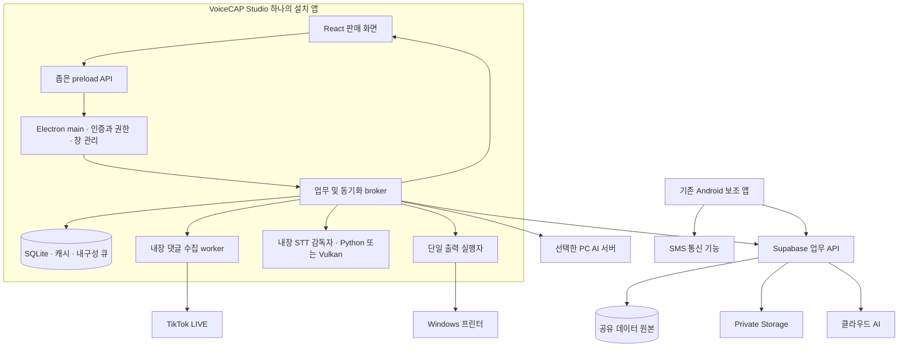

# VoiceCAP Studio for Windows — 통합 앱 설계도

설계일: 2026-09-26 · 설계 버전: 1.0 · 대상 소스: `62a464924b3785255e5d68e8898b14c23f66f554`

이 폴더는 **웹앱의 모든 기능과 기존 댓글 도우미를 하나의 Windows 판매 앱으로 이전하는 개발 설계도**다. 이전에 작성한 [전체 복제 설계도](../PROJECT_REPLICATION_BLUEPRINT.md)와 실제 소스 분석을 바탕으로 작성했다. 소스 분석은 현재 구조의 근거이며, 여기서 새로 제시하는 프로세스·IPC·DB·화면은 **앞으로 구현할 목표 설계**다.

현재 이 폴더에 저장한 것은 설계 문서와 샘플 데이터로 동작하는 화면 시안이다. 실제 Windows 설치 앱, 운영 DB 변경, 댓글 수집·결제·인쇄·문자 발송 구현을 완료했다는 의미는 아니다.

## 1. 이번 설계에서 지키는 요구사항

| 사용자 요구 | 설계에서의 처리 | 검증 위치 |
|---|---|---|
| 새 폴더에 저장 | 기존 소스와 분리한 `windows-app-blueprint/` | 이 폴더 전체 |
| Windows용 앱 | Electron 기반 설치형 앱, Windows 창·트레이·프린터·장치 지원 | 02·07 |
| 댓글 도우미 통합 | 수집·STT·인쇄·모델·진단을 앱 내부 서비스로 통합 | 02 |
| 웹 모든 기능 이전 | 기존 41개 route 선언과 화면 밖 기능까지 추적표 작성 | 01·05·06 |
| 최고의 판매 UI/UX | 판매 동선 중심 디자인 시스템·전 화면 명세·조작 가능한 시안 | 04·05·prototype |
| 설계 완성 후 효율 연구 보고 | 본 설계의 기준을 기록한 후 별도 연구 부록 작성 | appendices |

별도 댓글 도우미 설치, 브라우저에서 로컬 서버 주소 입력, 서로 다른 두 프로그램 업데이트를 기본 사용자 흐름에서 없앤다. 내부적으로 장시간 작업을 수행하는 worker 프로세스는 유지하되 사용자는 하나의 앱에서 상태와 설정을 관리한다.

## 2. 문서 구성과 읽는 순서

| 번호 | 문서 | 핵심 내용 |
|---|---|---|
| 01 | [범위·모든 기능 이전표](01_SCOPE_AND_FEATURE_PARITY.md) | 현 기능 ↔ 새 위치 ↔ 개발·인수 조건, route 누락 방지 |
| 02 | [앱 구조·댓글 도우미 통합](02_ARCHITECTURE_AND_HELPER_INTEGRATION.md) | 프로세스, 보안 경계, IPC, 댓글/STT/인쇄 서비스 |
| 03 | [데이터·API·동기화](03_DATA_API_SYNC.md) | 클라우드 원본, SQLite 큐, 거래·revision, 이전·복구 |
| 04 | [UI/UX·디자인 시스템](04_UI_UX_DESIGN_SYSTEM.md) | 색·타입·밀도·컴포넌트·접근성·Windows 동작 |
| 05 | [전체 화면 명세](05_SCREEN_SPECIFICATIONS.md) | 화면마다 진입·표시·행동·오류·빈 상태·완료 조건 |
| 06 | [구현 작업·검증 계획](06_IMPLEMENTATION_AND_TEST_PLAN.md) | 초보 개발 작업 순서, 책임 파일, 테스트, 출시 gate |
| 07 | [개발환경·설치·운영·인계](07_BUILD_RELEASE_AND_HANDOVER.md) | 새 프로젝트 구조, 빌드·업데이트·데이터 이전·지원 |
| 시안 | [Windows 앱 인터랙티브 시안](prototype/index.html) | 실제 연결 없이 라이브·판매·정산 화면을 조작 |
| 부록 | [설계 완성 후 효율 개선 연구](appendices/01_EFFICIENCY_RESEARCH.md) | 대안 비교·공식 근거·예상 효과·비용·실험·채택 판단 |
| 검증 | [설계 검토 결과](DESIGN_REVIEW.md) | 경로 커버리지·링크·시안 확인·미검증 범위 |

초보 개발자는 이 문서 → 01 → 02 → 03 → 07 순서로 구조를 이해한 뒤, 04/05를 보며 06의 작업 단계를 구현한다. 화면부터 공부하려면 `prototype/index.html`을 브라우저에서 열고 05와 대조한다.

## 3. 제품의 중심 경험

앱을 열면 **라이브 판매 작업대**에서 회차·상품·댓글·판매 상태를 한눈에 본다. 판매자는 구매자와 수량을 확인하고 한 번의 명확한 동작으로 판매를 등록한다. 음성인식은 이 동작을 보조하며, 불명확한 결과는 근거와 함께 검토 대상으로 남긴다.

첫 실행 경험:

```text
설치 → 로그인 → 스토어 선택
  → 오디오 입력 시험 → 방송 계정 연결
  → 프린터 시험(사용할 때) → 휴대폰 연결(문자를 사용할 때)
  → 새 회차 또는 기존 회차 → 라이브 작업대
```

설정 중 사용하지 않는 프린터·AI·문자는 건너뛸 수 있다. “건너뛰기”가 기능을 삭제하는 것은 아니다. 나중에 같은 앱의 설정에서 연결할 수 있어야 한다.

라이브 진행 중:

```text
현재 상품 + 같은 회차 댓글
  → 수동 선택 또는 최종 음성 후보
  → 구매자·상품·금액 검증
  → 앱 내부 저장 대기 / 클라우드 확정 상태 표시
  → 한 개의 출력 큐
  → 판매 상세·보류 검토·정산·배송으로 연결
```

운영자가 연결이나 인쇄 문제를 해결하려고 별도 도우미 창을 찾지 않도록, 하단 연결 상태와 장치 패널에서 댓글·STT·저장·프린터·휴대폰을 각각 확인한다. “앱 연결됨”이라는 하나의 표시로 실제 장애를 숨기지 않는다.

## 4. 전체 구조



도식의 broker는 특정 제품 이름이 아니라 “업무 요청을 검증하고 저장·전송 순서를 관리하는 구성요소”다. renderer는 화면만 담당하고 파일 경로·토큰·프로세스 실행 권한을 직접 갖지 않는다.

## 5. 주요 설계 결정

| 결정 | 이번 기준안 | 이유·조건 |
|---|---|---|
| 데스크톱 기반 | Electron + React + TypeScript | 기존 웹·Node 댓글 수집·Electron 인쇄 자산을 함께 이전 |
| 버전 출발점 | 기존 lock의 Electron 44.0.0 | 재현용 출발점. 실제 출시 시 지원 버전·보안 패치 검토 필수 |
| UI 실행 | 설치 앱에 포함된 로컬 renderer | 원격 운영 웹을 그대로 로드하는 창으로 끝내지 않음 |
| 기존 도우미 | 동일 앱 내부 service/worker로 흡수 | 단일 설치·로그인·설정·업데이트 |
| 로컬 통신 | 타입·스키마를 검사하는 제한된 IPC | renderer에 범용 파일/명령/HTTP 실행 권한 제공하지 않음 |
| 기존 2137 HTTP 서버 | 새 앱의 기본 경로에서 제거 | 포트 충돌·키 헤더 불일치·중복 실행 정리 |
| 공통 판매 처리 | 음성·수동·댓글 선택을 동일 업무 명령으로 정규화 | 일부 메타 누락·상이한 중복 방지·이중 출력 경로 해소 |
| 클라우드 데이터 | Supabase의 서버 확정 기록 | 웹·Windows·Android가 동일 원본 공유 |
| PC 임시 저장 | broker 한 곳이 소유한 SQLite | 미전송 작업·동기화 위치·복구 상태를 프로세스 종료 후 보존 |
| 댓글 적재 | Windows 앱 안에서 producer 1개 | 웹 큐와 helper 큐가 동시에 발행하던 구조 정리 |
| 인쇄 | 작업 식별자·revision별 단일 실행자 | 출력 결과 불명확 상태를 별도로 남김 |
| 문자 발송 | 기존 Android 기기 연동 유지 | Windows 앱 자체에 휴대폰 SIM 발송 기능이 생기지 않음 |
| AI 실행 | cloud와 PC 실행 경로를 명시 | 서버의 localhost를 사용자 PC로 착각하지 않음 |
| 자동 로그인 | main이 보호한 세션 갱신 토큰 | 기존 Base64 비밀번호 저장을 가져오지 않음 |
| 결제·훈련·통계 | 기존 범위 보존 + 실서비스 보완 작업 명시 | 가짜 결과를 운영 성공으로 표시하지 않음 |
| 업데이트 | 서명·검증·작업 종료 후 재시작 | 방송 중 강제 종료나 다른 포트 프로세스 강제 종료 없음 |

Electron을 선택했다고 최고 성능이 입증된 것은 아니다. 기존 코드 재사용과 통합 위험을 근거로 정한 기준안이다. Tauri·WinUI·오디오 전용 네이티브 보조 모듈 등 대안은 설계 완성 후 부록에서 비교한다.

## 6. 기능 이전의 정확한 의미

**기능을 모두 이전한다**는 것은 로그인·판매자·관리자 화면, 숨은 상세/모달, 별칭, 내보내기, 단축키, 설정, 권한 오류, 구독·법적 안내까지 새 앱에 대응 위치와 동작이 있다는 뜻이다. 목록에서 화면 이름을 옮기는 것만으로 완료하지 않는다.

예를 들면 `/seller/helper` 화면은 삭제하지 않고 **통합 연결 센터**로 바꾼다. 사용자는 이곳에서 댓글 수집 상태·STT 모델·프린터·진단·재시작을 관리한다. “별도 도우미 다운로드” 절차는 통합 설치로 대체되며, 그 절차가 제공하던 설치·연결·진단 능력은 앱에 남는다.

또한 기존 결제 화면을 외부 URL로만 치환해 메뉴에서 없애지 않는다. 앱에서 플랜·청구 상태·이력을 표시하고, 실제 결제 승인 과정이 공급자 소유 화면에서 필요할 경우 그 부분만 시스템 브라우저로 연결한다. 앱 복귀는 서버가 검증한 결제 상태로 처리한다.

훈련 UI도 유지한다. 다만 현재 구현의 임의 정확도·카운트 시뮬레이션을 실제 STT 학습으로 표기하지 않는다. 운영 목표는 녹음·시험 문장·전사 비교·사용자 사전/규칙 교정이며, 공급자가 지원하는 학습 기능은 지원 여부와 비용을 확인한 뒤 별도 연결한다.

## 7. 데이터와 오프라인의 원칙

“Windows 앱”과 “모든 업무가 인터넷 없이 가능”은 같은 의미가 아니다.

| 상황 | 목표 동작 |
|---|---|
| 인터넷 정상 | 거래 확정·댓글 동기화·파일 업로드·다기기 갱신 |
| 잠깐 끊김 | 로컬 임시 작업 보존·미동기화 명확 표시·재연결 재시도 |
| 인터넷 없음 | 이미 받은 데이터 열람, 내려받은 STT 모델로 전사, 허용된 초안 작성 |
| 새 로그인/새 권한 필요 | 서버 연결 전 진행 제한, 이유 표시 |
| TikTok 실시간 댓글/클라우드 AI/SMS 큐 | 외부 연결 필요. PC 내장만으로 오프라인 구현되지 않음 |
| 승인되지 않은 임시 판매 | 확정 매출·정산·인쇄와 구분. 정책 없는 무조건 출력 금지 |
| 결과를 모르는 인쇄/문자 발송 | 자동 반복하지 않고 확인 가능한 상태로 보존 |

로컬 임시 거래는 사용자가 볼 수 있는 상태를 갖는다. `로컬 저장`, `동기화 대기`, `서버 확정`, `충돌`, `실패`를 섞지 않는다. 서버에서 이미 처리된 요청의 응답만 유실될 수 있으므로 operation ID로 먼저 조회한다.

## 8. 디자인 방향

제품의 인상은 **차분하고 정교한 판매 도구**로 정한다. 화면 전체를 장식 카드나 과도한 그래프로 채우지 않고, 현재 상품과 구매자·금액·보류 사유를 빠르게 읽도록 배치한다.

- 넓은 밝은 표면, 잉크색 탐색 영역, 제한된 강조색으로 시선을 정리한다.
- 라이브는 상품·댓글·주문 검토의 세 영역을 중심으로 한다.
- 판매 목록은 표와 상세 패널을 사용해 비교와 연속 작업을 빠르게 한다.
- 금액·수량은 정렬되는 숫자 글꼴 설정과 명확한 단위를 사용한다.
- 대기·보류·실패는 색상뿐 아니라 문구·아이콘으로 구분한다.
- 다크 테마·작업 밀도·키보드 이동·큰 배율을 지원한다.
- 판매 등록 직후 결과와 다음 행동을 같은 위치에서 확인한다.
- 삭제·회차 종료·결제처럼 영향이 큰 행동의 확인은 구체적인 대상과 결과를 보여준다.

Windows의 시스템 재료·모션을 무조건 복제하기보다 플랫폼 익숙함과 업무 가독성을 함께 적용한다. React CSS로 구현한 시각적 표현을 WinUI 네이티브 Mica 효과라고 부르지 않는다. 정확한 토큰·치수·반응형 규칙과 근거는 04에 있다.

## 9. 개발 범위와 폴더 구분

현재 작성한 산출물:

```text
voice-pin-anti/
├─ src/, server/, desktop/, android/, supabase/  # 기존 구현; 이번 문서 작업에서 수정 안 함
├─ docs/replication/                            # 기존 시스템 분석 설계도
└─ windows-app-blueprint/                       # 이번 Windows 전환 설계
   ├─ README.md
   ├─ 01~07_*.md
   ├─ prototype/index.html
   ├─ appendices/01_EFFICIENCY_RESEARCH.md
   ├─ DESIGN_BASELINE.json
   └─ DESIGN_REVIEW.md
```

향후 구현 단계에서 새로 만들 코드 프로젝트의 제안 이름은 `voicecap-studio/`다. 이 설계 작업에서 동작하지 않는 npm 프로젝트나 빈 앱 코드를 실제 구현처럼 만들지는 않는다. 구체적인 목표 구조와 명령의 의미는 07에 있다.

## 10. 초보 개발자가 기억할 순서

1. 01의 기능 ID를 기준으로 빠뜨릴 기능을 없앤다.
2. 02의 프로세스와 03의 데이터 경계를 먼저 만든다.
3. 로그인·회차·상품·수동 판매를 먼저 실제 저장한다.
4. 댓글·STT를 붙여 동일한 판매 명령을 만들게 한다.
5. 인쇄·AI·Android와 장애 복구를 연결한다.
6. 04·05의 화면·상태·키보드 동작을 적용한다.
7. 모든 기능 ID의 검증 근거를 남기고 06의 출시 gate를 통과한다.

UI 시안이 예쁘게 열린다는 사실과 실제 거래가 안전하게 저장·복구된다는 사실을 각각 검증한다. 이전 분석에서 통과한 261개 테스트는 기존 프로젝트 결과다. 새 Windows 앱의 테스트가 이미 통과했다는 뜻은 아니다.

## 11. 설계 완성 후 연구 부록의 읽는 법

본 설계가 완성된 시점의 문서 해시는 `DESIGN_BASELINE.json`에 기록한다. 이후 효율 개선 조사는 [부록](appendices/01_EFFICIENCY_RESEARCH.md)에 작성한다. 부록은 다음을 구분한다.

1. 공식 자료와 코드로 확인한 사실.
2. 이 프로젝트에 적용했을 때 예상하는 효과.
3. 아직 측정하지 않은 성능 가설.
4. 구현비용·이전 위험·우선순위·채택 또는 보류 판단.

부록의 추가안이 본문 범위를 자동으로 바꾸지는 않는다. 성능 수치는 측정한 근거가 없으면 목표/가설로 표기하고, 채택하려면 작업 ID와 수용 테스트를 추가한다. 기능 누락이나 시각적 품질 하락을 비용 절감 방법으로 삼지 않는다.

## 12. 다른 컴퓨터로 옮겨 읽기

이 폴더 전체를 복사하면 Markdown 문서와 `prototype/index.html`을 읽을 수 있다. 시안은 외부 CDN이나 계정 없이 브라우저에서 연다. 문서에서 원본 코드로 연결한 `../src`, `../server`, `../docs/replication` 링크까지 사용하려면 원본 저장소와 기존 복제 설계 문서도 함께 옮겨 현재와 같은 상대 위치를 유지한다. 운영 비밀값·사용자 DB·로그는 설계도를 읽는 데 필요하지 않다.

문서를 수정한 뒤 원본 프로젝트 루트의 PowerShell에서 아래를 실행하면 파일 링크·41개 경로·67개 기능 ID·설계 기준 해시를 확인할 수 있다. Python 표준 라이브러리만 사용한다. 이는 **문서 일관성 검사**이며 실제 앱 테스트를 대신하지 않는다.

```powershell
python .\windows-app-blueprint\tools\validate_design.py --report .\windows-app-blueprint\VALIDATION_REPORT.json
```

의도적으로 본문을 개정하면 기존 기준 해시와 달라지는 것이 정상이다. 기존 기준 기록은 남기고 새 버전·변경 이유·새 검토 결과를 작성한다.
